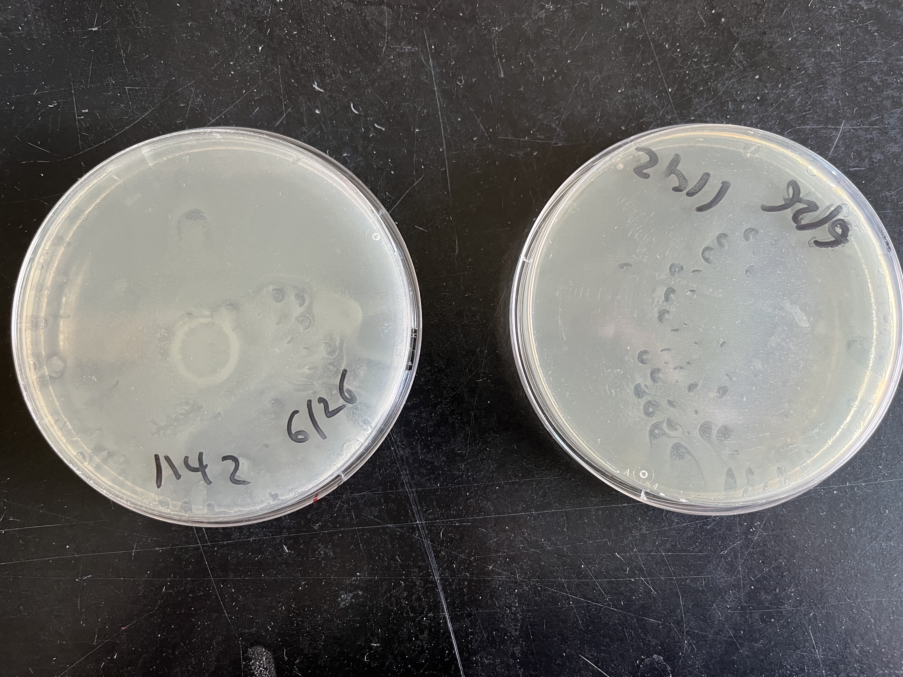
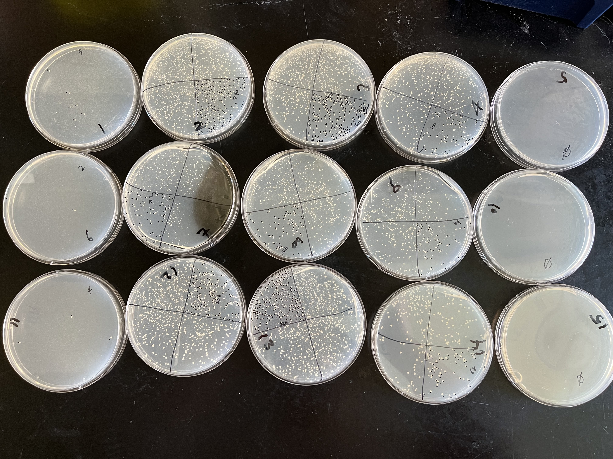
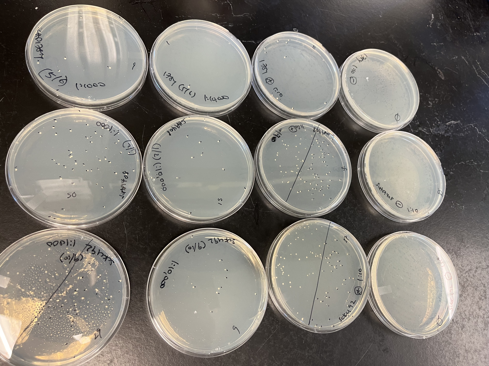
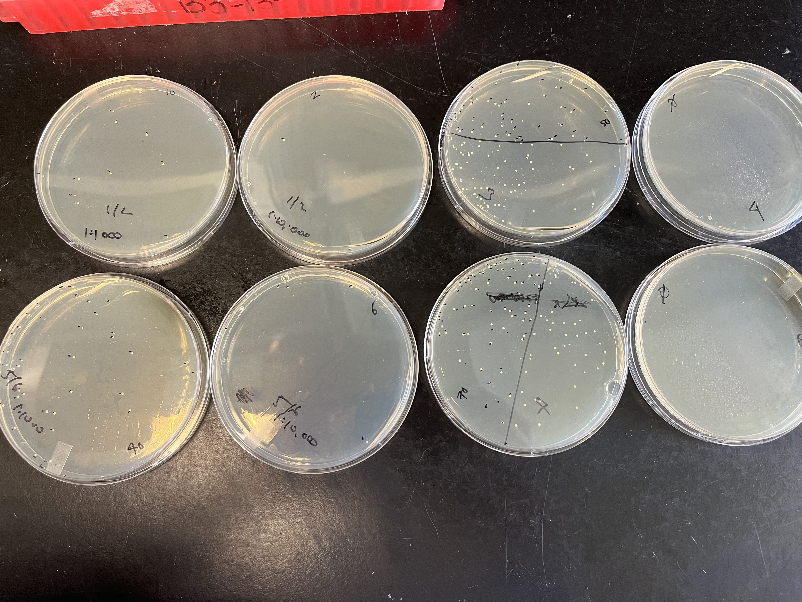
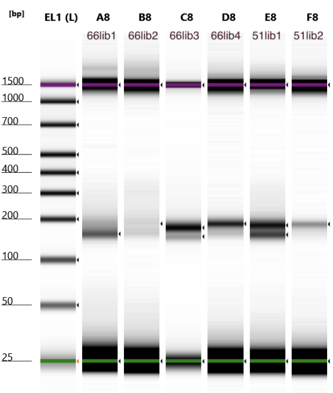

# Background
- https://github.com/rasilab/rqc_aggregation_aging/issues/113

| Strain   | Desc                  |
| -------- | --------------------- |
| scHP1408 | BY4741::Hel2-del      |
| scHP1784 | BY4741::Not5-del      |
| scKC192  | BY4741::Syh1-del      |
| scKC190  | BY4741::pHPSC1159-sc2 |
| scKC191  | BY4741::pHPHS1159-sc5 |

| plasmid       | Desc                                                                                           | cloned in                                                  |
| ------------- | ---------------------------------------------------------------------------------------------- | ---------------------------------------------------------- |
| pHPHS1142     | cytosolic 8x dicodon library: PGK1_HAoverhang_8xdicodon_oAS385overhang_24VNN_R1homology_T7_YFP | https://github.com/rasilab/rqc_aggregation_aging/issues/78 |
| pHPSC1159-sc2 | exact same as pHPSC1142 but the 8xdicodon sequence is truncated by 37bp (see above)            | https://github.com/rasilab/rqc_aggregation_aging/issues/94 |
| pHPSC1159-sc3 | exact same as pHPSC1142 but the 8xdicodon sequence is truncated by 31bp (see above)            | https://github.com/rasilab/rqc_aggregation_aging/issues/94 |

- Transform pHPSC1142 into hel2-del, not5-del, and syh1-del strains using liquid recovery (follow [exp48](https://github.com/rasilab/rqc_aggregation_aging/blob/master/experiments/kchen_exp48_higheff_transfo_8xdicodon_liquid_recovery.md#re-try-using-more-plasmid))
- Grow up for harvesting and spike-in scKC190 and scKC191 to all three strains at 10/n_barcodes (follow [exp48](https://github.com/rasilab/rqc_aggregation_aging/blob/master/experiments/kchen_exp48_higheff_transfo_8xdicodon_liquid_recovery.md#grow-up-this-library-for-harvesting-gdnarna-again-with-more-pellets))
# Procedure
## Midiprep more pHPHS1142
- 2022-06-26 ~6pm: thawed ecHP1142 glycerol stock and plated 200uL per plate to 2xLB+carb plates, used beads to spread, flip plate over after spreading a bunch and then dump beads out
- 2022-06-27 9:45am: despite flipping plate over to dump beads, plates still had some marks from where the beads had sat
- 2022-06-27 10:00am: Heungwon recommends prepping just the first plate but cutting out the middle circle part

- 2022-06-27 15:58 use cell scraper to gently remove as much of the central part as possible

- Then add 10mL LB and scrape the remaining plate into 15mL conical
- Spin 4500g 1m but heard rattling inside, so stopped and spun 4000g 8m
- Dump supernatant
- Add 2mL P1 buffer and pipette to resuspend pellet -> transfer to 50mL conical
- Add 2mL P2 buffer and pipette to mix -> incubate ~2m
- Add 4mL P3 buffer and pipette to mix -> incubate ~2m
- 2022-06-27 16:15 Spin 16,000g 10m using Bloom lab centrifuge (yellow 50mL conical holders, takes a few min to ramp up so input 12m)
- Pour supernatant into 15mL tubes (expect 8-9mL, got ~7mL)
- Transfer 4mL to midiprep column sitting on top of 15mL conical
- Spin 4000g 2m in our centrifuge, outer ring holders are easier to remove tube from
- Dump supernatant from culture tube and transfer remaining ~4mL supernatant into midi-column -> 4000g 2m
- Dump supernatant from culture tube and add 4mL 80% ethanol -> 4000g 2m
- Dump ethanol from culture tube -> spin 4000g 5m to remove all residual ethanol
- Put column on top of new culture tube
- Add 750uL RN-H2O (I use ultrapure H2O)
- Spin 4000g 3m
- Transfer to eppy (<500uL volume)
- Nanodrop, expect ~300ng/uL or 200+ug yield
  - only got 162ng/uL in <500uL -> 81ug
  - will need more for all three strains
- 2022-06-27 17:34 streak more ecHP1142 to LB+carb plates x2
  - 200uL LB into eppy
  - take glob of ecHP1142 using p1000 and resuspend in eppy
  - dump ~1/4 of plate worth of glass beads, move to sides
  - Add 100uL to each LB+carb plate (not on beads but in center)
  - Had ~40-50uL left so eyeballed it between the two plates
  - Heungwon swishes around for me, inverts, and dumps beads out
  - He says 10-20uL stock is more than enough, so I probably plated too much last time which led to the bead marks showing up
  - 2022-06-27 17:35 37C warm room
- 2022-06-28 10:00 Heungwon says distribution could be more even, but they should be fine:
- 2022-06-28 14:22 midiprep the two plates
  - add 10mL LB and scrape the first plate into 50mL conical
  - add 7mL LB and scrape second plate
  - use 3mL LB on both plates to scrape up remainder
  - mix with p5mL and use 500uL to make a glycerol stock + 500uL 50% glycerol -> HPark Box 14 along with other ecHPSC1142 stocks
  - Spin 4000g 5m
  - Dump supernatant
  - Add 4mL P1 buffer and pipette to resuspend pellet
  - Add 4mL P2 buffer and pipette to mix -> incubate ~2m
  - Add 8mL P3 buffer and pipette to mix -> incubate ~2m
  - Spin 16,000g 10m using Bloom lab centrifuge (yellow 50mL conical holders, takes a few min to ramp up so input 12m)
  - Pour supernatant into 15mL tubes (~15.5mL total)
  - Transfer 4mL to same midiprep column as yesterday sitting on top of 15mL conical
  - Spin 4000g 2m in our centrifuge, outer ring holders are easier to remove tube from
    - Didn't really go through, probably because of small particulates still in supernatant, so spun again 4000g 8m (this time all went through)
  - Dump supernatant from culture tube and transfer another ~4mL supernatant into midi-column -> 4000g 10m (all went through)
  - Dump supernatant from culture tube and add 4mL 80% ethanol -> 4000g 5m
    - still a little ethanol left, so dumped and spun longer for next round
  - Dump ethanol from culture tube -> spin 4000g 10m to remove all residual ethanol
  - Put column on top of new culture tube
  - Add 750uL RN-H2O (I use ultrapure H2O)
  - Spin 4000g 8m 2x (bc wasn't all through the first time)
  - Transfer to eppy (<500uL volume)
    - 211.5ng/uL, 1.8/2.03
  - Repeat by transferring 4mL supernatant -> 4000g 10m x2 (bc didn't go through fully first time)
  - transfer remaining 4mL supernatant -> 4000g 20m
  - wash 4mL 80% ethanol -> 4000g 20m
  - 4000g 10m
  - elute 750uL RN-H2O -> 4000g 20m -> 4000g 5m
  - Combine with previous 2 elutions
  - Nanodrop
- 2022-06-28 18:25 Digest 50ug pHPSC1142

| Reagent      | conc       | vol     | amt      |
| ------------ | ---------- | ------- | -------- |
| 10X FD Green | 10X        | 34 uL   | 1X       |
| pHPSC1142    | 174.6ng/uL | 287 uL  | 50ug     |
| Not1         |            | 16.7 uL | 1uL/3ug  |
| H2O          |            | 2.3     | to 340uL |

- Digest pHPSC1120 positive control at 100ng/uL

| Reagent                               | conc  | vol     | amt     |
| ------------------------------------- | ----- | ------- | ------- |
| 10X FD Green                          | 10X   | 5 uL    | 1X      |
| pHPSC1120-2 (singlecolony)   213ng/uL | 23 uL | 5ug     |         |
| Not1                                  |       | 1.7 uL  | 1uL/3ug |
| H2O                                   |       | 20.3 uL | to 50uL |

- 2022-07-07 10:35 Digest more pHPSC1120 positive control at 100ng/uL

| Reagent                    | conc     | vol     | amt     |
| -------------------------- | -------- | ------- | ------- |
| 10X FD Green               | 10X      | 5 uL    | 1X      |
| pHPSC1120-1 (singlecolony) | 232ng/uL | 22 uL   | 5ug     |
| Not1                       |          | 1.7 uL  | 1uL/3ug |
| H2O                        |          | 21.3 uL | to 50uL |

## Prepare 50% PEG3350
- 2022-06-28 PEG:
  - 25g PEG3350 to 250mL bottle
  - 20mL MQ H2O -> heat/stir until clear/mostly clear
  - magnet to remove stir bar, then drip MQ in until 50mL notch reached
  - heat/stir more
  - autoclave liquid cycle 15m

## Transform scHP1408 (hel2-del) with 1142 library
- 2022-06-28 16:58 Start O/N scHP1408 from single colony into 3ml YPD x2 -> 30C 280rpm stoddard lab shaker
- 2022-06-29 10:21 Dilute 2mL into 100mL YPD
  - 500mL baffle flask in stoddard lab 30C 280rpm, check OD after 4hrs
- Prepare 50ug library plasmid in 340uL total volume using sterile water
  - 1.6ug pHPSC1120.1 in 56.7uL H2O for pos cntrl

| digest            | conc     | vol   | H2O    | TOTAL  |
| ----------------- | -------- | ----- | ------ | ------ |
| pHPSC1142         | 147ng/uL | 340uL | 0uL    | 340uL  |
| pHPSC1120.1 (pos) | 100ng/uL | 16uL  | 40.7uL | 56.7uL |
| H2O (neg)         | 0        | 0     | 56.7uL | 56.7uL |

-	Prepare transformation mix
  - vortex, keep at RT

| Reagent     | 1X lib vol | 1x cntrl vol | MM     | date    |
| ----------- | ---------- | ------------ | ------ | ------- |
| 50% PEG3350 | 2.4mL      | 400uL        | 4.8mL  | 6/28/22 |
| 1M LiAc     | 360uL      | 60uL         | 720uL  | 8/12    |
| TOTAL       | 2760uL     | 460uL        | 5.52mL |         |

-	Prepare recovery mix (40mL total) at RT

| Reagent      | vol  |
| ------------ | ---- |
| SCD-URA      | 20mL |
| 20% dextrose | 20mL |
| TOTAL        | 40mL |

- 2022-06-29 14:30 After ~4.5hrs or OD ~1.0 - 2.0 -> 0.772*2 = 1.54 ODend
  - spin 50mL cells (~1e9) 3000g 5m
  - spin 2x5mL cells (1x~1.38e8) 3000g 5m (pos/neg control)
- Wash 25mL/5mL autoclaved MQ H2O (dump MQ then pipette to resuspend pellet with same p10mL between all 3 conicals) -> 3000g 5m x2, invert ~1m after last wash to remove all H2O
- During washes, prepare carrier DNA:
  - Use ~1mL aliquot of carrier DNA saved in my PCR box because these are from Heungwon's prep which worked better than mine
  - boil 5m
  - ice until use
- Resuspend cell pellet in salmon sperm DNA:

| Digest      | carrier DNA 2mg/mL | DNA    | TOTAL |
| ----------- | ------------------ | ------ | ----- |
| pHPSC1142   | 500uL              | 340uL  | 840uL |
| pHPSC1120.1 | 83.3uL             | 56.7uL | 140uL |
| H2O         | 83.3uL             | 56.7uL | 140uL |

-	Then transfer cell suspension to diluted DNA
-	Then transfer cell suspension+DNA mix to pre-prepared Transformation mix in 50mL/15mL conicals, swirl gently to mix:

| Sample      | carrier/plasmid | LiAc/PEG3350 | TOTAL | conical size |
| ----------- | --------------- | ------------ | ----- | ------------ |
| pHPSC1142   | 840uL           | 2760uL       | 3.6mL | 50mL         |
| pHPSC1120.1 | 140uL           | 460uL        | 600uL | 15mL         |
| H2O neg     | 140uL           | 460uL        | 600uL | 15mL         |

-	Incubate 35min in 42oC water bath, swirling tube gently to mix every 6-7 minutes
-	Dilute transformation mix into room temp recovery mix
  - pHPSC1142 library: +26mL = ~30mL total in 50mL conical
  - pHPSC1120.1 pos cntrl: +4.3mL = ~5mL total in 15mL conical
  - H2O neg cntrl: +4.3mL = ~5mL total in 15mL conical

| Sample      | transfo vol | Recovery mix | TOTAL |
| ----------- | ----------- | ------------ | ----- |
| pHPSC1142   | 3.6mL       | 26mL         | ~30mL |
| pHPSC1120.1 | 600uL       | 4.3mL        | ~5mL  |
| H2O neg     | 600uL       | 4.3mL        | ~5mL  |

-	Spin down cells 1800g 5min, dump sup
-	Resuspend into 100mL SCD-URA in 1L baffled flask
  - aliquot 160uL of this 100mL suspension to an eppy
  - plate 100uL of this 100mL suspension directly to 10cm SCD-URA -> 1:1000
  - take 10uL from this 100mL suspension to a 90uL pool of H2O on 10cm SCD-URA -> 1:10,000
  -	For positive and neg ctrl, resuspend pellet to 1mL H2O and plate 100uL to 10cm SCD-URA plates
- Measure starting OD of 100mL suspension: 500uL SCD-URA + 500uL suspension -> 0.297*2 -> starting OD 0.594
- Stoddard lab 280rpm 30C shaker 2022-06-29 16:00
- Next AM: want to see the culture increase ~4.5x over ~18hrs to signify that enough cells transformed and are growing up in outgrowth, may also see large debris
  - large debris as expected
  - 6/30 3pm: 0.284*20 = 5.7, only 10x over 23hrs but may be okay?
  - spin 18mL 1800g 5m, resuspend in 100mL in fresh SCD-URA, incubate ~8+ hours to overnight
- 6/31 12pm: 0.376 * 20 = 7.52, not sure why it's growing so slowly but I had to leave and efficiency looked trash anyway, so just made 10mL glycerol stocks in 15mL conicals (7mL culture + 3mL 50% glycerol) and stuck in -80C

| date | parent   | plasmid   | count | approximated from             | colonies |
| ---- | -------- | --------- | ----- | ----------------------------- | -------- |
| 6/31 | scHP1408 | pHPSC1142 | 3     | 1:1000 dil plate              | 3000     |
| 6/31 | scHP1408 | H2O       | 0     |                               | 0        |
| 6/31 | scHP1408 | pHPSC1120 | 90    | counted 1/4 of 1:10 dil plate | 3600     |

- pHPSC1120 transformation composition:
  - 1.6ug per 1e8 cells -> 16ug per 1e9 cells
  - 3600 transformants

| reagent        | vol  | proportion | amt   | date/lot        |
| -------------- | ---- | ---------- | ----- | --------------- |
| carrier DNA    | 83.3 | 0.14       |       | HPark/re-boiled |
| LiAc           | 60   | 0.1        |       | 8/12            |
| 50% PEG3350    | 400  | 0.67       |       | 6/28/22         |
| pHPSC1120      | 56.7 | 0.095      | 1.6ug | digested 6/28   |
| scHP1408 cells |      |            | 1e8   |                 |

- Compared to pHPSC1142 transformation composition:
  - 50ug per 1e9 cells
  - 3000 transformants

| reagent        | vol   | proportion | amt  | date/lot        |
| -------------- | ----- | ---------- | ---- | --------------- |
| carrier DNA    | 500   | 0.14       |      | HPark/re-boiled |
| LiAc           | 360   | 0.1        |      | 8/12            |
| 50% PEG3350    | 2.4mL | 0.67       |      | 6/28/22         |
| pHPSC1142      | 340   | 0.094      | 50ug | digested 6/28   |
| scHP1408 cells |       |            | 1e9  |                 |

## Redo transformation: trial 1
- Conditions for redo:
  - use my prep of carrier DNA that has never been boiled before (use 1120 to compare if carrier DNA is the problem)
  - try with less plasmid to cells ratio and more transformation volume (compare with 1120 to see if plasmids are transforming at same efficiency)
    - 1.6ug 1120 in 1e8 1408 cells in 600uL volume yielded 3600 colonies, confirm that 1142 yields this much too when transformed the same way
  - include scHP1784 in this because would probably need to do a similar thing for this strain anyway
  - if this doesn't work, I can also try using the HPark prep of carrier DNA and thawing it at RT without re-boiling (as I did/quantified in exp45 works about as well as boiling for the first time)
- Redo at a small scale (1/10) then scale up for the real thing when you confirm the efficiency
  - use 50mL conicals to keep consistent with real experiment

| reagent        | vol  | proportion | amt   | date/lot   |
| -------------- | ---- | ---------- | ----- | ---------- |
| carrier DNA    | 83.3 | 0.14       |       | my prep    |
| LiAc           | 60   | 0.1        |       | 8/12       |
| 50% PEG3350    | 400  | 0.67       |       | 6/28/22    |
| pHPSC1142      | 56.7 | 0.095      | 1.6ug | 7/5 digest |
| scHP1408 cells |      |            | 1e8   |            |

| reagent        | vol  | proportion | amt | date/lot   |
| -------------- | ---- | ---------- | --- | ---------- |
| carrier DNA    | 83.3 | 0.14       |     | my prep    |
| LiAc           | 60   | 0.1        |     | 8/12       |
| 50% PEG3350    | 400  | 0.67       |     | 6/28/22    |
| pHPSC1142      | 56.7 | 0.095      | 5ug | 7/5 digest |
| scHP1408 cells |      |            | 1e8 |            |

| reagent        | vol  | proportion | amt   | date/lot   |
| -------------- | ---- | ---------- | ----- | ---------- |
| carrier DNA    | 83.3 | 0.14       |       | my prep    |
| LiAc           | 60   | 0.1        |       | 8/12       |
| 50% PEG3350    | 400  | 0.67       |       | 6/28/22    |
| pHPSC1142      | 56.7 | 0.095      | 1.6ug | 7/5 digest |
| scHP1784 cells |      |            | 1e8   |            |

| reagent        | vol  | proportion | amt | date/lot   |
| -------------- | ---- | ---------- | --- | ---------- |
| carrier DNA    | 83.3 | 0.14       |     | my prep    |
| LiAc           | 60   | 0.1        |     | 8/12       |
| 50% PEG3350    | 400  | 0.67       |     | 6/28/22    |
| pHPSC1142      | 56.7 | 0.095      | 5ug | 7/5 digest |
| scHP1784 cells |      |            | 1e8 |            |

- Redo positive control same as before except using my prep of carrier DNA:
  - use 15mL conical as before

| reagent        | vol  | proportion | amt   | date/lot      |
| -------------- | ---- | ---------- | ----- | ------------- |
| carrier DNA    | 83.3 | 0.14       |       | my prep       |
| LiAc           | 60   | 0.1        |       | 8/12          |
| 50% PEG3350    | 400  | 0.67       |       | 6/28/22       |
| pHPSC1120      | 56.7 | 0.095      | 1.6ug | digested 6/28 |
| scHP1408 cells |      |            | 1e8   |               |

| reagent        | vol  | proportion | amt | date/lot      |
| -------------- | ---- | ---------- | --- | ------------- |
| carrier DNA    | 83.3 | 0.14       |     | my prep       |
| LiAc           | 60   | 0.1        |     | 8/12          |
| 50% PEG3350    | 400  | 0.67       |     | 6/28/22       |
| H2O            | 56.7 | 0.095      | 0   | autoclaved MQ |
| scHP1408 cells |      |            | 1e8 |               |

| reagent        | vol  | proportion | amt   | date/lot        |
| -------------- | ---- | ---------- | ----- | --------------- |
| carrier DNA    | 83.3 | 0.14       |       | HPark re-boiled |
| LiAc           | 60   | 0.1        |       | 8/12            |
| 50% PEG3350    | 400  | 0.67       |       | 6/28/22         |
| pHPSC1120      | 56.7 | 0.095      | 1.6ug | digested 6/28   |
| scHP1784 cells |      |            | 1e8   |                 |

| reagent        | vol  | proportion | amt | date/lot      |
| -------------- | ---- | ---------- | --- | ------------- |
| carrier DNA    | 83.3 | 0.14       |     | my prep       |
| LiAc           | 60   | 0.1        |     | 8/12          |
| 50% PEG3350    | 400  | 0.67       |     | 6/28/22       |
| H2O            | 56.7 | 0.095      | 0   | autoclaved MQ |
| scHP1784 cells |      |            | 1e8 |               |

### Procedure
- 2022-07-05 14:16 Digest pHPSC1142 37C waterbath overnight:

| Reagent      | conc       | vol     | amt      |
| ------------ | ---------- | ------- | -------- |
| 10X FD Green | 10X        | 34 uL   | 1X       |
| pHPSC1142    | 174.6ng/uL | 287 uL  | 50ug     |
| Not1         |            | 16.7 uL | 1uL/3ug  |
| H2O          |            | 2.3     | to 340uL |

- 2022-07-05 14:16 Start O/N from single colonies scHP1408 and scHP1784 in 3mL YPD -> 230rpm 30C warm room
- 2022-07-06 10:00: Dilute 2mL into 100mL YPD -> OD was ~0.7, so removed 50mL and added 50mL YPD -> OD ~0.3 for both -> 30C 280rpm 4hrs
- Measure OD and confirm it's between 1-2 before starting
  - scHP1408: 1.4
  - scHP1784: 1.8
- Aliquot 20mL cells into 50mL conicals for each strain (2x50mL total)
- Wash 20mL MQ 3000g 5m x2, invert 1m after last spin to remove all H2O
- Boil 1mL aliquot of carrier DNA 5m -> ice
- Prepare LiAc/PEG and aliquot 460uL to 4x 50mL conicals and 460uL to 4x 15mL conicals
- Prepare digested DNA in eppies

| tube | DNA  | uL DNA | uL H2O |
| ---- | ---- | ------ | ------ |
| 1    | 1142 | 10.9   | 45.8   |
| 2    | 1142 | 34     | 22.7   |
| 3    | 1120 | 16     | 40.7   |
| 4    | H2O  | 0      | 56.7   |
| 5    | 1142 | 10.9   | 45.8   |
| 6    | 1142 | 34     | 22.7   |
| 7    | 1120 | 16     | 40.7   |
| 8    | H2O  | 0      | 56.7   |

- Resuspend each pellet in carrier DNA, then transfer to DNA in eppies, then transfer to conical of LiAc/PEG and swirl to mix. Repeat for each tube.
  - 333.2uL carrier DNA (pipette to mix) -> 83.3uL per transfo eppy

| tube | DNA              | carrier/DNA | conical | LiAc/PEG |
| ---- | ---------------- | ----------- | ------- | -------- |
| 1    | 1.6ug pHPHSC1142 | 83.3uL 1408 | 50mL    | 460uL    |
| 2    | 5ug pHPHSC1142   | 83.3uL 1408 | 50mL    | 460uL    |
| 3    | 1.6ug 1120       | 83.3uL 1408 | 15mL    | 460uL    |
| 4    | H2O              | 83.3uL 1408 | 15mL    | 460uL    |
| 5    | 1.6ug pHPSC1142  | 83.3uL 1784 | 50mL    | 460uL    |
| 6    | 5ug pHPSC1142    | 83.3uL 1784 | 50mL    | 460uL    |
| 7    | 1.6ug 1120       | 83.3uL 1784 | 15mL    | 460uL    |
| 8    | H2O              | 83.3uL 1784 | 15mL    | 460uL    |

-	Incubate 35min in 42oC water bath, swirling tube gently to mix every 6-7 minutes
- Recover:

| tube | Sample       | transfo vol | Recovery mix | TOTAL | ODstart |
| ---- | ------------ | ----------- | ------------ | ----- | ------- |
| 1    | 1408::1142   | 600uL       | 4.3mL        | ~5mL  | 0.648   |
| 2    | 1408::1142   | 600uL       | 4.3mL        | ~5mL  | 0.663   |
| 3    | 1408::1120.1 | 600uL       | 4.3mL        | ~5mL  | 0.635   |
| 4    | 1408::H2O    | 600uL       | 4.3mL        | ~5mL  | 0.699   |
| 5    | 1784::1142   | 600uL       | 4.3mL        | ~5mL  | 0.85    |
| 6    | 1784::1142   | 600uL       | 4.3mL        | ~5mL  | 0.77    |
| 7    | 1784::1120.1 | 600uL       | 4.3mL        | ~5mL  | 0.70    |
| 8    | 1784::H2O    | 600uL       | 4.3mL        | ~5mL  | 0.825   |

- Spin down cells 1800g 5min, dump sup
- Resuspend in 1mL SCD-URA per tube
- Plate 100uL directly to SCD-URA plates
- With remaining transformants (~900uL), add 5mL in SCD-URA and transfer to culture tubes
- Use 1mL to measure ODstart (aim for 0.6-0.8) and shake 30C overnight 280rpm Stoddard lab shaker slanted 2022-07-06 16:30
- Measure OD at 18hrs, and increase in ~4.5X over this time is indicative of a good transformation
- 2022-07-07 10:00 the shaker had stopped shaking at some point! All cells had settled to the bottom and there was a bunch of debris all clumped up. Resuspending the clumps yielded cultures like what I expected to see. Because there was no shaking/aeration, I guess I shouldn't be surprised that cultures only ~2x overnight but I'm confused why both negative controls also doubled. Just ignore these measurements and wait for the dilution plate counts
- 2022-07-08 10:00 count plates

| plate | DNA              | carrier/DNA | conical | LiAc/PEG | count | colonies                                 | scale | ug plasmid scale |
| ----- | ---------------- | ----------- | ------- | -------- | ----- | ---------------------------------------- | ----- | ---------------- |
| 1     | 1.6ug pHPHSC1142 | 83.3uL 1408 | 50mL    | 460uL    | 4     | 40                                       | 5000x | 8000 ug          |
| 2     | 5ug pHPHSC1142   | 83.3uL 1408 | 50mL    | 460uL    | 9     | 90                                       | 2222x | 11,000 ug        |
| 3     | 1.6ug 1120       | 83.3uL 1408 | 15mL    | 460uL    | 82 *4 | 3300                                     | 60x   | 96 ug            |
| 4     | H2O              | 83.3uL 1408 | 15mL    | 460uL    | 0     | 0                                        |       |                  |
| 5     | 1.6ug pHPSC1142  | 83.3uL 1784 | 50mL    | 460uL    | 0     | 0                                        |       |                  |
| 6     | 5ug pHPSC1142    | 83.3uL 1784 | 50mL    | 460uL    | 9     | 90                                       | 2222x |                  |
| 7     | 1.6ug 1120       | 83.3uL 1784 | 15mL    | 460uL    | 96    | 960                                      | 200x  |                  |
| 8     | H2O              | 83.3uL 1784 | 15mL    | 460uL    | 0     | lots of weird pink colonies, ignore them |       |                  |

- 1408::1120 repeated with about the same number of colonies (3600 vs 3300), so my prep of carrier DNA is comparable to HPark's prep (which I also quantified in exp45 with similar results)
- scHP1784 transforms ~3.5x worse than scHP1408
- all transformations got exactly the same carrier DNA, LiAC/PEG, and heat bath shock, but somehow the backbone plasmid 1120 is transforming ~40x better than 1142 library plasmid. The only difference between these transformations besides the plasmid itself (which is only different by 100bp insert) is the conical used for heat shock. The heat shock step is pretty important, so maybe a 15mL conical is better at transferring heat than the 50mL conical?
- I've always done these transformations in 50mL conicals and not had this problem, so I really don't think it's the conical, but just in case I will repeat using 15mL conicals.
- Since all reagents used were exactly the same, and 1120.1 is the backbone of 1142 so should not be very different in efficiency, the only issue I can think of is that the strains do not transform well for this plasmid. I will repeat the transformation using BY4741-1 as another control, since this strain has transformed well before.

## Redo transformation: trial 2
- Repeat trial 1, this time including BY4741-1 as an added control to figure out why hel2-del and not5-del don't transform well
- Note that since I ran out of pHPSC1120.1-1, I used pHPSC1120.1-2. These are both minipreps from single colonies of ecHP1120.1, so they are likely identical but may have different mutations in mCitrine. 
- Use 2022-07-05 digest of 1142 and 2022-07-07 digest of pHPSC1120.1-2
- 2022-07-07 ~11am Start O/N from single colony patches of scHP1408 and scHP1784 in 3mL YPD -> 280rpm 30C slanted Stoddard lab shaker
- 2022-07-08 10:50: Dilute 1mL into 100mL YPD -> scHP1408 ODstart =0.365, scHP1784 ODstart=0.39, added 7mL YPD to scHP1784 and remeasured ODstart = 0.35 -> 30C 280rpm 4hrs
- 2022-07-08 15:00: Decided to change gears and include BY4741-1 in parallel for this repeat, so use the leftover overnights and dilute 700uL in 70mL YPD: -> 30C 280rpm 4hrs
  - New batch of YPD than last trial
  - scHP1408: 0.345
  - scHP1784: 0.313
  - BY4741-1: 0.353
- Measure OD and confirm it's between 1-2 before starting (aim for 1.5 for all)
  - scHP1408: 0.69*2 = 1.38
  - scHP1784: 0.611*2 = 1.222
  - BY4741-1: 0.69*2 = 1.38
- Aliquot 15mL cells into 50mL conicals for each strain (3x50mL total)
- Wash 15mL MQ 3000g 5m x2, invert 1m (actually was 2m) after last spin to remove all H2O
- Boil 1mL aliquot + 0.5mL aliquot of carrier DNA 5m -> ice -> combine into one eppy -> ice
- Prepare LiAc/PEG and aliquot 460uL 9x 15mL conicals
- Prepare digested DNA in eppies

| tube | DNA  | uL DNA | uL ultrapure |
| ---- | ---- | ------ | ------------ |
| 1    | 1142 | 34     | 22.7         |
| 2    | 1120 | 16     | 40.7         |
| 3    | H2O  | 0      | 56.7         |
| 4    | 1142 | 34     | 22.7         |
| 5    | 1120 | 16     | 40.7         |
| 6    | H2O  | 0      | 56.7         |
| 7    | 1142 | 34     | 22.7         |
| 8    | 1120 | 16     | 40.7         |
| 9    | H2O  | 0      | 56.7         |

- Resuspend each pellet in carrier DNA, then transfer to DNA in eppies, then transfer to conical of LiAc/PEG and swirl to mix. Repeat for each tube.
  - 250uL carrier DNA (pipette to mix) -> 83.3uL per transfo eppy
  - do all in 15mL conicals just in case that is somehow the problem

| tube | DNA             | carrier/DNA     | conical | LiAc/PEG |
| ---- | --------------- | --------------- | ------- | -------- |
| 1    | 5 ug pHPHSC1142 | 83.3uL 1408     | 15mL    | 460uL    |
| 2    | 1.6ug 1120      | 83.3uL 1408     | 15mL    | 460uL    |
| 3    | H2O             | 83.3uL 1408     | 15mL    | 460uL    |
| 4    | 5 ug pHPSC1142  | 83.3uL 1784     | 15mL    | 460uL    |
| 5    | 1.6ug 1120      | 83.3uL 1784     | 15mL    | 460uL    |
| 6    | H2O             | 83.3uL 1784     | 15mL    | 460uL    |
| 7    | 5 ug pHPSC1142  | 83.3uL BY4741-1 | 15mL    | 460uL    |
| 8    | 1.6ug 1120      | 83.3uL BY4741-1 | 15mL    | 460uL    |
| 9    | H2O             | 83.3uL BY4741-1 | 15mL    | 460uL    |

-	Incubate 35min in 42oC water bath, swirling tube gently to mix every 7 minutes
- Recover (25mL SCD-URA + 25mL 20% glucose) by adding 4.3mL recover mix to each conical:

| tube | Sample           | transfo vol | recovery mix | TOTAL |
| ---- | ---------------- | ----------- | ------------ | ----- |
| 1    | 1408::1142       | 600uL       | 4.3mL        | ~5mL  |
| 2    | 1784::1142       | 600uL       | 4.3mL        | ~5mL  |
| 3    | BY4741-1::1120.1 | 600uL       | 4.3mL        | ~5mL  |
| 4    | 1408::1120       | 600uL       | 4.3mL        | ~5mL  |
| 5    | 1784::1142       | 600uL       | 4.3mL        | ~5mL  |
| 6    | 1784::1142       | 600uL       | 4.3mL        | ~5mL  |
| 7    | 1784::1120.1     | 600uL       | 4.3mL        | ~5mL  |
| 8    | 1784::H2O        | 600uL       | 4.3mL        | ~5mL  |

- Spin down cells 1800g 5min, dump sup
- Resuspend in 1mL SCD-URA per tube
- Add beads to SCD-URA plates made on 2/22 (combined two bags both from 2/22)
- 2022-07-08 20:39 Plate 100uL directly to SCD-URA plates -> 30C Stoddard lab
- Skip the OD measurements and just count colonies on the dilution plates

| plate | DNA            | carrier/DNA | conical | LiAc/PEG | count | colonies |
| ----- | -------------- | ----------- | ------- | -------- | ----- | -------- |
| 1     | 5ug pHPHSC1142 | 83.3uL 1408 | 15mL    | 460uL    | 15    | 150      |
| 2     | 1.6ug 1120     | 83.3uL 1408 | 15mL    | 460uL    | 69*4  | 2760     |
| 3     | H2O            | 83.3uL 1408 | 15mL    | 460uL    | 0     | 0        |
| 4     | 5ug pHPSC1142  | 83.3uL 1784 | 15mL    | 460uL    | 13    | 130      |
| 5     | 1.6ug 1120     | 83.3uL 1784 | 15mL    | 460uL    | 43*4  | 1720     |
| 6     | H2O            | 83.3uL 1784 | 15mL    | 460uL    | 0     | 0        |
| 7     | 5ug pHPSC1142  | 83.3uL WT   | 15mL    | 460uL    | 14    | 140      |
| 8     | 1.6ug 1120     | 83.3uL WT   | 15mL    | 460uL    | 31*4  | 1240     |
| 9     | H2O            | 83.3uL WT   | 15mL    | 460uL    | 0     | 0        |

- The outcomes of the trial will reveal:
  - if 15mL conicals vs 50mL conicals were the issue (if 5ug 1142 in 1408/1784 is higher efficiency this time)
  - if something is wrong with this plasmid prep (if 5ug 1142 in WT is just as low as 1408/1784 while 1120 transforms as expected)
    - 50ug in 1e9 cells in 3.6mL transfo volume yielded >200,000 transformants in exp48. I would expect that 5ug in 1e8 cells in 600uL transfo volume should yield approx 20,000 transformants. If it's substantially lower than there may be something wrong with this plasmid prep.
  - if different strains transform at very different efficiencies for this library (if 5ug 1142 in WT is much higher than 1408/1784)

- Trial 2:

| plate | DNA            | carrier/DNA | conical | LiAc/PEG | count | colonies |
| ----- | -------------- | ----------- | ------- | -------- | ----- | -------- |
| 1     | 5ug pHPHSC1142 | 83.3uL 1408 | 15mL    | 460uL    | 15    | 150      |
| 2     | 1.6ug 1120     | 83.3uL 1408 | 15mL    | 460uL    | 69*4  | 2760     |
| 3     | H2O            | 83.3uL 1408 | 15mL    | 460uL    | 0     | 0        |
| 4     | 5ug pHPSC1142  | 83.3uL 1784 | 15mL    | 460uL    | 13    | 130      |
| 5     | 1.6ug 1120     | 83.3uL 1784 | 15mL    | 460uL    | 43*4  | 1720     |
| 6     | H2O            | 83.3uL 1784 | 15mL    | 460uL    | 0     | 0        |
| 7     | 5ug pHPSC1142  | 83.3uL WT   | 15mL    | 460uL    | 14    | 140      |
| 8     | 1.6ug 1120     | 83.3uL WT   | 15mL    | 460uL    | 31*4  | 1240     |
| 9     | H2O            | 83.3uL WT   | 15mL    | 460uL    | 0     | 0        |

- Trial 1:

| plate | DNA              | carrier/DNA | conical | LiAc/PEG | count | colonies |
| ----- | ---------------- | ----------- | ------- | -------- | ----- | -------- |
| 1     | 1.6ug pHPHSC1142 | 83.3uL 1408 | 50mL    | 460uL    | 4     | 40       |
| 2     | 5ug pHPHSC1142   | 83.3uL 1408 | 50mL    | 460uL    | 9     | 90       |
| 3     | 1.6ug 1120       | 83.3uL 1408 | 15mL    | 460uL    | 82 *4 | 3300     |
| 4     | H2O              | 83.3uL 1408 | 15mL    | 460uL    | 0     | 0        |
| 5     | 1.6ug pHPSC1142  | 83.3uL 1784 | 50mL    | 460uL    | 0     | 0        |
| 6     | 5ug pHPSC1142    | 83.3uL 1784 | 50mL    | 460uL    | 9     | 90       |
| 7     | 1.6ug 1120       | 83.3uL 1784 | 15mL    | 460uL    | 96    | 960      |
| 8     | H2O              | 83.3uL 1784 | 15mL    | 460uL    | 0     | 0        |

- 2022-07-11 09:40 Results
  - 15mL conicals instead of 50mL may confer a very slight increase in efficiency but probably not (90 vs 150 colonies)
  - WT cells also did not transform well with this plasmid despite having good results in exp48, there were about equal number of colonies between strains and all were >10x worse than parent plasmid 1120
  - So something is wrong with this prep of pHPSC1142.. I will do another trial using different preps of pHPSC1142. I think I still have some leftover from exp48
- Efficiencies so far:

| plasmid          | ug  | prep date | strain ID | strain   | avg colony count | expected for 50ug | exp |
| ---------------- | --- | --------- | --------- | -------- | ---------------- | ----------------- | --- |
| pHPSC1142        | 1.6 | 6/27/22   | scHP1408  | hel2-del | 40               | 400               | 65  |
| pHPSC1142        | 5   | 6/27/22   | scHP1408  | hel2-del | 120              | 1200              | 65  |
| pHPSC1142        | 1.6 | 6/27/22   | scHP1784  | not5-del | 0                | -                 | 65  |
| pHPSC1142        | 5   | 6/27/22   | scHP1784  | not5-del | 110              | 1100              | 65  |
| pHPSC1142        | 5   | 6/27/22   | BY4741-1  | WT       | 140              | 1400              | 65  |
| pHPSC1120.1-1or2 | 1.6 | 11/24/21  | scHP1408  | hel2-del | 3220             | 32,200            | 65  |
| pHPSC1120.1-1or2 | 1.6 | 11/24/21  | scHP1784  | not5-del | 1340             | 13,400            | 65  |
| pHPSC1120.1-1or2 | 1.6 | 11/24/21  | BY4741-1  | WT       | 1240             | 12,400            | 65  |
| pHPSC1142        | 5   | 12/14/21  | BY4741-1  | WT       | ~30,000          | ~300,000          | 48  |

- There is something wrong with the 6/27 midiprep of pHPSC1142 compared to my 12/14 prep, but parent plasmid pHPSC1120 is also not transforming at high enough efficiency to reach 200,000 with 50ug. So the overall transformation efficiency is low, and the efficiency for the 6/27 prep of 1142 is way low on top of that.
  - I know from exp45 that my prep of carrier DNA is ~70% as effective as HPark's prep (which I used in exp48), but that still doesn't account for the low efficiency all around
  - I did notice that my more recent midipreps of pHPSC1142 were not freezing in -20C and appeared more ethanol-y than previous preps.. I also just realized that I had completely forgotten to heat-inactivate the digests so far in this experiment! Perhaps a combo of these two things are causing low efficiency for all conditions?

## Trial 3: different preps of plasmid
- Compare my recent preps of pHPSC1142 (which I suspect had some ethanol carryover that might be affecting efficiency?) with my leftover midiprep of pHPSC1142 from exp48 (which transformed well and had good sequencing data) using the 10x scaled down trial as before
- 2022-07-11 14:00 start O/Ns os BY4741-1, scHP1408, scHP1784 in 3mL YPD slanted Stoddard lab 280rpm 30C O/N
- 2022-07-11 13:30 Digest plasmid

| Reagent      | conc       | vol      | amt      |
| ------------ | ---------- | -------- | -------- |
| 10X FD Green | 10X        | 17 uL    | 1X       |
| pHPSC1142    | 174.6ng/uL | 143.5 uL | 25ug     |
| Not1         |            | 8.35 uL  | 1uL/3ug  |
| H2O          |            | 1.15     | to 170uL |

| Reagent      | conc     | vol      | amt      |
| ------------ | -------- | -------- | -------- |
| 10X FD Green | 10X      | 17 uL    | 1X       |
| pHPSC1142    | 351ng/uL | 71.25 uL | 50ug     |
| Not1         |          | 8.35 uL  | 1uL/3ug  |
| H2O          |          | 73.4     | to 170uL |

| Reagent      | conc     | vol      | amt      |
| ------------ | -------- | -------- | -------- |
| 10X FD Green | 10X      | 17 uL    | 1X       |
| pHPSC1142    | 363ng/uL | 68.85 uL | 50ug     |
| Not1         |          | 8.35 uL  | 1uL/3ug  |
| H2O          |          | 75.8     | to 170uL |

| Reagent                            | conc     | vol     | amt     |
| ---------------------------------- | -------- | ------- | ------- |
| 10X FD Green                       | 10X      | 5 uL    | 1X      |
| pHPSC1120.1-1/2 (singlecolony mix) | 270ng/uL | 18.5 uL | 5ug     |
| Not1                               |          | 1.7 uL  | 1uL/3ug |
| H2O                                |          | 24.8 uL | to 50uL |

- 2022-07-11 13:45 Also start 5mL LB + 5uL carb O/N of ecHPSC1120.1 (the mixed/not colony-purified e.coli glycerol stock) for more plasmid
  - 2022-07-12 10:30 move to 4C
- 2022-07-12 9:30 dilute 500uL into 5mL YPD in 250mL unbaffled flasks
  - WT: 0.248
  - 1408: 0.254
  - 1784: 0.220
- 30C 280rpm Stoddard lab ~4hrs 15m
- Measure OD and confirm it's between 1-2 before starting (aim for 1.2-1.3 for all)
  - BY4741-1: 1.488
  - scHP1408: 1.43
  - scHP1784: 1.18
- Aliquot 25mL cells into 1x50mL conical for each strain (3x50mL conicals total)
- Wash 25mL MQ 3000g 5m x2, invert 1m after last spin to remove all H2O
- Boil 1mL aliquot + 0.5mL aliquot of carrier DNA 5m -> ice -> combine into one eppy -> ice
- spin down -> heat-inactivate digests 80C 5m heat block -> ice
- Prepare LiAc/PEG and aliquot 460uL 15x 15mL conicals

| reagent     | vol | 20x  |
| ----------- | --- | ---- |
| LiAc        | 60  | 1200 |
| 50% PEG3350 | 400 | 8000 |

- Prepare digested DNA in eppies

| tube | DNA            | prep     | uL DNA | uL ultrapure | note                             |
| ---- | -------------- | -------- | ------ | ------------ | -------------------------------- |
| 1    | 5ug pHPHSC1142 | 6/27/22  | 34     | 22.7         |                                  |
| 2    | 5ug pHPHSC1142 | 2/25/22  | 34     | 22.7         |                                  |
| 3    | 5ug pHPHSC1142 | 12/14/21 | 34     | 22.7         |                                  |
| 4    | 1.6ug 1120     | 11/24/21 | 16     | 40.7         |                                  |
| 5    | H2O            |          | 0      | 56.7         |                                  |
| 6    | 5ug pHPSC1142  | 6/27/22  | 34     | 22.7         |                                  |
| 7    | 5ug pHPSC1142  | 2/25/22  | 34     | 22.7         |                                  |
| 8    | 5ug pHPSC1142  | 12/14/21 | 34     | 22.7         |                                  |
| 9    | 1.6ug 1120     | 11/24/21 | 16     | 40.7         |                                  |
| 10   | H2O            |          | 0      | 56.7         |                                  |
| 11   | 5ug pHPSC1142  | 6/27/22  | 34     | 22.7         |                                  |
| 12   | 5ug pHPSC1142  | 2/25/22  | 34     | 22.7         |                                  |
| 13   | 5ug pHPSC1142  | 12/14/21 | 34     | 22.7         |                                  |
| 14   | 1.6ug 1120     | 11/24/21 | 16     | 40.7         | got a couple uL less than others |
| 15   | H2O            |          | 0      | 56.7         |                                  |

- Resuspend each pellet in carrier DNA, then transfer to DNA in eppies, then transfer to conical of LiAc/PEG and swirl to mix. Repeat for each tube.
  - 416.5uL carrier DNA (pipette to mix) -> 83.3uL per transfo eppy

| tube | DNA            | prep     | carrier/DNA | conical | LiAc/PEG |
| ---- | -------------- | -------- | ----------- | ------- | -------- |
| 1    | 5ug pHPHSC1142 | 6/27/22  | 83.3uL 1408 | 15mL    | 460uL    |
| 2    | 5ug pHPHSC1142 | 2/25/22  | 83.3uL 1408 | 15mL    | 460uL    |
| 3    | 5ug pHPHSC1142 | 12/14/21 | 83.3uL 1408 | 15mL    | 460uL    |
| 4    | 1.6ug 1120     | 11/24/21 | 83.3uL 1408 | 15mL    | 460uL    |
| 5    | H2O            |          | 83.3uL 1408 | 15mL    | 460uL    |
| 6    | 5ug pHPSC1142  | 6/27/22  | 83.3uL 1784 | 15mL    | 460uL    |
| 7    | 5ug pHPSC1142  | 2/25/22  | 83.3uL 1784 | 15mL    | 460uL    |
| 8    | 5ug pHPSC1142  | 12/14/21 | 83.3uL 1784 | 15mL    | 460uL    |
| 9    | 1.6ug 1120     | 11/24/21 | 83.3uL 1784 | 15mL    | 460uL    |
| 10   | H2O            |          | 83.3uL 1784 | 15mL    | 460uL    |
| 11   | 5ug pHPSC1142  | 6/27/22  | 83.3uL WT   | 15mL    | 460uL    |
| 12   | 5ug pHPSC1142  | 2/25/22  | 83.3uL WT   | 15mL    | 460uL    |
| 13   | 5ug pHPSC1142  | 12/14/21 | 83.3uL WT   | 15mL    | 460uL    |
| 14   | 1.6ug 1120     | 11/24/21 | 83.3uL WT   | 15mL    | 460uL    |
| 15   | H2O            |          | 83.3uL WT   | 15mL    | 460uL    |

-	Incubate 35min in 42oC water bath, swirling tube gently to mix every 7 minutes
- Recover (35mL SCD-URA + 35mL 20% glucose) by adding 4.3mL recover mix to each conical
- Spin down cells 1800g 5min, dump sup
- Add beads to SCD-URA plates
- Resuspend in 1mL SCD-URA per tube
  - Use p2mL to avoid reaching the pipette into the barrel, then use same p2mL to plate 100uL to plate
- Plate 100uL directly to SCD-URA plates -> 2022-07-12 16:27 30C Stoddard lab

| plate | DNA            | prep     | carrier/DNA | conical | LiAc/PEG | note                                                                  |
| ----- | -------------- | -------- | ----------- | ------- | -------- | --------------------------------------------------------------------- |
| 1     | 5ug pHPSC1142  | 6/27/22  | 83.3uL 1408 | 15mL    | 460uL    |                                                                       |
| 2     | 5ug pHPSC1142  | 2/25/22  | 83.3uL 1408 | 15mL    | 460uL    |                                                                       |
| 3     | 5ug pHPSC1142  | 12/14/21 | 83.3uL 1408 | 15mL    | 460uL    |                                                                       |
| 4     | 1.6ug 1120     | 11/24/21 | 83.3uL 1408 | 15mL    | 460uL    |                                                                       |
| 5     | H2O            |          | 83.3uL 1408 | 15mL    | 460uL    |                                                                       |
| 6     | 5ug pHPHSC1142 | 6/27/22  | 83.3uL 1784 | 15mL    | 460uL    | (174ng/uL prep)                                                       |
| 7     | 5ug pHPHSC1142 | 2/25/22  | 83.3uL 1784 | 15mL    | 460uL    | (351ng/uL prep)                                                       |
| 8     | 5ug pHPHSC1142 | 12/14/21 | 83.3uL 1784 | 15mL    | 460uL    | (363ng/uL prep)                                                       |
| 9     | 1.6ug 1120     | 11/24/21 | 83.3uL 1784 | 15mL    | 460uL    |                                                                       |
| 10    | H2O            |          | 83.3uL 1784 | 15mL    | 460uL    |                                                                       |
| 11    | 5ug pHPSC1142  | 6/27/22  | 83.3uL WT   | 15mL    | 460uL    |                                                                       |
| 12    | 5ug pHPSC1142  | 2/25/22  | 83.3uL WT   | 15mL    | 460uL    |                                                                       |
| 13    | 5ug pHPSC1142  | 12/14/21 | 83.3uL WT   | 15mL    | 460uL    |                                                                       |
| 14    | 1.6ug 1120     | 11/24/21 | 83.3uL WT   | 15mL    | 460uL    | 14 and 15 miiiiight have gotten mixed up during plating, re-plated 14 |
| 15    | H2O            |          | 83.3uL WT   | 15mL    | 460uL    | I don't think they are mixed up though                                |

| Reagent used   | batch/date made   | note                                                                                     |
| -------------- | ----------------- | ---------------------------------------------------------------------------------------- |
| 50% PEG3350    | 6/28/22           |                                                                                          |
| LiAce          | 8/12              |                                                                                          |
| carrier DNA    | my prep/200uL box |                                                                                          |
| SCD-URA plates | 2022-07-12        | "1" is darker orange than "2", probably because the glucose I used was different batches |
| 20% glucose    | 2022-07-12        |                                                                                          |
| SC-URA         | 2022-07-12        |                                                                                          |

### Results
- 2022-07-14 11:45

| plate | DNA            | prep              | count | colonies on plate | total colonies |
| ----- | -------------- | ----------------- | ----- | ----------------- | -------------- |
| 1     | 5ug pHPHSC1142 | 6/27/22 174ng/uL  | 9     | 9                 | 90             |
| 2     | 5ug pHPHSC1142 | 2/25/22 351ng/uL  | 240   | 960               | 9600           |
| 3     | 5ug pHPHSC1142 | 12/14/21 363ng/uL | 160   | 640               | 6400           |
| 4     | 1.6ug 1120     | 11/24/21          | 100   | 400               | 4000           |
| 5     | H2O            |                   | 0     | 0                 | 0              |
| 6     | 5ug pHPSC1142  | 6/27/22           | 2     | 2                 | 20             |
| 7     | 5ug pHPSC1142  | 2/25/22           | 72    | 288               | 2880           |
| 8     | 5ug pHPSC1142  | 12/14/21          | 100   | 400               | 4000           |
| 9     | 1.6ug 1120     | 11/24/21          | 84    | 336               | 3360           |
| 10    | H2O            |                   | 0     | 0                 | 0              |
| 11    | 5ug pHPSC1142  | 6/27/22           | 4     | 4                 | 40             |
| 12    | 5ug pHPSC1142  | 2/25/22           | 206   | 824               | 8240           |
| 13    | 5ug pHPSC1142  | 12/14/21          | 220   | 880               | 8800           |
| 14    | 1.6ug 1120     | 11/24/21          | 68    | 272               | 2720           |
| 15    | H2O            |                   | 0     | 0                 | 0              |

- Clearly something is wrong with the 6/27/22 prep of pHPSC1142 compared to the other preps! 
- Looking back at the three midipreps:
  - I realized I switched to 4000g spins for midipreps after 2/2/22 because that is when the ancient centrifuge started making sounds above 4000g. I assumed that spinning for much longer at lower speed would be okay but I am now pretty certain that the ethanol carryover was the problem.
  - I had suspected previously that there could be ethanol carryover since the preps never froze in the freezer, but I figured since I'm using a regular freezer (not a lab freezer) that perhaps the temperature wasn't exactly -20C, and often I have seen things that should be frozen don't freeze in this freezer so I thought nothing of it. But following this experiment I put the three preps into a thermoblock in a real -20C and prep 1 and 2 (made after 2/2/22) both did not freeze, while prep 3 (made/used in exp48) did freeze. 
  - Heungwon also thinks the midiprep columns don't remove ethanol well since we can't spin them at high enough speed on our old centrifuge. He recommends miniprepping over 4xcolumns per plate instead.
  - It also makes sense that this is an issue of ethanol carryover because the concentration was lower in this prep, meaning that I had to use more volume for the digest. Talking to Heungwon, it seems like the ethanol inhibited the Not1 digestion, hence such few colonies since the plasmid never properly digested! Running on gel confirms this.

| prep # | ng/uL | date prepped | spins at   | freezes -20C |
| ------ | ----- | ------------ | ---------- | ------------ |
| 1      | 174   | 2022-06-27   | 4000g      | no           |
| 2      | 351   | 2022-02-25   | 4000g      | no           |
| 3      | 363   | 2021-12-14   | 5000-6000g | yes          |

### Miniprep 1120 parent plasmid
- pelleted ecHP1120 (mixed/not colony purified) and stored in -20C yesterday
- 2022-07-13 17:38 miniprep, elute into same eppy as 1120.1/2 and nanodrop
  - 295ng/uL, 1.85/~2.0
- 37C waterbath (100ng/uL)

| Reagent           | conc     | vol    | amt      |
| ----------------- | -------- | ------ | -------- |
| 10X FD Green      | 10X      | 10 uL  | 1X       |
| pHPSC1120.1 (mix) | 295ng/uL | 33.9   | 10ug     |
| Not1              |          | 3.4 uL | 1uL/3ug  |
| H2O               |          | 52.71  | to 100uL |

### Miniprep pHPSC1142
- 2022-07-14 12:28

- Prep the first and third plate, second plate looked too variable
- Dispense 10mL LB per 10cm plate and scrape cells into suspension
- Pipette to resuspend and transfer to 50mL conical
- Spin 4000g 10m in our centrifuge
- Dump supernatant
- Add 4mL P1 buffer and pipette to resuspend pellet
- Add 4mL P2 buffer and pipette to mix -> incubate ~2m
- Add 8mL P3 buffer and pipette to mix -> incubate ~2m
- Spin 16,000g 10m using Bloom lab centrifuge (yellow 50mL conical holders, takes a few min to ramp up but can increase the time as it spins)
- Pour supernatant into 15mL tubes: ~15.5mL
- Transfer 800uL to each miniprep column x8
- Spin max speed 60s
- Dump supernatant
- Wash 200uL endowash buffer -> 30s max speed
- Wash 400uL DNA wash buffer -> 30s max speed
- Spin with empty tube 60s max speed
- Elute 30uL ultrapure H2O into two eppies until all 8 columns done
- Repeat entirely 1x (elute into same 2 eppies)
- Repeat with remaining over 3 columns (elute into same 2 eppies)
- Combine eppies together and nanodrop:
  - 523ng/uL, 1.86/2.26
  - ~183ug yield

## Trial 4: Syh1-del
- 2022-07-13 started ON of colony8
- 2022-07-14 11:00 dilute 500uL into 50mL YPD in 250mL flask -> ODstart 0.213
- 2022-07-15 15:30 OD = 0.7*2 = 1.4
- Spin 25mL culture in 50mL conical
- Wash 2x 25mL autoclaved MQ 3000g 5m -> invert ~2m
- Boil 500uL carrier DNA (myprep)
- heat-inactivate 1120 digest from 7/13, put other digests on ice since already heat-inactivated
- Make LiAc/PEG: 1200uL LiAce, 2400uL PEG -> aliquot 460uL to each 15mL conical x5
- Prepare DNA in eppies:

| tube | DNA        | uL DNA | uL ultrapure |
| ---- | ---------- | ------ | ------------ |
| 1    | 1142 prep1 | 34     | 22.7         |
| 2    | 1142 prep2 | 34     | 22.7         |
| 3    | 1142 prep3 | 34     | 22.7         |
| 4    | 1120       | 16     | 40.7         |
| 5    | H2O        | 0      | 56.7         |

- Resuspend pellet in 416.5uL carrier DNA -> pipette to mix
- Aliquot 83.3uL into DNA, then transfer into 15mL conical
- 42C 35m, flick around every 7m
- Recover with 4.3mL SCD-URA:20%Glucose and spin 1800g 5m
- Resuspend in 1mL SCD-URA -> plate 100uL to SCD-URA
- 2022-07-14 16:51 30C Stoddard lab

### Results
- Possibly some cell contamination since there are a few colonies in neg control, but I think I can use it to at least approximate what to expect

| plate | DNA            | prep              | count | colonies on plate | total colonies |
| ----- | -------------- | ----------------- | ----- | ----------------- | -------------- |
| 1     | 5ug pHPHSC1142 | 6/27/22 174ng/uL  |       |                   |                |
| 2     | 5ug pHPHSC1142 | 2/25/22 351ng/uL  | 65    | 520               | 5200           |
| 3     | 5ug pHPHSC1142 | 12/14/21 363ng/uL | 26    | 208               | 2800           |
| 4     | 1.6ug 1120     | 11/24/21          | 40    | 320               | 3200           |
| 5     | H2O            |                   | 15    | 15                |                |

## Miniprep lots more pHPSC1142 for scaling up
- 2022-07-14 ~5pm: streak 7xLBcarb plates with ecHP1142
  - 700uL LB into an eppy
  - Take multiple globs of stock into LB until there is about 80-100uL inside (~10-15uL per plate)
  - Aliquot 100uL to each LBcarb plate with beads on
  - Take up remainder ~100uL and spread out approx evenly over 7 plates (last plate didn't really get any)
  - Spread around a bunch
- 2022-07-15 HPark puts plates in 4C for me around 10:30am
- 2022-07-15 13:30 miniprep
  - 595ng/uL in ~1.6mL -> ~950ug plasmid

## Transform scHP1784, scHP1408, and scK192 with 1142 library to scale -> transfo1

| Reagent used   | batch/date made   | note |
| -------------- | ----------------- | ---- |
| 50% PEG3350    | 6/28/22           |      |
| LiAce          | 8/12              |      |
| carrier DNA    | my prep/200uL box |      |
| SCD-URA plates | 2022-07-12        | "2"  |
| 20% glucose    | 2022-07-12        |      |
| SC-URA         | 2022-07-12        |      |

- 2022-07-17
- multiply each reagent by 6 to scale up accordingly with Tyler's protocol. the only difference I'll do this time is that I'll use 50mL cells (instead of 5mL*6=30mL) since that is closer to exp48/Tyler's protocol and maybe it will give me more transformants
- Average expected transformants using good preps of plasmid:

| strain   | plasmid   | avg tfu 5ug/1e8/0.6mL | expected tfu 30ug/6e8/3.6mL | scale | ug     |
| -------- | --------- | --------------------- | --------------------------- | ----- | ------ |
| scHP1784 | pHPSC1142 | 3440                  | ~21,000                     | 10x   | 300 ug |
| scHP1408 | pHPSC1142 | 8500                  | 51,000                      | 4x    | 120 ug |
| scKC192  | pHPSC1142 | 3500                  | 21,000                      | 10x   | 300 ug |

- Since I don't think I have enough NotI for the full scale I might need, I'll do 3x for each strain to start and see what the efficiency is
- start ONs scHP1408, scHP1784, scKC192 in 4mL YPD each
- digest 450ug pHPSC1142 (147ng/uL)

| Reagent      | conc     | vol      | amt       |
| ------------ | -------- | -------- | --------- |
| 10X FD Green | 10X      | 306 uL   | 1X        |
| pHPSC1142    | 585ng/uL | 769.2 uL | 450ug     |
| Not1         |          | 150 uL   | 1uL/3ug   |
| H2O          |          | 1834.8   | to 3060uL |

- Aliquot into 9x340uL eppies -> 37C waterbath
- 2022-07-18 10:30: Dilute yeast 1:100 in 200mL YPD for ODstart 0.2-0.3
  - 2mL scHP1408 in 200mL YPD -> 0.736 -> remove 100mL and add 100mL YPD -> 0.125 -> + 500ul -> 0.182 -> +500uL -> 0.215
    - I think I took out 1mL for measuring using the same pipette so there may have been lots of cells on the sides that made OD higher than expected?
  - 1mL scHP1784 in 200mL YPD -> 0.196
  - 1mL scKC192 in 200mL YPD -> 0.154 -> +500uL -> 0.194
  - shake 30C warm room, two 1L bottles at 230rpm shaker (scHP1408 and scHP1784) and scKC192 1L bottle on other shaker 253rpm
- 2022-07-18 14:30 4hrs of growth in warm room (not stoddard lab)
  - scHP1408: 0.85
  - scHP1784: 0.516
  - scKC192: 0.868
  - all strains seem to be growing slower than in my trials..
  - put back in 30C warm room, all three 230rpm 1hr
- 2022-07-18 15:30 5hrs growth
  - scHP1408: 1.4
  - scHP1784: 1.0 (put back in 30C stoddard lab 280rpm 30m) -> 1.4
  - scKC192: 1.4
- When OD is 1.0-1.5:
  - spin 2x50mL scHP1408 (~1e9) 3000g 5m
  - spin 1x10mL scHP1408 3000g 5m (pos/neg control)
  - same for scKC192
  - invert ~1m after last spin to remove all H2O
  - do scHP1784 while these were incubating since it took 30m more to reach 1.4
  - Wash with 25mL/10mL autoclaved MQ
- Boil 4x1.0mL carrier DNA 5m
- Heat inactivate digests 80C 5m
- Thaw previously digested 1120 on ice
- Make LiAc/PEG
  - Aliquot 2760uL to 6x50mL conicals
  - Aliquot 460uL to 6x15mL conicals
- Dilute DNA:

| Tube | digest    | uL  | uL H2O | amt   | for strain |
| ---- | --------- | --- | ------ | ----- | ---------- |
| 1    | pHPSC1142 | 204 | 136    | 30ug  | scHP1408   |
| 2    | pHPSC1142 | 204 | 136    | 30ug  | scHP1408   |
| 3    | pHPSC1120 | 16  | 40.7   | 1.6ug | scHP1408   |
| 4    | H2O       | 0   | 56.7   | 0     | scHP1408   |
| 5    | pHPSC1142 | 204 | 136    | 30ug  | scHP1784   |
| 6    | pHPSC1142 | 204 | 136    | 30ug  | scHP1784   |
| 7    | pHPSC1120 | 16  | 40.7   | 1.6ug | scHP1784   |
| 8    | H2O       | 0   | 56.7   | 0     | scHP1784   |
| 9    | pHPSC1142 | 204 | 136    | 30ug  | scKC192    |
| 10   | pHPSC1142 | 204 | 136    | 30ug  | scKC192    |
| 11   | pHPSC1120 | 16  | 40.7   | 1.6ug | scKC192    |
| 12   | H2O       | 0   | 56.7   | 0     | scKC192    |

- Resuspend each 50mL pellet into 500uL carrier DNA
- Resuspend each 10mL pellet in 166.6uL carrier DNA
- Aliquot 500uL into each 340uL digest and transfer to LiAc/PEG in 50mL conicals
- Repeat for each sample
- Aliquot 83.3uL carrier/cells into 56.7uL pos/neg cntrls and transfer to LiAc/PEG in 15mL conicals
- Repeat for each sample

| Digest      | carrier DNA 2mg/mL | ug DNA | uL DNA | TOTAL |
| ----------- | ------------------ | ------ | ------ | ----- |
| pHPSC1142   | 500uL              | 30 ug  | 340uL  | 840uL |
| pHPSC1120.1 | 83.3uL             | 1.6 ug | 56.7uL | 140uL |
| H2O         | 83.3uL             | 0      | 56.7uL | 140uL |

| Sample      | carrier/plasmid | LiAc/PEG3350 | TOTAL | conical size |
| ----------- | --------------- | ------------ | ----- | ------------ |
| pHPSC1142   | 840uL           | 2760uL       | 3.6mL | 50mL         |
| pHPSC1120.1 | 140uL           | 460uL        | 600uL | 15mL         |
| H2O neg     | 140uL           | 460uL        | 600uL | 15mL         |

-	Dilute transformation mix into room temp recovery mix
  - pHPSC1142 library: +26mL = ~30mL total in 50mL conical
  - pHPSC1120.1 pos cntrl: +4.3mL = ~5mL total in 15mL conical
  - H2O neg cntrl: +4.3mL = ~5mL total in 15mL conical

| Reagent      | vol   |
| ------------ | ----- |
| SCD-URA      | 100mL |
| 20% dextrose | 100mL |

| Sample      | transfo vol | Recovery mix | TOTAL |
| ----------- | ----------- | ------------ | ----- |
| pHPSC1142   | 3.6mL       | 26mL         | ~30mL |
| pHPSC1120.1 | 600uL       | 4.3mL        | ~5mL  |
| H2O neg     | 600uL       | 4.3mL        | ~5mL  |

-	Spin down cells 1800g 5min, decant sup
- Resuspend into 100mL SCD-URA (made 7/12 and glucose added 7/12) in 500mL baffled flask (combine both pellets into 1x100mL), incubate 30oC shaker 280rpm stoddard lab shaker
  - Take out 1.5mL into eppy, use 1mL to measure OD and plate from this eppy
  - scHP1480: 1.08
  - scHP1784: 1.0
  - scKC192: 1.02
  - plate 100uL of this 100mL suspension directly to 10cm SCD-URA -> 1:1000
  - take 10uL from this 100mL suspension to a 90uL pool of H2O on 10cm SCD-URA -> 1:10,000
- Resuspend controls in 1mL SCD-URA -> plate 100uL 
- ethanol wipe and very quickly flame the pipetteboys every time you have to reach into 15mL conicals
- 30C Stoddard lab 280rpm shaker ~6pm
- 2022-07-19 12:30 measure OD (800uL SCD-URA + 200uL culture):
  - scHP1408: 3.9
  - sHP1784: 2.15 (more debris than other two cultures)
  - scKC192: 3.68
- Aliquot 100OD*mL into 50mL conicals and spin 1800rpm 5m -> decant sup and keep upside down until you can flame the top
- Aliquot 100mL SCD-URA (made 7/12 and glucose added today) into 500mL unbaffled flasks
- Resuspend pellets into 100mL SCD-URA and measure OD
  - scHP1408: 25.5mL -> 0.882
  - scHP1784: 46.5mL -> 0.70
  - scKC192: 27.2mL -> 0.660
- Slightly lower than expected (should be 1.0) but should be fine (0.660 ~ 6mil cells/mL * 100mL = 600million cell starting culture or 3000x200,000)
- Since cultures did not increase by 4.5x over 18hrs (~2-4x over 18hrs), I suspect I have not achieved the full 200,000 tfu for any of the strains, but hopefully at least 100,000

### Results
- 2022-07-20 13:32 count plates

| strain   | plasmid   | ODinc | 1:1000 | 1:10,000 | avg tfu |
| -------- | --------- | ----- | ------ | -------- | ------- |
| scHP1784 | pHPSC1142 | 2x    | 9      | 1        | 9500    |
| scHP1408 | pHPSC1142 | 4x    | 50     | 15       | 100,000 |
| scKC192  | pHPSC1142 | ~3.5x | 58     | 9        | 74,000  |

| strain   | plasmid   | avg tfu 5ug/1e8/0.6mL  | expected tfu 30ug/6e8/3.6mL *2 | actual tfu | 
| -------- | --------- | ---------------------- | ------------------------------ | ---------- |
| scHP1784 | pHPSC1142 | 3440                   | ~21,000 *2 = 42,000            | 9,500      |
| scHP1784 | pHPSC1120 | 1700 (1.6ug/1e8/0.6mL) | --                             | 100        |
| scHP1408 | pHPSC1142 | 8500                   | 51,000 *2 = 102,000            | 100,000    |
| scHP1408 | pHPSC1120 | 3350 (1.6ug/1e8/0.6mL) | --                             | 1100       |
| scKC192  | pHPSC1142 | 3500                   | 21,000 *2 = 42,000             | 74,000     |
| scKC192  | pHPSC1120 | 3200 (1.6ug/1e8/0.6mL) | --                             | 740        |

- No neg cntrl plates had any colonies
- hel2-del and syh1-del had about/greater the expected number of colonies based on my trials, but not5-del had much lower efficiency this time
- looking at 1120 positive control, the overall transformation efficiency seems lower this time by 5-10x
- make glycerol stocks:

| strain   | plasmid   | avg tfu | ODend | stock              | loc               | stock                  | loc                   | stock name                  |
| -------- | --------- | ------- | ----- | ------------------ | ----------------- | ---------------------- | --------------------- | --------------------------- |
| scHP1784 | pHPSC1142 | 9,500   | 13.54 | 5x1mL in eppendorf | KChen Yeast Box 4 | 1x10mL in 15mL conical | KChen Yeast Pellets 2 | scHP1784::pHPSC1142 7/20/22 |
| scHP1408 | pHPSC1142 | 100,000 | 14.3  | 5x1mL in eppendorf | KChen Yeast Box 4 | 1x10mL in 15mL conical | KChen Yeast Pellets 2 | scHP1408::pHPSC1142 7/20/22 |
| scKC192  | pHPSC1142 | 74,000  | 13.36 | 5x1mL in eppendorf | KChen Yeast Box 4 | 1x10mL in 15mL conical | KChen Yeast Pellets 2 | scKC192::pHPSC1142 7/20/22  |

- Repeat as needed to reach the remaining tfu:
  - since the 1:1000 plates are plated directly from the 100mL suspension, I trust that count more than the 1:10,000 count. So I will err on the side of needing more tranformations
  - 2022-07-20 15:20 colony PCR showed that scHP1784 is not a true not5-del, so I will hold off on these until I can repeat the deletion

| strain   | plasmid   | avg tfu | repeats needed | next repeat |
| -------- | --------- | ------- | -------------- | ----------- |
| scHP1784 | pHPSC1142 | 9,500   | 20             | NONE        |
| scHP1408 | pHPSC1142 | 100,000 | 1-4            | 2x50ug      |
| scKC192  | pHPSC1142 | 74,000  | 3-4            | 2x50ug      |

## Repeat high-eff transfo for scHP1408 and scKC192 -> transfo2

| Reagent used   | batch/date made   | note                                                                                     |
| -------------- | ----------------- | ---------------------------------------------------------------------------------------- |
| 50% PEG3350    | 7/23/22           |                                                                                          |
| LiAce          | 8/12              |                                                                                          |
| carrier DNA    | my prep/200uL box |                                                                                          |
| SCD-URA plates | 2022-07-12        | "1" is darker orange than "2", probably because the glucose I used was different batches |
| 20% glucose    | 2022-08-09        |                                                                                          |
| SC-URA         | 2022-02-23 "TT"   |                                                                                          |

| strain   | plasmid   | avg tfu | repeats needed | next repeat |
| -------- | --------- | ------- | -------------- | ----------- |
| scHP1408 | pHPSC1142 | 100,000 | 1-4            | 2x50ug      |
| scKC192  | pHPSC1142 | 74,000  | 3-4            | 2x50ug      |

- 2022-07-27 16:05 Digest pHPSC1142 (585ng/uL) -> aliquot 340uL (50ug) x4
  - 2022-07-31 totally forgot about these! Patrick helped me spin down and store in -20C on 7/31 ~3pm, so they digested for 4 days total oops
  - 2022-08-08 14:45 thaw at room temp, combine and check 10uL on a 2% gel 150V 30m to check for star activity, saw only a single band so I think they should be fine

| Reagent      | conc     | vol    | amt       |
| ------------ | -------- | ------ | --------- |
| 10X FD Green | 10X      | 136 uL | 1X        |
| pHPSC1142    | 585ng/uL | 342 uL | 200ug     |
| Not1         |          | 66 uL  | 1uL/3ug   |
| H2O          |          | 816 uL | to 1360uL |

- 2022-07-27 16:05 Also start 5mL LB + 5uL carb O/N of ecHPSC1120.1 x4 (the mixed/not colony-purified e.coli glycerol stock) for more plasmid 
- 2022-07-28 spin 3000g 8m and save 2xpellets
- 2022-08-08 14:42 miniprep pHPSC1120 and digest pHPSC1120 positive control at 100ng/uL as before
  - used "1120" column saved from last time, two pellets prepped individually through same column, elute 30uL each time

| Reagent           | conc     | vol    | amt      |
| ----------------- | -------- | ------ | -------- |
| 10X FD Green      | 10X      | 10 uL  | 1X       |
| pHPSC1120.1 (mix) | 242ng/uL | 41.3   | 10ug     |
| Not1              |          | 3.4 uL | 1uL/3ug  |
| ultrapure H2O     |          | 45.3   | to 100uL |

- 2022-08-08 15:56 start ON scHP1408 and scKC192 from patch to 4mL YPD -> 30C stoddard lab 280rpm
- 2022-08-09 11:07 Dilute yeast 1:100 in YPD for ODstart 0.2-0.3 -> 30C 280rpm 4-5hrs until OD ~1.5
  - 1.2mL in 120mL YPD in 500mL baffle flask
  - scHP1408 and scKC192 both 0.219 ODstart
- 2022-08-09 15:00:
  - spin 2x50mL scHP1408 (~1e9) 3000g 5m (ODend 1.38)
  - spin 1x10mL scHP1408 3000g 5m (pos/neg control)
  - same for scKC192 (ODend 1.40)
  - invert ~1m after last spin to remove all H2O
  - Wash with 25mL/10mL autoclaved MQ
- Boil 3x1.0mL carrier DNA 5m
- Heat inactivate digests 80C 5m
- Make LiAc/PEG:
  - Aliquot 2760uL to 4x50mL conicals
  - Aliquot 460uL to 2x15mL conicals

| Reagent     | 1X lib vol | 1x cntrl vol | MM     |
| ----------- | ---------- | ------------ | ------ |
| 50% PEG3350 | 2.4mL      | 400uL        | 12mL   |
| 1M LiAc     | 360uL      | 60uL         | 1.8mL  |
| TOTAL       | 2760uL     | 460uL        | 13.8mL |

- Dilute DNA:

| Tube | digest    | uL   | uL H2O | amt    | for strain |
| ---- | --------- | ---- | ------ | ------ | ---------- |
| 1    | pHPSC1142 | <320 | 0      | ~47 ug | scHP1408   |
| 2    | pHPSC1142 | ~320 | 0      | 47 ug  | scHP1408   |
| 3    | pHPSC1120 | 16   | 40.7   | 1.6 ug | scHP1408   |
| 4    | H2O       | 0    | 56.7   | 0      | scHP1408   |
| 5    | pHPSC1142 | 320  | 0      | 47 ug  | scKC192    |
| 6    | pHPSC1142 | 320  | 0      | 47 ug  | scKC192    |
| 7    | pHPSC1120 | 16   | 40.7   | 1.6 ug | scKC192    |
| 8    | H2O       | 0    | 56.7   | 0      | scKC192    |

- Resuspend each 50mL pellet into 500uL carrier DNA
- Resuspend each 10mL pellet in 166.6uL carrier DNA
- Aliquot 500uL into each ~340uL digest and transfer to LiAc/PEG in 50mL conicals
- Repeat for each sample
- Aliquot 83.3uL carrier/cells into 56.7uL pos/neg cntrls and transfer to LiAc/PEG in 15mL conicals
- Repeat for each sample

| Digest      | carrier DNA 2mg/mL | ug DNA | uL DNA     | TOTAL  |
| ----------- | ------------------ | ------ | ---------- | ------ |
| pHPSC1142   | 500uL              | ~47 ug | ~300-320uL | ~840uL |
| pHPSC1120.1 | 83.3uL             | 1.6 ug | 56.7uL     | 140uL  |
| H2O         | 83.3uL             | 0      | 56.7uL     | 140uL  |

| Sample      | carrier/plasmid | LiAc/PEG3350 | TOTAL | conical size |
| ----------- | --------------- | ------------ | ----- | ------------ |
| pHPSC1142   | 840uL           | 2760uL       | 3.6mL | 50mL         |
| pHPSC1120.1 | 140uL           | 460uL        | 600uL | 15mL         |
| H2O neg     | 140uL           | 460uL        | 600uL | 15mL         |

-	Dilute transformation mix into room temp recovery mix
  - pHPSC1142 library: +26mL = ~30mL total in 50mL conical
  - pHPSC1120.1 pos cntrl: +4.3mL = ~5mL total in 15mL conical
  - H2O neg cntrl: +4.3mL = ~5mL total in 15mL conical

| Reagent      | vol  |
| ------------ | ---- |
| SCD-URA      | 75mL |
| 20% dextrose | 75mL |

| Sample      | transfo vol | Recovery mix | TOTAL |
| ----------- | ----------- | ------------ | ----- |
| pHPSC1142   | 3.6mL       | 26mL         | ~30mL |
| pHPSC1120.1 | 600uL       | 4.3mL        | ~5mL  |
| H2O neg     | 600uL       | 4.3mL        | ~5mL  |

-	Spin down cells 1800g 5min, decant sup
- Resuspend into 100mL SCD-URA in 500mL baffled flask (combine both pellets into 1x100mL)
  - Take out 1.5mL into eppy, use 1mL to measure OD, also plate dilution plates from this eppy
  - ODstart 5:20pm scHP1480: 0.695
  - ODstart 5:20pm scKC192: 0.795
  - plate 100uL of this 100mL suspension directly to 10cm SCD-URA -> 1:1000
  - take 10uL from this 100mL suspension to a 90uL pool of H2O on 10cm SCD-URA -> 1:10,000
- Resuspend controls in 1mL SCD-URA -> plate 100uL
- very quickly flame the pipetteboys every time you have to reach into 15mL conicals
- 30C Stoddard lab 280rpm shaker
- 2022-08-10 10:50am measure OD
  - 200uL culture + 800uL SCD-URA (1:5)
  - scHP1408: 0.416*5 = 2.08, ~3x increase over 17hrs
  - scKC192: 0.542*5 = 2.71, ~3.4x increase over 17hrs
  - these increases are encouraging, I would expect 100-150K transformants
- Aliquot >=100OD*mL into 50mL conicals and spin 1800rpm 5m -> decant sup and keep upside down until you can flame the top
- Aliquot 100mL SCD-URA into 500mL unbaffled flasks
- Resuspend pellets into 100mL SCD-URA and measure OD
  - scHP1408: 49mL -> 0.534
  - scKC192: 37mL -> 0.589
  - again these ODstarts are lower than I expected (100*OD in 100mL should be OD1.0), but they are still >=2500x the 200,000 library and should grow to saturation overnight without issue, so it should be fine
  - there was a ton of debris after spinning down (pellets looked darker than usual and debris ran up the sides of the conical). After resuspending they looked more like your average yeast culture but with small debris chunks inside.
  - 2022-08-10 11:47 30C 280rpm stoddard lab incubator
- 2022-08-11 10:49
  - Despite having an encouraging ODincrease, the efficiency was way lower than I anticipated

| strain   | plasmid     | ODinc | 1:1000 | 1:10,000 | avg tfu |
| -------- | ----------- | ----- | ------ | -------- | ------- |
| scHP1408 | pHPSC1142   | 3x    | 10     | 2        | 15,000  |
| scKC192  | pHPSC1142   | ~3.4x | 40     | 6        | 50,000  |

| strain   | control     | 1:10 | total tfu |
| -------- | ----------- | ---- | --------- |
| scHP1408 | pHPSC1120.1 | 50*2 | 1000      |
| scHP1408 | H2O         | 0    | 0         |
| scK192   | pHPSC1120.1 | 70*2 | 1400      |
| scKC192  | H2O         | 0    | 0         |

| strain   | plasmid   | transfo1 tfu | transfo2 tfu | total tfu |
| -------- | --------- | ------------ | ------------ | --------- |
| scHP1408 | pHPSC1142 | 100,000      | 15,000       | 115,000   |
| scKC192  | pHPSC1142 | 74,000       | 40,000       | 110,000   |

| strain   | plasmid   | avg tfu | ODend | stock              | loc               | stock                  | loc                   | stock name                  |
| -------- | --------- | ------- | ----- | ------------------ | ----------------- | ---------------------- | --------------------- | --------------------------- |
| scHP1408 | pHPSC1142 | 15,000  | 12.82 | 5x1mL in eppendorf | KChen Yeast Box 4 | 1x10mL in 15mL conical | KChen Yeast Pellets 2 | scHP1408::pHPSC1142 8/11/22 |
| scKC192  | pHPSC1142 | 40,000  | 12.56 | 5x1mL in eppendorf | KChen Yeast Box 4 | 1x10mL in 15mL conical | KChen Yeast Pellets 2 | scKC192::pHPSC1142 8/11/22  |

## Transfo3
- Repeat exactly as transfo1, since transfo2 had poor efficiency
- In transfo2, I upped the plasmid amount of ~50ug while transfo1 was 30ug. Since 50ug in 1e9 cells was what I had done succesfully in exp48, I thought it would only improve efficiency. Either it was the reason for poor efficiency or perhaps my PEG has gone bad

| Reagent used   | batch/date made   | note                 |
| -------------- | ----------------- | -------------------- |
| 50% PEG3350    | 8/11/22           |                      |
| LiAce          | 8/12              |                      |
| carrier DNA    | my prep/200uL box |                      |
| SCD-URA plates | 2022-07-12        | "1"                  |
| 20% glucose    | 2022-08-09        |                      |
| SC-URA         | 2022-02-23 "TT"   | two separate bottles |

- start ONs scHP1408, scKC192 in 4mL YPD each
- digest 180ug pHPSC1142 (147ng/uL)

| Reagent      | conc     | vol      | amt       |
| ------------ | -------- | -------- | --------- |
| 10X FD Green | 10X      | 122.4 uL | 1X        |
| pHPSC1142    | 585ng/uL | 308 uL   | 180ug     |
| Not1         |          | 60 uL    | 1uL/3ug   |
| H2O          |          | 733.6 uL | to 1224uL |

- 2022-08-11 12:30 37C waterbath
- 2022-08-12 10:30 Dilute yeast 1:100 in 175mL YPD for ODstart 0.2-0.3 (1.8mL in 175mL YPD)
  - 1408: 0.295
  - 192: 0.275
- 2022-08-12 15:00 4hrs growth 30C 280rpm for OD ~1.5 for each
  - spin 3x50mL scHP1408 (~1e9) 3000g 5m
  - spin 1x10mL scHP1408 3000g 5m (pos/neg control)
  - same for scKC192
  - invert ~1m after last spin to remove all H2O
  - Wash with 25mL/10mL autoclaved MQ
- Boil 3.5x1.0mL carrier DNA 5m
- Heat inactivate digests 80C 5m
- Thaw previously digested 1120 on ice
- Make LiAc/PEG
  - Aliquot 8280uL to 2x50mL conicals
  - Aliquot 460uL to 4x15mL conicals
- Dilute DNA:

| Tube | digest    | uL  | uL H2O | amt   | for strain |
| ---- | --------- | --- | ------ | ----- | ---------- |
| 1    | pHPSC1142 | 200 | 140    | <30ug | scHP1408   |
| 2    | pHPSC1142 | 200 | 140    | <30ug | scHP1408   |
| 3    | pHPSC1142 | 200 | 140    | <30ug | scHP1408   |
| 4    | pHPSC1120 | 16  | 40.7   | 1.6ug | scHP1408   |
| 5    | H2O       | 0   | 56.7   | 0     | scHP1408   |
| 6    | pHPSC1142 | 200 | 140    | <30ug | scKC192    |
| 7    | pHPSC1142 | 200 | 140    | <30ug | scKC192    |
| 8    | pHPSC1142 | 200 | 140    | <30ug | scKC192    |
| 9    | pHPSC1120 | 16  | 40.7   | 1.6ug | scKC192    |
| 10   | H2O       | 0   | 56.7   | 0     | scKC192    |

- Resuspend each 50mL pellet into 500uL carrier DNA -> transfer to prepared DNA in eppy -> transfer to conical
- Repeat (pool tubes 1-3 into one conical, and tubes 6-8 into one conical)
- Resuspend each 10mL pellet in 80uL carrier DNA
  - Did not prepare enough carrier DNA! So reduced this by a lot. Hopefully it will still show that transformations worked and H2O is clear
  - Aliquot 40uL carrier/cells to controls then to LiAc/PEG

| Digest      | carrier DNA 2mg/mL | ug DNA | uL DNA | TOTAL  |
| ----------- | ------------------ | ------ | ------ | ------ |
| pHPSC1142   | 1.5mL              | 90 ug  | 1020uL | 2520uL |
| pHPSC1120.1 | 40uL               | 1.6 ug | 56.7uL | 96.7uL |
| H2O         | 40uL               | 0      | 56.7uL | 96.7uL |

| Sample      | carrier/plasmid | LiAc/PEG3350 | TOTAL   | conical size |
| ----------- | --------------- | ------------ | ------- | ------------ |
| pHPSC1142   | 2520uL          | 8280uL       | 10.8mL  | 50mL         |
| pHPSC1120.1 | 96.7uL          | 460uL        | 556.7uL | 15mL         |
| H2O neg     | 96.7uL          | 460uL        | 556.7uL | 15mL         |

-	Dilute transformation mix into room temp recovery mix
  - Aliquot 5mL transfo to new 50mL conical, add 39mL recovery mix so all 4x50mL conicals for both strains have ~45mL volume
  - pHPSC1120.1 pos cntrl: +4.3mL = ~5mL total in 15mL conical
  - H2O neg cntrl: +4.3mL = ~5mL total in 15mL conical

| Reagent      | vol  |
| ------------ | ---- |
| SCD-URA      | 85mL |
| 20% dextrose | 85mL |

-	Spin down cells 1800g 5min, decant sup
- Resuspend into 100mL SCD-URA in 500mL baffled flask (combine both pellets into 1x100mL), incubate 30oC shaker 280rpm stoddard lab shaker
  - Take out 1.5mL into eppy, use 1mL to measure OD and plate from this eppy
  - scHP1480: 1.4
  - scKC192: 1.2
  - plate 100uL of this 100mL suspension directly to 10cm SCD-URA -> 1:1000
  - take 10uL from this 100mL suspension to a 90uL pool of H2O on 10cm SCD-URA -> 1:10,000
- Resuspend controls in 1mL SCD-URA -> plate 100uL 
- very quickly flame the pipetteboys every time you have to reach into 15mL conicals
- 30C Stoddard lab 280rpm shaker
- 2022-08-13 13:30: measure OD (800uL SCD-URA + 200uL culture):
  - scHP1408: 5.59 (20mL) 
  - scKC192: 5.67 (20mL)
- Aliquot 100OD*mL into 50mL conicals (rounded up to 20mL each) and spin 1800rpm 5m -> decant sup and keep upside down until you can flame the top
- Aliquot 100mL SCD-URA into 500mL unbaffled flasks
- Resuspend pellets into 100mL SCD-URA and measure OD
  - scHP1408: 0.8
  - scKC192: 0.7
- 2022-08-14 15:19

| strain   | plasmid   | count 1:1000 | count 1:10,000 | avg tfu |
| -------- | --------- | ------------ | -------------- | ------- |
| scHP1408 | pHPSC1142 | 82           | 4              | 40,000  |
| scKC192  | pHPSC1142 | 120          | 6              | 90,000  |

- Make glycerol stocks:

| strain   | plasmid   | avg tfu | ODend | stock              | loc               | stock                  | loc                   | stock name                  |
| -------- | --------- | ------- | ----- | ------------------ | ----------------- | ---------------------- | --------------------- | --------------------------- |
| scHP1408 | pHPSC1142 | 15,000  | 11.90 | 4x1mL in eppendorf | KChen Yeast Box 4 | 1x10mL in 15mL conical | KChen Yeast Pellets 2 | scHP1408::pHPSC1142 8/14/22 |
| scKC192  | pHPSC1142 | 40,000  | 10.80 | 4x1mL in eppendorf | KChen Yeast Box 4 | 1x10mL in 15mL conical | KChen Yeast Pellets 2 | scKC192::pHPSC1142 8/14/22  |

## Summary of three transformation results
- ODinc refers to increase in OD over ~18hrs after transformation
- For reference, exp48 (WT::1142 and good quality data) had ODinc of 4.5X and counted 155,000-250,000 transformants (based on 1:1000 and 1:10,000)
- cell/barcode/mL: assuming 10 million cells in 1mL of OD 1.0 culture, how many cells would represent each barcode in the stock on average based on the measured ODend
- transfo1:

| strain   | plasmid   | ODinc | 1:1000 | 1:10,000 | avg tfu | stock                       | ODend | cell/barcode/mL | cell/barcode/mL |
| -------- | --------- | ----- | ------ | -------- | ------- | --------------------------- | ----- | --------------- | --------------- |
| scHP1408 | pHPSC1142 | 4x    | 50     | 15       | 100,000 | scHP1408::pHPSC1142 7/20/22 | 14.3  | ~1430           | 2860            |
| scKC192  | pHPSC1142 | ~3.5x | 58     | 9        | 74,000  | scKC192::pHPSC1142 7/20/22  | 13.36 | ~1336           | 2300            |

- transfo2:

| strain   | plasmid   | ODinc | 1:1000 | 1:10,000 | avg tfu | stock                       | ODend | cell/barcode/mL | cell/barcode/mL |
| -------- | --------- | ----- | ------ | -------- | ------- | --------------------------- | ----- | --------------- | --------------- |
| scHP1408 | pHPSC1142 | 3x    | 10     | 2        | 15,000  | scHP1408::pHPSC1142 8/11/22 | 12.82 | ~8500           | 12,820          |
| scKC192  | pHPSC1142 | ~3.4x | 40     | 6        | 50,000  | scKC192::pHPSC1142 8/11/22  | 12.56 | ~2500           | 3140            |

- transfo3:

| strain   | plasmid   | ODinc | 1:1000 | 1:10,000 | avg tfu | stock                       | ODend | cell/barcode/mL | cell/barcode/mL |
| -------- | --------- | ----- | ------ | -------- | ------- | --------------------------- | ----- | --------------- | --------------- |
| scHP1408 | pHPSC1142 | ~3.5X | 82     | 4        | 40,000  | scHP1408::pHPSC1142 8/14/22 | 11.90 | ~3000           | 1450            |
| scKC192  | pHPSC1142 | ~4X   | 120    | 6        | 90,000  | scKC192::pHPSC1142 8/14/22  | 10.80 | ~1200           | 900             |

- all 1:1000 transfos:

| strain   | plasmid   | transfo1 tfu | transfo2 tfu | transfo3 | total tfu |
| -------- | --------- | ------------ | ------------ | ---------| --------- |
| scHP1408 | pHPSC1142 | 50,000       | 10,000       | 82,000   | 142,000   |
| scKC192  | pHPSC1142 | 58,000       | 40,000       | 120,000  | 218,000   |

- all 1:10,000 transfos:

| strain   | plasmid   | transfo1 tfu | transfo2 tfu | transfo3 | total tfu |
| -------- | --------- | ------------ | ------------ | ---------| --------- |
| scHP1408 | pHPSC1142 | 150,000      | 20,000       | 40,000   | 210,000   |
| scKC192  | pHPSC1142 | 90,000       | 60,000       | 60,000   | 210,000   |

- scHP1408 has somewhere between 140-210,000 transformants
- scKC192 has somewhere between 210-218,000 transformants

## Dilute for harvesting - try 1
- 2022-08-15 Make 2x1L YEP, 4x0.5L SC-URA, let cool >=1hr and add 20% glucose to SC-URA

| Reagent                                        | amt        | received date |
| ---------------------------------------------- | ---------- | ------------- |
| YE                                             | 10g/1L     |               |
| bacto peptone                                  | 20g/1L     |               |
| bacto yeast nitrogen base w/o ammonium sulfate | 0.85g/0.5L |               |
| ammonium sulfate                               | 2.5g/0.5L  |               |
| SC-URA mix                                     | 1g/0.5L    | 2/2022 TT     |

- Dilute from glycerol stocks into SCD-URA and aim for OD <=0.1
- Normalize based on cell/barcode/mL above s.t. the overnight culture has approx equal representation for each barcode
  - Since the 1:1000 and 1:10,000 dilution plates often had such divergent tfu counts, I want to figure out the best way to average these tfu counts so I'm not skewing my library unintentially
- Going off of average tfu between 1:1000 and 1:10,000 counts:

| stock   | strain         | dil factor | vol     | cell/barcode | %     |
| ------- | -------------- | ---------- | ------- | ------------ | ----- |
| 7/20/22 | scHP1408::1142 | 6x         | 1 mL    | ~1430        | 0.61  |
| 8/11/22 | scHP1408::1142 | 1x         | 167 uL  | ~1420        | 0.10  |
| 8/14/22 | scHP1408::1142 | 2.8x       | 468 uL  | ~1400        | 0.286 |
| TOTAL   |                |            | 1635 uL |              |       |
| ---     | ---            | ---        | ---     | ---          |       |
| 7/20/22 | scKC192::1142  | 1.9x       | 475 uL  | ~635         | 0.388 |
| 8/11/22 | scKC192::1142  | 1x         | 250 uL  | ~625         | 0.204 |
| 8/14/22 | scKC192::1142  | 2x         | 500 uL  | ~600         | 0.408 |
| TOTAL   |                |            | 1225 uL |              |       |

- Going off of 1:1000 count tfu:

| stock   | strain         | dil factor | vol     | cell/barcode | %     |
| ------- | -------------- | ---------- | ------- | ------------ | ----- |
| 7/20/22 | scHP1408::1142 | 4.5x       | 511 uL  | ~1467        | 0.314 |
| 8/11/22 | scHP1408::1142 | 1x         | 114 uL  | ~1460        | 0.07  |
| 8/14/22 | scHP1408::1142 | 8.8x       | 1 mL    | ~1450        | 0.614 |
| TOTAL   |                |            | 1627 uL |              |       |
| ---     | ---            | ---        | ---     | ---          |       |
| 7/20/22 | scKC192::1142  | 1.4x       | 400 uL  | ~920         | 0.24  |
| 8/11/22 | scKC192::1142  | 1x         | 286 uL  | ~900         | 0.17  |
| 8/14/22 | scKC192::1142  | 3.5x       | 1 mL    | ~900         | 0.593 |
| TOTAL   |                |            | 1686 uL |              |       |

- Going off of average between avg tfu and 1:1000 count tfu (essentially giving the 1:1000 tfu a little more weight):

| stock   | strain         | dil factor | vol     | cell/barcode | avg cell/barc | %     |
| ------- | -------------- | ---------- | ------- | ------------ | ------------- | ----- |
| 7/20/22 | scHP1408::1142 | 5.25x      | 903 uL  | ~1300-2600   | ~2000         | 0.435 |
| 8/11/22 | scHP1408::1142 | 1x         | 172 uL  | ~1460-2200   | ~1800         | 0.083 |
| 8/14/22 | scHP1408::1142 | 5.8x       | 1 mL    | ~1450-3000   | ~2225         | 0.482 |
| TOTAL   |                |            | 2075 uL |              |               |       |
| ---     | ---            | ---        | ---     | ---          |               |       |
| 7/20/22 | scKC192::1142  | 1.65x      | 600 uL  | ~800-1380    | ~1090         | 0.305 |
| 8/11/22 | scKC192::1142  | 1x         | 364 uL  | ~900-1140    | ~1020         | 0.185 |
| 8/14/22 | scKC192::1142  | 2.75x      | 1 mL    | ~900-1200    | ~1050         | 0.51  |
| TOTAL   |                |            | 1964 uL |              |               |       |

- Dilution:
  - 2022-08-15 14:45 Thaw one of each stock at room temp
  - Aliquot cells to conical as per table below and mix the cells well
    - At this point, this mix is comprised of all ~200,000 barcodes at approximately equal cellular representation
  - Aliquot 1/4 of that mix (~500uL) into 50mL SCD-URA in 250mL flask and measure OD
    - required volume to reach OD ~0.1 was ~25% more than I calculated, which makes sense since these stocks are 30% vol glycerol which I forgot to factor in
    - scHP1408: 0.115
    - scKC192: 0.119
  - 2022-08-15 15:14 230C 30C warm room

| stock   | strain         | vol     | starting vol & barcodes |
| ------- | -------------- | ------- | ----------------------- |
| 7/20/22 | scHP1408::1142 | 903 uL  | ~500                    |
| 8/11/22 | scHP1408::1142 | 172 uL  | ~450                    |
| 8/14/22 | scHP1408::1142 | 1 mL    | ~556                    |
| TOTAL   |                | 2075 uL | 519 uL + 240uL          |
| ---     | ---            | ---     |                         |
| 7/20/22 | scKC192::1142  | 600 uL  | ~273                    |
| 8/11/22 | scKC192::1142  | 364 uL  | ~255                    |
| 8/14/22 | scKC192::1142  | 1 mL    | ~263                    |
| TOTAL   |                | 1964 uL | 491 uL + 270uL          |

- 2022-08-15 14:50 start O/N of scKC190 (sc2) and scKC191 (sc5) from patch plate to 3mL SCD-URA -> Stoddard lab 280rpm 30C incubator
- With remaining mixed cultures, add 300uL 50% glycerol to 700uL mixed culture and save as stocks

| strain   | plasmid   | avg tfu | stock              | loc               | stock name                  | note                                                     |
| -------- | --------- | ------- | ------------------ | ----------------- | --------------------------- | -------------------------------------------------------- |
| scHP1408 | pHPSC1142 | 175,000 | 2x1mL in eppendorf | KChen Yeast Box 4 | scHP1408::pHPSC1142 8/15/22 | "1" is a full stock, "2" is whatever culture is leftover |
| scKC192  | pHPSC1142 | 214,000 | 2x1mL in eppendorf | KChen Yeast Box 4 | scKC192::pHPSC1142 8/15/22  | "1" is a full stock, "2" is whatever culture is leftover |

- 2022-08-16 10:12
  - the cultures are definitely not saturated at all
  - scHP1408: 1.332
  - SC-URA was made by TT in 2/2022 and his media has worked fine before, so the SC-URA mix should be fine
  - test the media I made yesterday (8/15) vs the TT media that has worked fine so far with 1mL scHP1408 in 10mL in 200mL flasks
    - 2022-08-16 10:53 230rpm 30C (also put scHP1408 back to 30C)
- 2022-08-16 16:30 Measure ODs of test cultures and calculate growth rates

| media used     | culture start    | ODstart | culture end      | ODend | time elapsed | growth rate | desc                   |
| -------------- | ---------------- | ------- | ---------------- | ----- | ------------ | ----------- | ---------------------- |
| SCD-URA (8/15) | 2022-08-15 15:14 | 0.115   | 2022-08-16 10:12 | 1.332 | 19 hrs       | 0.064 OD/hr | overnight culture      |
| SCD-URA (TT)   | 2022-08-16 10:53 | 0.197   | 2022-08-16 16:30 | 1.848 | 5.5 hrs      | 0.3 OD/hr   | test TT media          |
| SCD-URA (8/15) | 2022-08-16 10:53 | 0.186   | 2022-08-16 16:30 | 1.744 | 5.5 hrs      | 0.29 OD/hr  | test new 8/15 media    |
| SCD-URA (8/15) | 2022-08-15 15:14 | 0.115   | 2022-08-16 16:30 | 9.28  | 25.25 hrs    | 0.36 OD/hr  | overnight culture      |
|                | 2022-03-10 14:20 | 0.104   | 2022-03-10 20:10 | 0.351 | 6 hrs        | 0.04 OD/hr  | exp48 culture (in YPD) |

- Something very strange happened during the overnight culture... how can cultures grow from 0.2 -> ~1.8 over 5.5 hrs but not reach saturation from 0.1 over 19hrs? Clearly my media is fine so I'm not sure what else could have happened. The only thing I can think of was that the starting OD was measured wrong and it actually started way lower than I thought? Actually this is more consistent with cells sitting in lag phase for a super long time before finally starting to grow (hence growing exponentially from 0.2 to 1.8 over an expected amount of time)

## Dilute for harvesting - try 2
- 2022-08-25 10:34 Retry overnight cultures using same media (8/15) and stocks frozen on 8/15 above (already the mix that I need)
  - 50mL SCD-URA to 2x250mL unbaffled flasks
  - start O/Ns of scKC190 and scKC191 from patch into 3mL YPD each
  - 30C 230rpm warm room 2022-08-25 10:50 for >20hrs
    - 2022-08-25 16:20 check OD to see if growing: basically no growth over the last 5.5hrs, moved all to stoddard lab 280rpm 30C incubator until AM. 
    - Based on this measurement and the one in table above, I suspect that at ODstart 0.1 and in SCD-URA the cells take ~6hrs to start dividing then will take off after that point. I suspect that starting at OD 0.2 (instead of 0.1) gives them a big boost.
    - 2022-08-26 12:26 Cells have only divided 6x over the last 25hrs, they may have been in lag phase for ~15-16hrs before they started growing. Wait for two more divisions, if they are not growing as expected at ~4pm then repeat this using YPD instead of SCD-URA, since these cells have already been under selection for two days prior to freezing down stocks.
    - Even though lag phase was way longer than I've ever experienced, confirm that the exponential phase is at least correct (expect ~140m doubling time for WT yeast in synthetic media)
    - 2022-08-26 17:34 cells in exponential phase are doubling at about 2.5-3hrs, which is what we'd expect for growth in synthetic media and for a KO strain. So these cells should be fine, just have a super long lag phase in this batch of SCD-URA media I guess.

| stock   | strain         | vol           | 2022-08-25 10:50 | 2022-08-25 16:20 | 2022-08-26 12:10 | 2022-08-26 15:00 | 2022-08-26 17:30 |
| ------- | -------------- | ------------- | ---------------- | ---------------- | ---------------- | ---------------- | ---------------- |
| 8/15/22 | scHP1408::1142 | 760uL + 190uL | 0.102            | 0.096            | 3.4              | 6.5              | 13.4             |
| 8/15/22 | scKC192::1142  | 760uL + 190uL | 0.104            | 0.163            | 3.3              | 5.1              | 11.4             |
| patch   | scKC190        | 3mL ON        |                  |                  | 34 (0.68*50)     |                  |                  |
| patch   | scKC191        | 3mL ON        |                  |                  | 36.5 (0.73*50)   |                  |                  |

- 2022-08-26 11:29 make new 20% glucose (100g in 500mL MQ)

| Reagent     | date made  |
| ----------- | ---------- |
| 20% glucose | 2022-08-26 |
| YEP         | 2022-08-15 |

- Spike-in sc2 and sc5
  - measure OD of spike-in2 and spike-in5, both were very dense and had super high ODs
    - 20uL culture in 980uL YPD -> OD*50
  - combine 1:1 sc2 + sc5 with each other and measure again -> should be exactly halfway of the two
    - 500uL scKC190 + 468uL scKC191 -> dilute 100uL in 900uL YPD -> dilute 100uL in 900uL YPD -> measure OD 0.24*2=0.48
    - keep the OD0.48 spikein mix at RT until cells in SCD-URA are done growing
- 2022-08-26 16:45 decided to scrap this and next time make the overnights using YPD, since these cells have already been selected for >=40hrs in SCD-URA prior to making stocks.
- Make stocks of these pre-mixed cells:

| strain   | plasmid   | avg tfu | stock              | loc               | stock name                  | ODend |
| -------- | --------- | ------- | ------------------ | ----------------- | --------------------------- | ----- |
| scHP1408 | pHPSC1142 | 175,000 | 2x1mL in eppendorf | KChen Yeast Box 4 | scHP1408::pHPSC1142 8/26/22 | 13.4  |
| scKC192  | pHPSC1142 | 214,000 | 2x1mL in eppendorf | KChen Yeast Box 4 | scKC192::pHPSC1142 8/26/22  | 11.4  |

## Dilute for harvesting - try 3
- 2022-08-28 dilute overnights into 50mL YPD
  - thaw one of each of the below stocks
  - dilute 625uL to 50mL YPD
  - add 125 uL + 70 uL each
    - scHP1408: 0.10
    - scKC192: 0.10

| parent strain | plasmid   | avg tfu | stock              | loc               | stock name                  | ODend |
| ------------- | --------- | ------- | ------------------ | ----------------- | --------------------------- | ----- |
| scHP1408      | pHPSC1142 | 175,000 | 2x1mL in eppendorf | KChen Yeast Box 4 | scHP1408::pHPSC1142 8/26/22 | 13.4  |
| scKC192       | pHPSC1142 | 214,000 | 2x1mL in eppendorf | KChen Yeast Box 4 | scKC192::pHPSC1142 8/26/22  | 11.4  |

- Start ONs of scKC190 and scKC191 in 3mL YPD
- 280rpm 30C stoddard lab
- 2022-08-29 10:15
- Dilute back to 0.1 in YPD
  - 400mL YPD into 2L flasks

| strain         | mL added       | OD    | mL added | OD    |
| -------------- | -------------- | ----- | -------- | ----- |
| scHP1408::1142 | 3 mL culture   | 0.163 | 25mL YPD | 0.110 |
| scKC192::1142  | 1.75mL culture | 0.127 | 25mL YPD | 0.106 |

- Spike-in sc2 and sc5
  - measure OD of spike-in2 and spike-in5
    - dilute 1:10 first, then measure at 1:5
    - 190: 26.05
    - 191: 26.85
  - combine the 1:10 dilutions 1:1 -> 2.57
  - dilute to OD 0.1 to produce spikein mix: 195uL of 1:10 1:1 190:191 mix into 4.8mL YPD
- spike-in spikein mix at 10/175,000 for scHP1408 and 10/214,000 for scKC192

| strain         | ODsaturation | ODstart main | ODscmix | amt scmix             | vol main | vol scmix |
| -------------- | ------------ | ------------ | ------- | --------------------- | -------- | --------- |
| scHP1408::1142 | 13.5         | 0.110        | 0.119   | 10/175,000 = 0.000057 | 425 mL   | 24.3 uL   |
| scKC192::1142  | 23           | 0.106        | 0.119   | 10/214,000 = 0.000047 | 425 mL   | 20 uL     |

- 2022-08-29 11:00 30C 230rpm warm room 4-6hrs until OD 0.40
- 2022-08-29 14:50
  - scHP1408: 0.450 -> ice
  - scKC192: 0.432 -> ice 
- Chill 50mL falcon tubes on ice
- 2022-08-29 14:50 Remove flask from shaker and place in ice-water bath
- Pour into 50mL conicals in cold room and spin 3000g 5m 4C in cold room centrifuge (200million cells)
- Vacuum away supernatant while on ice and transfer to dry ice/ethanol bath
- Transfer from dry ice/ethanol -> -80C

# Results - bottlenecked libraries!
- Approximations:
  - OD 1.0 ~ 10-20 million cells/mL
- 2022-09-14 the libraries all look bottlenecked and overall it looks like there were approx 50% of the barcode representation that I expected to get based on dilution plate counts
- But my dilution plates and recovery culture OD measurements all seemed to corroborate each other and seemed consistent with exp51 prep
- The only thing I did differently is that I started overnights in YPD to grow for harvesting because cells were not growing well in SCD-URA for some reason (lag phase was too long). I wonder if that was the issue...
- Overview of cell representation during recovery/stock/grow-up using hel2-del (scHP1408) and transfo1 as example:
  - 1e9 cells are transformed with plasmid and recovered in SCD-URA
  - of these 1e9 cells in selective media, 1:1000 dilution plate count showed that only 50,000 cells successfully integrated
  - OD of recovery culture started at ~1.0 and reached OD 3.9 after 18.5hrs -> if we say 50,000 cells is approx OD 0.005, that means integrants divided ~9.5x during 18.5hrs recovery to reach OD 3.9
    - cells divide every ~120m in SCD-URA, which would be 9.25 divisions if there is zero lag phase
  - after 18.5hrs recovery, we would have ~2e7 integrants in addition to ~1e9 untransformed cells in SCD-URA (AKA only 1% of this cell pool are integrants at this point)
  - then we take 100*OD of these cells into fresh 100ml SCD-URA -> 1e9 cells move on to next dilution in 100mL (OD ~0.9), only 1% of these are integrants (1e7 integrants in 1e9 total) and will grow overnight
  - saturated overnight culture reached ODend 14.3
    - 0.9 -> 14.3 = 4 divisions, 143e6 cell/mL * 100mL = 1.43e10 cells total 
  - that means that 1e7 integrants divided into 1.4e10 cells = ~10 divisions, and the 1e9 untransformed cells should remain 1e9 in 100mL (1e7 untransformed cells/mL)
  - the final makeup of a 1mL glycerol stock is thus 1e7 untransformed cells : 1.43e8 integrated cells, AKA 10% of each glycerol stock is actually untransformed cells (that would theoretically grow in YPD)
  - since I did not hit 200,000 tfu in transfo1, I repeated 2x more to reach ~140-210,000 tfu total across three transfos
  - I tried to combine the three glycerol stocks together proportionately to start the overnight for harvesting, but since dilution counts were so disparate I am not confident it was totally proportional
  - usually I dilute into SCD-URA, but I diluted into YPD this time because cells had too long of a lag phase in SCD-URA for some reason. I thought since I had selected for two days already that I could go into YPD without much concern.
  - But if each glycerol stock is theoretically 10% unintegrated cells, then at time of harvest you'd expect 10% of the pellet to be unintegrated cells (maybe more if there is a growth advantage to being unintegrated)
  - Could this explain the fact that I got half the representation I was expecting to get based on my dilution plate counts?
  - On top of that, I may have actually added proportionately more of a lower-representing stock than I should have

| Exp     | parent strain   | plasmid | cells | dil plates     | ODstart rec | ODend rec | ODinc | ODstart ON | ODend ON   | stocked  | 1:1000  | 1:10000 |
| ------- | --------------- | ------- | ----- | -------------- | ----------- | --------- | ----- | ---------- | ---------- | -------- | ------- | ------- |
| Tyler's | example         | 50 ug   | 8.3e8 | 100uL of 10-1  | 0.83        | 4.4       | 5.3x  | 1.0        | saturation |          | 5-10mil |         |
| 48      | BY4741 (WT)     | 50 ug   | 1e9   | 100uL straight | 0.685       | 3.095     | 4.5x  | 1.0        | 10.47      | 12/17/21 | 155,000 | 250,000 |
| 65      | scHP1408 (hel2) | 60 ug   | 2e9   | 100uL straight | 1.08        | 3.9       | 3.6x  | 0.882      | 14.3       | 7/20/22  | 50,000  | 150,000 |
| 65      | scHP1408 (hel2) | 94 ug   | 2e9   | 100uL straight | 0.695       | 2.08      | 3x    | 0.534      | 12.82      | 8/11/22  | 10,000  | 20,000  |
| 65      | scHP1408 (hel2) | ~90 ug  | 3e9   | 100uL straight | 1.4         | 5.59      | 4x    | 0.8        | 11.9       | 8/14/22  | 82,000  | 40,000  |
| 65      | scKC192 (syh1)  | 60 ug   | 2e9   | 100uL straight | 1.02        | 3.68      | 3.6x  | 0.66       | 13.36      | 7/20/22  | 58,000  | 90,000  |
| 65      | scKC192 (syh1)  | 94 ug   | 2e9   | 100uL straight | 0.795       | 2.71      | 3.4x  | 0.589      | 12.56      | 8/11/22  | 40,000  | 60,000  |
| 65      | scKC192 (syh1)  | ~90 ug  | 3e9   | 100uL straight | 1.2         | 5.67      | 4.7x  | 0.7        | 10.80      | 8/14/22  | 120,000 | 60,000  |

- Mixed the stocks above ratiometrically so all the barcodes are represented approximately equally:
  - If I unintentionally skewed my library here, then you would see that a subset of barcodes get way more reads than all the others barcodes

| stock   | strain         | OD    | vol     | count   | cell/barcode | %     |
| ------- | -------------- | ----- | ------- | ------- | ------------ | ----- |
| 7/20/22 | scHP1408::1142 | 14.3  | 1 mL    | 50,000  | ~1430        | 0.61  |
| 8/11/22 | scHP1408::1142 | 12.82 | 167 uL  | 10,000  | ~1420        | 0.10  |
| 8/14/22 | scHP1408::1142 | 11.9  | 468 uL  | 82,000  | ~1400        | 0.286 |
| TOTAL   |                |       | 1635 uL |         |              |       |
| ---     | ---            |       | ---     |         | ---          |       |
| 7/20/22 | scKC192::1142  | 13.36 | 475 uL  | 58,000  | ~635         | 0.388 |
| 8/11/22 | scKC192::1142  | 12.56 | 250 uL  | 40,000  | ~625         | 0.204 |
| 8/14/22 | scKC192::1142  | 10.80 | 500 uL  | 120,000 | ~600         | 0.408 |
| TOTAL   |                |       | 1225 uL |         |              |       |

- Sequencing representation:
  - Given the number of reads I got for each library, how many reads per barcode could I expect?

| Exp | parent strain | count range       | reads RNA | expected read/barc | reads gRNA | expected read/barc |
| --- | ------------- | ----------------- | --------- | ------------------ | ---------- | ------------------ |
| 51  | BY4741        | 155,000 - 250,000 | 24 mil    | 120                | 70 mil     | 350                |
| 66  | scHP1408 hel2 | 140,000 - 210,000 | 14 mil    | 80                 | 17 mil     | 97                 |
| 66  | scKC192 syh1  | 210,000 - 218,000 | 177,000   | 0.85               | 8 mil      | 38                 |

| Exp | parent strain | count range       | barcodes RNA | reads RNA | expected read/barc | barcodes gRNA | reads gRNA | expected read/barc |
| --- | ------------- | ----------------- | ------------ | --------- | ------------------ | ------------- | ---------- | ------------------ |
| 51  | BY4741        | 155,000 - 250,000 | 160,000      | 24 mil    | 150                | 190,000       | 70 mil     | 368                |
| 66  | scHP1408 hel2 | 140,000 - 210,000 | 69,000       | 14 mil    | 202                | 66,000        | 17 mil     | 258                |
| 66  | scKC192 syh1  | 210,000 - 218,000 | 38,000       | 177,000   | 5                  | 95,000        | 8 mil      | 84                 |

- Possible reasons for bottlenecking:
  - I followed the same library prep strategy for both exp51 and exp66, but in exp66 we ran out of SuperaseIn so it wasn't included during IVT. I also accidentally lysed the pellets for gDNA extraction using Zymolyase instead of R-Zymolase (which includes RNase A).
  - pooling the different stocks together based on differing dilution counts (e.g. 1:1000 count often differed >2x to 1:10,000 count, so I took averages for pooling): I may have accidentally skewed the library by using more volume from a stock that had less representation compared to the other stocks (AKA allocated more starting cell numbers to a fewer number of barcodes by accident). I think this alone wouldn't cause the severe bottlenecking I see though.
  - growing cells for harvesting overnight in YPD instead of SCD-URA means ~10% of the cells are untransformed: could these 10% untransformed cells have grown in YPD to take over more of the culture? Let's say somehow these 10% of cells grew overnight to take up 50% of the culture, this would mean that instead of working with ~10ug RNA I actually had 5ug RNA, and using half of that in the RT would be 2.5ug RNA. However, in Heungwon's library prep in the [frameshifted exp271](http://rasilab.org/ln/hpark/2020/10/17/experiment-267-deep-seq-samples-from-e265-and-e267-cytosolicsu9-targeting-8x-dicodon-library-for-yeast-mrna-stability/#314_DONE_T7_IVT_reaction), he used 1ug RNA in RT and still had good representation, so even if these 10% untransformed cells did somehow disproportionately take over the culture, it doesn't seem like I should see such a large bottlenecking effect
  - dilution plate counts were off: dilution plates were plated by resuspending all cells in 100mL SCD-URA, then aliquoting out 1mL culture. From this 1mL culture, I plated 100uL to 1x10cm SCD-URA for 1:1000 and 10uL to a 90uL pool of SCD-URA on 1x10cm SCD-URA for 1:10,000. There were high discrepancies between the 1:1000 and 1:10,000 counts, but it is exactly how I did it in exp51 where data looked good.
  - read counts were too low: I ended up getting ~15-30% of the reads I targeted. In exp51, the gRNA library got 10mil more reads than targeted and had almost perfect barcode representation. The mRNA library got 40% of the reads that I targeted, and had 30,000 less barcodes than the gRNA library. This indicates to me that having too low read count can have a bottlenecking effect, but can it bottleneck to the degree I see in exp66?
    - Look back at experiments that had good data:
      - (HP e271) 210K/55mil = 0.004
      - (HP e271) 175K/60mil = 0.003
      - (HP e271) 170K/60mil = 0.003
      - (HP e271) 150K/50mil = 0.003
      - (KC e51) 190K/70mil = 0.003
      - (KC e51) 160K/24mil = 0.007
    - If we consider 0.003-0.007 as the "perfect" ratio (at this ratio of barcodes to reads, there are enough reads to 'support' all the barcodes in the library), then anything above this ratio means there are too few read counts to 'support' the number of barcodes. If the ratio is below 0.003, then that would mean there is an excess of reads to 'support' the barcodes (assuming the library is not uber skewed?).
    - My bottlenecked libraries:
      - (KC e66) 69K/14mil = 0.003
      - (KC e66) 66K/17mil = 0.004
      - (KC e66) 38K/177K = 0.2
      - (KC e66) 95K/8mil = 0.02
    - Thinking about it this way, I now believe the bottlenecking in the syh1 libraries is due to low read count. I think the bottlenecking in the hel2 library is also most likely due to low read count, especially since I can't pinpoint an experimental source of error.

# Regrow libraries for harvesting
- 2022-09-24 16:30 Dilute all stocks to 0.1 in 50mL SCD-URA (2/18/22 TT)
  - grow at 30C 230rpm for ~40hrs
  - 2022-09-26 10:00 flasks are definitely saturated, but Rasi mentioned it's best to grow KO strains together for sequencing so I will re-dilute
- 2022-09-26 10:00 dilute scKC192 stocks

| stock   | strain        | stockOD | vol            | ODstart |
| ------- | ------------- | ------- | -------------- | ------- |
| 7/20/22 | scKC192::1142 | 13.36   | 500 uL + 100uL | 0.097   |
| 8/11/22 | scKC192::1142 | 12.56   | 500 uL + 100uL | 0.101   |
| 8/14/22 | scKC192::1142 | 10.80   | 500 uL + 150uL | 0.106   |

- 2022-09-26 11:19 dilute scHP1408 stocks

| stock   | strain         | stockOD | vol             | ODstart |
| ------- | -------------- | ------- | --------------- | ------- |
| 7/20/22 | scHP1408::1142 | 14.3    | 500 uL + 150uL  | 0.095   |
| 8/11/22 | scHP1408::1142 | 12.82   | 500 uL          | 0.093   |
| 8/14/22 | scHP1408::1142 | 11.9    | 500 uL + 250 uL | 0.095   |

- Also start ONs in ~2.5-3mL YPD for scKC190, scKC191, [Not5KO](https://github.com/rasilab/rqc_aggregation_aging/blob/master/experiments/kchen_exp64_ko_not5_syh1.md) colonies 1-3 for freezing down 
- Summary of previous SCD-URA overnight outgrowths

| media   | date prepped | date glucose prepped | ODstart       | strain         | time to OD >=10 |
| ------- | ------------ | -------------------- | ------------- | -------------- | --------------- |
| SCD-URA | 2022-08-15   | 2022-08-15           | 0.115         | scHP1408::1142 | ~25.5 hrs       |
| SCD-URA | 2022-08-15   | 2022-08-15           | 0.102         | scHP1408::1142 | ~30.5 hrs       |
| SCD-URA | 2022-08-15   | 2022-08-15           | 0.104         | scKC192::1142  | ~30.5 hrs       |
| SCD-URA | 2022-08-15   | 2022-08-15           | 0.097 - 0.106 | scHP1408::1142 |                 |
| SCD-URA | 2022-08-15   | 2022-08-15           | 0.093 - 0.095 | scKC192::1142  |                 |

# Dilute for harvesting
- 2022-09-27 10:43 check one of the OD 0.095 (scHP1408) cultures: 100uL in 900uL SCD-URA = 0.27 = 2.7
- Needs >=2 more divisions, or ~4.7 more hrs
- 2022-09-27 12:46 0.505*10 = 5.05, growing as expected, this is consistent with previous two tries where lag phase was >=12hrs
- 2022-09-27 14:45 0.80*10 = 8.0
  - expect 2.7 -> 10.8 over 280m (1 doubling per 140m in synthetic media for WT cells, perhaps longer for del strains)
  - actual 2.7 -> 8.0 over 240m (aka expect OD 9.25 if WT cells after 240m) seems close enough since these are del strains
  - leave all strains sitting at RT until back-dilute
- back-dilute all to OD 1.2-1.4 in same SCD-URA media (8/15 batch)
  - remove all cells, then put 5mL cells back
  - add 50mL SCD-URA with cylinder
  - measure OD with 500uL + 500uL SCD-URA, confirm it's ~1.2
- 2022-09-28 09:30 Dilute back to 0.1 in YPD
  - 400mL YPD into 2L flasks
- 2022-09-28 9:30 Make YEP
  - 1L and 0.5L, autoclave 15m
- Use same proportions for scKC192 strain as last time, because data did not look skewed
- Use a more even proportion for scHP1408 this time because data was skewed

| stock   | strain         | %     |
| ------- | -------------- | ----- |
| 7/20/22 | scHP1408::1142 | .45   |
| 8/11/22 | scHP1408::1142 | .10   |
| 8/14/22 | scHP1408::1142 | .45   |
| TOTAL   |                |       |
| ---     | ---            |       |
| 7/20/22 | scKC192::1142  | 0.305 |
| 8/11/22 | scKC192::1142  | 0.185 |
| 8/14/22 | scKC192::1142  | 0.509 |
| TOTAL   |                |       |

- Dilute all strains 1mL into 9mL YPD (1:10) -> 500uL + 500uL YPD to measure OD
- Measure OD, mix strains proportionately as per table below into ~10mL volume

| stock   | strain         | ODend (1:10) | vol      | ncells      | %    |
| ------- | -------------- | ------------ | -------- | ----------- | ---- |
| 7/20/22 | scHP1408::1142 | 12.1         | 4.5 mL   | 544.5 mil   | 0.45 |
| 8/11/22 | scHP1408::1142 | 12.74        | 952 uL   | 121.3 mil   | 0.10 |
| 8/14/22 | scHP1408::1142 | 11.52        | 4.7 mL   | 541.4 mil   | 0.45 |
| -       |                |              | 10.152mL | 1207.2 mil  |      |
| 7/20/22 | scKC192::1142  | 12.02        | 3.08 mL  | 370.2 mil   | 0.32 |
| 8/11/22 | scKC192::1142  | 11.9         | 1.85 mL  | 220.15      | 0.19 |
| 8/14/22 | scKC192::1142  | 11.54        | 4.94 mL  | 570.1 mil   | 0.49 |
|         |                |              | 9.87mL   | 1160.45 mil |      |

- Spike-in sc2 and sc5
  - measure OD of spike-in2 and spike-in5
    - dilute 1:10 first, then measure at 1:2
    - 190: 1.102
    - 191: 1.150
  - combine the 1:10 dilutions 1:1, dilute 1:10 and measure OD again

| spikein | OD 1:10 | vol    |
| ------- | ------- | ------ |
| scKC190 | 1.102   | 1 mL   |
| scKC191 | 1.150   | 958 uL |

- Measure OD of subpools

| strain         | ODsubpool | mL   | ODmain |
| -------------- | --------- | ---- | ------ |
| scHP1408::1142 | 14.12     | 2.86 | 0.109  |
| scKC192::1142  | 13.54     | 2.96 | 0.091  |
| spikeins       | 0.359     |      |        |
|                |           |      |        |

- Dilute each strain into 400mL YPD in 2L flask to OD 0.10
- spike-in spikein mix at 10/175,000 for scHP1408 and 10/214,000 for scKC192

| strain         | ODstart main | ODscmix | amt scmix             | vol main | vol scmix if 1:1 | vol 1:10 scmix |
| -------------- | ------------ | ------- | --------------------- | -------- | ---------------- | -------------- |
| scHP1408::1142 | 0.109        | 0.359   | 10/175,000 = 0.000057 | 400 mL   | 22.9 uL          | 69.5 uL        |
| scKC192::1142  | 0.091        | 0.359   | 10/214,000 = 0.000047 | 400 mL   | 18.7 uL          | 47.4 uL        |

- 2022-09-28 14:15 30C 230rpm warm room 4-6hrs until OD 0.40
- 2022-09-28 17:15 (3 hrs)
  - scHP1408: 0.139
  - scKC192: 0.111
- 2022-09-28 18:45 (4.5hrs)
  - scHP1408: 0.150 -> +0.041
  - scKC192: 0.142 -> +0.051
- 2022-09-28 20:15 (6hrs)
  - scHP1408: 0.176
  - scKC192: 0.183
- After 6hrs, they haven't even had one single doubling, which is very unusual
- 2022-09-28 21:15 (7hrs)
  - scHP1408: 0.221
- 2022-09-28 21:00 Maybe the YEP I made was bad? The 1L bottle might be a little lighter than the 0.5L bottles, so maybe I put too little of something? Make 2x0.5L YEP:
  - 10g bacto peptone (newer one)
  - 5g yeast extract
  - 450mL dH2O
  - autoclave 30m
- 2022-09-28 21:27 maybe the 20% glucose made on 8/16 is the culprit.. remake this too.

| media  | date made | glucose added | glucose batch | grew normally |
| ------ | --------- | ------------- | ------------- | ------------- |
| YEP    | 8/24      | 8/12          | 2022-08-09    | yes           |
| YEP    | 9/28      | 9/28          | 2022-08-26    | no            |
| SC-URA |           |               |               |               |

## Test SCD-URA and overnights
- My suspicion is that something is near expiration in the media. I don't suspect the TT prep of SC-URA mix much, because I've used it several times in the past.
- A similar thing happened with YPD in exp48, where cells were not growing prior to harvesting, but would be fully saturated the next AM. This is also indicative of a longer than usual lag phase. In those experiments, I ordered new YE and the cells grew as expected for midlog harvesting.

| label            | vol  | bacto | bacto amt | NH4SO4 | NH4SO4 amt | SC mix     | SC mix amt |
| ---------------- | ---- | ----- | --------- | ------ | ---------- | ---------- | ---------- |
| SC-URA 9/27 (1)  | 1L   | new   | 1.7g      | same   | 5.0g       | SC-URA TT  | 2g         |
| SC-HUML 9/27 (2) | 0.5L | new   | 0.85g     | same   | 2.5g       | SC-HUML KC | 0.685g     |
| SC-URA 9/27 (3)  | 0.5L | old   | 0.85g     | same   | 2.5g       | SC-URA TT  | 1g         |

- talked to Rasi and he said the lag phase is definitely weird, but as long as they are growing as expected during the 4hrs midlog phase portion then it's ok
- test cultures -> 2022-09-28 21:15 230rpm warm room
  - used the scHP1408::1142 mix in 50mL conical that has been sitting at room temp since it was pooled at 2022-09-28 14:15

| strain                        | OD    | vol          | SC-URA    | gluc             | ODstart | 2022-09-29 10:30 | 2022-09-29 12:22  | 2022-09-29 14:30 |
| ----------------------------- | ----- | ------------ | --------- | ---------------- | ------- | ---------------- | ----------------- | ---------------- |
| scHP1408::1142 (mix of above) | 14.12 | 354uL        | Old, 8/15 | 8/26             | 0.115   | 1.91 (4div/13hr) | 3.55 (1.86x/2hrs) | 6.06 (1.7x/2hrs) |
| scHP1408::1142 (mix of above) | 14.12 | 354uL + 50uL | New, 9/27 | 8/26, added 9/28 | 0.101   | 3.28 (5div/13hr) | 4.93 (1.5x/2hrs)  | 7.18 (1.5x/2hrs) |

- So it seems like the media with new bacto is better, but this time even the old media is growing to saturation within 24hrs (2022-09-29 13:15 put back in 30C 230rpm)
- Perhaps starting from glycerol stock is harder on the cells... because clearing nothing is wrong with the media.
- I have no idea what is causing these differences in growth, I'm just going to use the new SCD-URA media and hope that random chance will sway in my favor this time....... (it didn't)

## Test YPD medias
- 2022-09-28 21:30 it became apparent that the cells were not growing as expected and never reached midlog phase even after ~8hrs
- 2022-09-28 21:00 made new YEP media and autoclaved 30m, 2022-09-29 ~11:00 made new 20% glucose (100g glucose in 500mL MQ -> 0.2uM filter)
- measured pH of "YPD 9/28 (1)
- Use the scHP1408::1142 mix that has been sitting at RT since 2022-09-28 14:15 to test growth to midlog phase in different YPD batches
  - Aliquot 50mL of each media into 500mL flasks using p25
  - Measure OD by using each individual media to blank before measuring the culture, since all medias are slightly different color
- 2022-09-29 12:20 30C 230rpm

| label              | YEP batch         | glucose               | date added | vol cells | vol media | ODstart | 2022-09-29 16:45 | 2022-09-29 18:15 |
| ------------------ | ----------------- | --------------------- | ---------- | --------- | --------- | ------- | ---------------- | ---------------- |
| "YPD (1) 9/28 +D"  | 2022-09-28 ~9:30  | 2022-08-26            | 9/28       | 584 uL    | 75 mL     | 0.092   | 0.119            | 0.153            |
| "YPD 5/24 +D 8/12" | 2022-05-24        | 2022-08-09 (probably) | 8/12       | 504 uL    | 50mL      | 0.098   | 0.153            | 0.193            |
| "YPD 9/28 (2) +D"  | 2022-09-28 ~21:00 | 2022-09-29            | 2022-09-29 | 404 uL    | 50mL      | 0.092   | 0.124            | 0.153            |

- All medias are similarly not growing well, so it's not a batch issue

# Dilute for harvesting again
- Since the new bacto SCD-URA is growing better for these library cells, I will start overnights for harvesting using these and hope they come to saturation within 24hrs
- start library strains from glycerol stock into 50mL SCD-URA in 250mL flasks (borrowed 3 from bloom lab), start 3mL YPD overnights for scKC190 and scKC191

| media  | date made | glucose | batch                                           |
| ------ | --------- | ------- | ----------------------------------------------- |
| SC-URA | 9/27/22   | 9/29/22 | "SC-URA 9/27 (1)", new bacto_ynb, SC-URA TT mix |
| YEP    | 9/30/22   | 9/29/22 | 2L autoclave 30m                                |

- 2022-09-29 14:30 30C 230rpm
- 2022-09-30 10:00 strains are clearly not saturated again, though one flask (scHP1408 8/11 stock) looks close to saturation or possibly saturated?? All others are probably ~1.5
  - scHP1408 8/11: 1.4*5 = 7
  - scHP1408 7/20: 0.86*2 = 1.72
  - scKC192 8/11: 0.6*2 = 1.2
  - others didn't measure, but look like 1.5
- 2022-09-30 10:30 put back in 30C for >=7hrs

| stock   | strain         | vol stock      | ODstart | 2022-09-30 10:00 |
| ------- | -------------- | -------------- | ------- | ---------------- |
| 7/20/22 | scHP1408::1142 | 500 + 50 + 100 | 0.098   | 1.72             |
| 8/11/22 | scHP1408::1142 | 600            | 0.094   | 7                |
| 8/14/22 | scHP1408::1142 | 600            | 0.095   |                  |
| ---     | ---            |                |         |                  |
| 7/20/22 | scKC192::1142  | 600            | 0.113   |                  |
| 8/11/22 | scKC192::1142  | 600            | 0.102   | 1.2              |
| 8/14/22 | scKC192::1142  | 600            | 0.1     |                  |

- Make 1x2L YEP -> autoclave 30m
- 2022-09-30 17:30 backdilute to ~0.2 in 50mL YPD (250mL flask) and grow overnight, next AM dilute to 0.1 and harvest using the same YPD
  - restart ONs of scKC190 and scKC191 in 3mL YPD
  - aliquot 400mL YPD to 2x2L flasks and leave covered for tomorrow

| stock   | strain         | ODend | ODend | vol to YPD | ODstart |
| ------- | -------------- | ----- | ----- | ---------- | ------- |
| 7/20/22 | scHP1408::1142 | 0.86  | 8.6   | 1.2 mL     | 0.236   |
| 8/11/22 | scHP1408::1142 | 1.24  | 12.4  | 806 uL     | 0.224   |
| 8/14/22 | scHP1408::1142 | 0.77  | 7.7   | 1.3 mL     | 0.20    |
| 7/20/22 | scKC192::1142  | 0.87  | 8.7   | 1.2 mL     | 0.23    |
| 8/11/22 | scKC192::1142  | 0.77  | 7.7   | 1.3 mL     | 0.24    |
| 8/14/22 | scKC192::1142  | 0.83  | 8.3   | 1.2 mL     | 0.20    |

- 2022-09-30 17:40 30C 230rpm
- 2022-10-01 09:00 Dilute all strains 1mL into 9mL YPD (1:10) -> 500uL + 500uL YPD to measure OD
- Mix saturated strains proportionately as per table below into ~10mL volume
  - Make 1:1 mix of spike-ins using 1:10 dilutions

| stock   | strain         | ODend | ODend | %    | vol      | ncells   | nbarcodes |
| ------- | -------------- | ----- | ----- | ---- | -------- | -------- | --------- |
| 7/20/22 | scHP1408::1142 | 0.452 | 9.04  | 0.45 | 6.2 mL   | 558 mil  | 50-150K   |
| 8/11/22 | scHP1408::1142 | 0.624 | 12.5  | 0.10 | 1 mL     | 125 mil  | 10-20K    |
| 8/14/22 | scHP1408::1142 | 0.879 | 17.58 | 0.45 | 3.2 mL   | 560 mil  | 40-82K    |
| TOTAL   |                |       |       |      | 10.4mL   | 1243 mil | ~165K     |
| 7/20/22 | scKC192::1142  | 0.651 | 13.02 | 0.32 | 3.8 mL   | 494 mil  | 58-90K    |
| 8/11/22 | scKC192::1142  | 0.768 | 15.36 | 0.19 | 1.9 mL   | 292 mil  | 40-60K    |
| 8/14/22 | scKC192::1142  | 0.810 | 16.2  | 0.49 | 4.6 mL   | 745 mil  | 60-120K   |
| TOTAL   |                |       |       |      | 10.3 mL  | 1530 mil | ~200K     |
|         | scK190         | 0.831 | 1.662 | 0.5  | 567 uL   |          | 1         |
|         | scKC191        | 0.471 | .942  | 0.5  | 1 mL     |          | 1         |
| TOTAL   |                |       |       |      | 1.567 mL |          | 2         |

- Measure OD of subpools

| strain         | OD    | ODsubpool | mL   | OD    | +YPD  | ODmain |
| -------------- | ----- | --------- | ---- | ----- | ----- | ------ |
| scHP1408::1142 | 0.656 | 13.12     | 3.05 | 0.154 | 20 mL | 0.112  |
| scKC192::1142  | 0.829 | 16.58     | 2.4  | 0.146 | 40 mL | 0.120  |
| spikeins       | 0.696 | 1.392     |      |       |       |        |

- Dilute each strain into 400mL YPD in 2L flask to OD 0.10
- dilute scmix again 1:10 (1:100) -> OD 0.203
- spike-in spikein mix at 10/175,000 for scHP1408 and 10/214,000 for scKC192
- dilute scmix again 1:10 (1:1000) for spiking in

| strain         | ODstart main | ODscmix | amt scmix             | vol main | vol scmix if 1:1 | vol 1:1000 scmix |
| -------------- | ------------ | ------- | --------------------- | -------- | ---------------- | ---------------- |
| scHP1408::1142 | 0.112        | 0.203   | 10/175,000 = 0.000057 | ~420 mL  | 23.9 uL          | 132 uL           |
| scKC192::1142  | 0.120        | 0.203   | 10/214,000 = 0.000047 | ~440 mL  | 20.7 uL          | 124 uL           |

- 2022-10-01 10:30 30C 230rpm warm room 4-6hrs until OD 0.45-0.48
- 2022-10-01 14:16 make glycerol stocks of saturated cells just in case (time_sat_at_RT is how long they've just been sitting at roomtemp before I decided to make stocks)

| strain   | plasmid   | original stock date | stock label                           | ODend | loc                        | reps  | media | time_sat_at_RT |
| -------- | --------- | ------------------- | ------------------------------------- | ----- | -------------------------- | ----- | ----- | -------------- |
| scHP1408 | pHPSC1142 | 2022-07-20          | scHP1408::pHPSC1142 "7/20/22" 10/1/22 | 9.04  | KChen library yeast stocks | 3x1mL | YPD   | 4hrs           |
| scHP1408 | pHPSC1142 | 2022-08-11          | scHP1408::pHPSC1142 "8/11/22" 10/1/22 | 12.5  | KChen library yeast stocks | 3x1mL | YPD   | 4hrs           |
| scHP1408 | pHPSC1142 | 2022-08-14          | scHP1408::pHPSC1142 "8/14/22" 10/1/22 | 17.58 | KChen library yeast stocks | 3x1mL | YPD   | 4hrs           |
| scKC192  | pHPSC1142 | 2022-07-20          | scKC192::pHPSC1142 "7/20/22" 10/1/22  | 13.02 | KChen library yeast stocks | 3x1mL | YPD   | 4hrs           |
| scKC192  | pHPSC1142 | 2022-08-11          | scKC192::pHPSC1142 "8/11/22" 10/1/22  | 15.36 | KChen library yeast stocks | 3x1mL | YPD   | 4hrs           |
| scKC192  | pHPSC1142 | 2022-08-14          | scKC192::pHPSC1142 "8/14/22" 10/1/22  | 16.2  | KChen library yeast stocks | 3x1mL | YPD   | 4hrs           |

- 2022-10-01 14:14

| strain         | ODstart | 2022-10-01 14:15 | 2022-10-01 15:40 | 2022-10-01 16:12     |
| -------------- | ------- | ---------------- | ---------------- | -------------------- |
| scHP1408::1142 | 0.112   | 0.244            | 0.35             | 0.42 -> ice          |
| scKC192::1142  | 0.120   | 0.248            | 0.35             | 0.40 -> ice at 16:25 |

- Chill 8x50mL (x2) falcon tubes on ice and put in cold room
- Remove flask from shaker and place in ice-water bath
- Pour into 50mL conicals in cold room and spin 3000g 5m 4C in cold room centrifuge (200million cells)
- Vacuum away supernatant while on ice and transfer to dry ice/ethanol bath
- Transfer from dry ice/ethanol -> -80C KChen Yeast Pellets 2-5
  - Exp65 (lid) 1408:1142 10/1 (label) transferred at 2022-10-01 16:35
  - Exp65 (lid) 192:1142 10/1 (label) transferred at 2022-10-01 16:45
- 2022-10-03 12:40 Heungwon suggests making SCD-URA plates and scraping the library on to make sure that they grow right on plates. If they do, he thinks this method of growing makes sense and should be good (overnight in SCD-URA to select away remaining 10% cells, followed by overnight in YPD to allow normal growth next AM for harvesting). He mentioned that he does remember sometimes switching cells out of a media they've been in will cause them to be unhappy, so next time I should just do YPD to YPD. I didn't want to do that this time because I wanted to keep things as similar to the WT experiment as possible.
- 2022-10-03 Make SCD-URA plates (500mL, autoclave 15m)

| reagent   | batch | amt      |
| --------- | ----- | -------- |
| SC-URA    | TT    | 1 g      |
| bacto ynb | 2022  | 0.85g    |
| NH4SO4    |       | 2.5g     |
| dextrose  |       | 10g      |
| agar      |       | 10g      |
| dH2O      |       | to 500mL |

- 2022-10-03 17:45 pour plates
- Streak scHP1408::1142 and scKC192::1142 glycerol stocks (the ones I used to harvest). Look for very small colonies at 24hrs, and ~1mm colonies at 48hrs.
- 2022-10-03 18:30 streak with SCD-URA stock and YPD stock (4x10cm total)