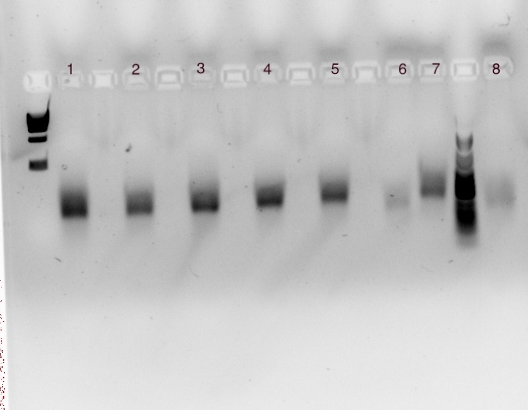
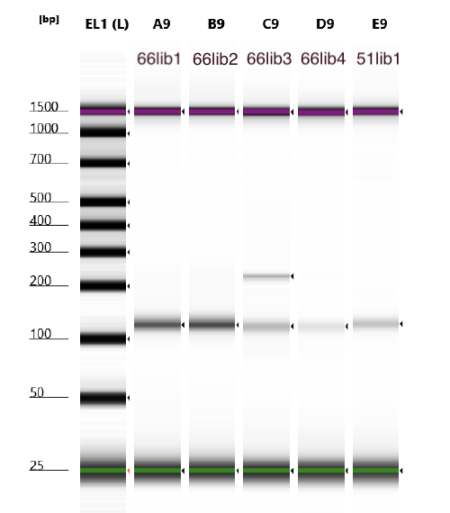
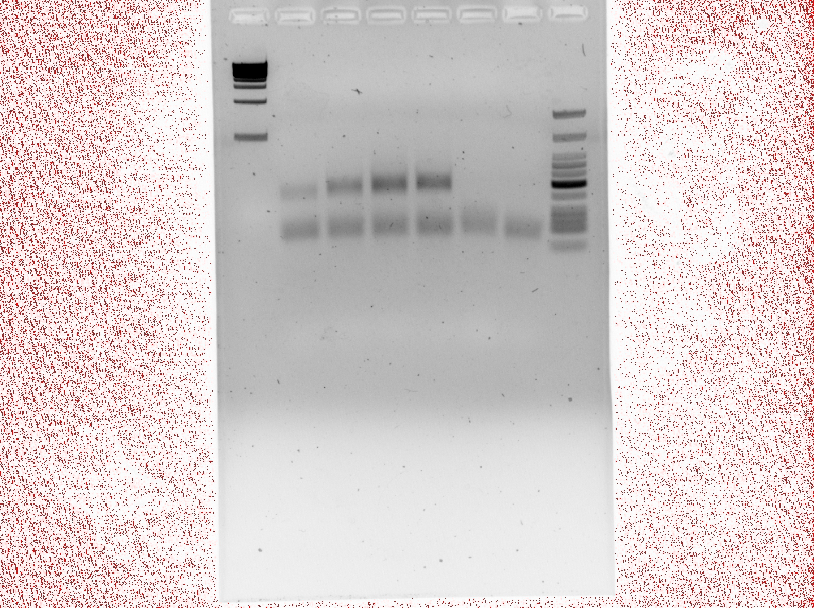
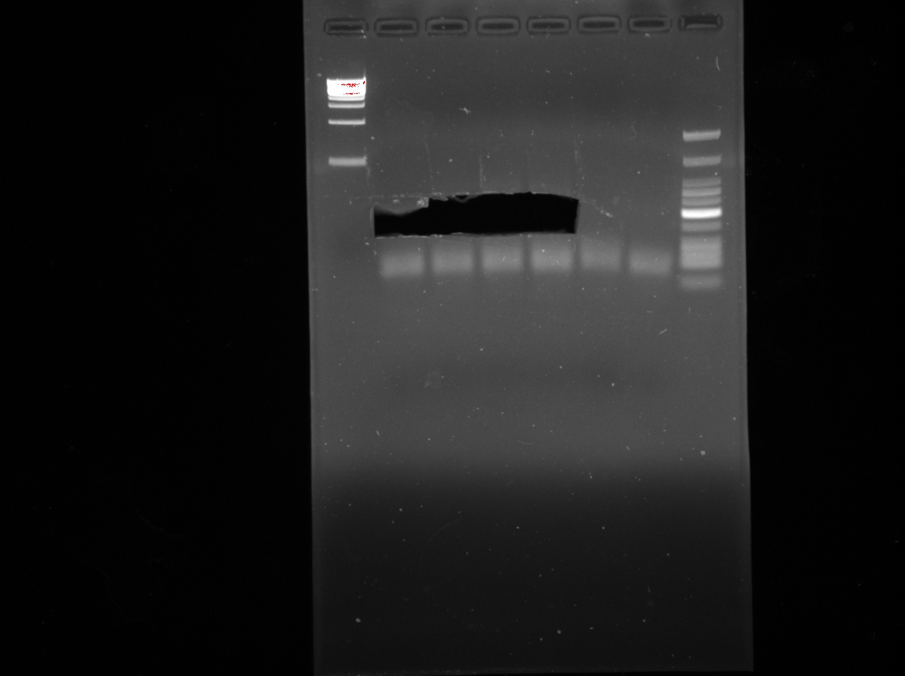
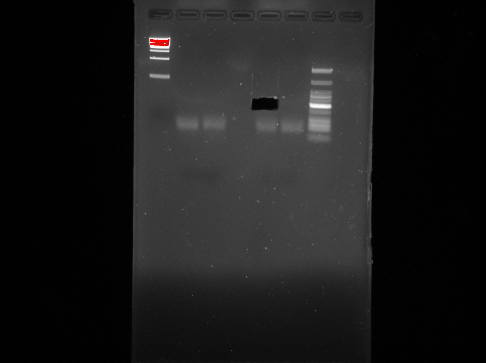

# Background
- Exp65: high-efficiency transformation of full cytosolic 8x dicodon library into Hel2-del and Syh1-del yeast
- https://github.com/rasilab/rqc_aggregation_aging/issues/113
- Harvest pellets at 50mL of OD0.4 (~200 million cells)

# Goal
Library prep exp65 cytosolic 8x dicodon library in hel2-del and syh1-del cells

# Strategy
- Maintaining representation in gDNA for a 200,000 barcode library:
  - Extract/shear/cleanup >=2ug gDNA (>=1000x per cell)
  - Input >=2ug gDNA into IVT reaction, IVT should amplify the gDNA ~50x
  - Input at least half of the gRNA into RT reaction
  - Input 20% of RT product into R1 reaction
  - Input 25-50% of R1 product in R2
- Maintaining representation in RNA for a 200,000 barcode library:
  - Extract >=10ug RNA from cells
  - Input at least half of that yield into the RT reaction, splitting up or doing >=100uL reactions if needed
  - Input 20% of RT product into R1 reaction
  - Input 25-50% of R1 product in R2

# Procedure
- Extract gDNA from 6x50mL pellets in 35uL tris each time (210uL total)
- Harvest RNA from one pellet and expect >=10ug yield as usual

### Extract gDNA
- Standard protocol for 50mL of OD 0.4 culture pellet, or ~2e8 cells or 4x the manufacturer protocol
- Prewarm 10mM Tris pH8 to 65C
- Protocol:
  - Take 6x50mL pellets out from -80C onto ice
  - add YD digestion buffer and zymolyase
    - 3mL YD digestion buffer (combined two kits)
    - 125uL zymolyase E1004-1 (I think there was ~115-120uL left)
  - resuspend pellet in 240uL mix and transfer to eppy
    - do 5xpellets for 1408 and 5xpellets for 192, wiping pipette with ethanol between each sample
    - after confirming there is enough mix, do the final pellet for each (wiping between each sample)
  - realized I should have done 250uL not 240uL, so went back and added 10uL to all 1408 samples and 5 out of 6 of the 192 samples (ran out)
  - 2022-08-29 16:48 Incubate at 37°C for 45 minutes 500rpm (our lab's eppendorf block thingy).
    - You should be able to see if cells are completely or incompletely lysed following this step (aka the solution should go from cloudy to clear)
  - Add 120 μl of YD Lysis Buffer -> vortex hard for 10-20 seconds
  - Add 250 μl of chloroform. Mix thoroughly for 1 minute.
  - Centrifuge in a table top centrifuge at >10,000 rpm for 2 minutes.
  - Separate the top phase into a separate eppy
    - The liquid will be separated into 2 aqueous phase and separated by a thin white line in between. Be careful not to disturb the white line and anything below!! Leave some behind if you need to!
  - Load 1/6 of the supernatant onto Zymo-spin III column (x2 columns at a time) and centrifuge at >10,000 rpm for 1 minute.
  - Add 300 μl of DNA Wash Buffer and centrifuge for 1 minute at ≥10,000 rpm to wash. Add another 300 μl of DNA Wash Buffer to repeat the wash and centrifuge for 1 minute.
  - Transfer the Zymo-spin III column to a new 1.5 ml centrifuge tube and add 50 μl prewarmed 10mM Tris pH8 directly onto the membrane. incubate 3m and spin 1m max speed
    - spin into one agilent eppy one at a time, so the first column will incubate less than the second column
  - Then repeat until all top phase is washed/eluted into the same agilent eppy
  - Nanodrop the final eluate: expect 6ug from 6x50mL OD0.4 pellets
    - scHP1408::1142: ~350-400uL at 49.7ng/uL -> 17.4ug to 19.9ug, 1.90/1.54
    - scKC192::1142: ~350-400uL at 37ng/uL -> 12.95ug to 14.8ug, 1.96/1.54

| genotype            | ng/uL | 260/280 | 260/230 | vol        | amt               |
| ------------------- | ----- | ------- | ------- | ---------- | ----------------- |
| scHP1408::pHPSC1142 | 49.7  | 1.90    | 1.54    | 350-400 uL | 17.4ug to 19.9ug  |
| scKC192::pHPSC1142  | 37    | 1.96    | 1.44    | 350-400 uL | 12.95ug to 14.8ug |

### Shear gDNA
- 2022-08-29 19:30 Shear 30s on/off 10m balanced, (Agilent eppies, use H2O to balance)
  - VIDD bldg 4th floor
  - fill with one small bucket of ice
  - fill to line with MQ
- Nanodrop after shearing

| genotype            | ng/uL | 260/280 | 260/230 | vol        | amt              |
| ------------------- | ----- | ------- | ------- | ---------- | ---------------- |
| scHP1408::pHPSC1142 | 52.2  | 1.88    | 1.43    | 350-400 uL | 18.3ug to 20.9ug |
| scKC192::pHPSC1142  | 41.7  | 1.87    | 1.28    | 350-400 uL | 14.6ug to 16.7ug |

### Clean up and concentrate gDNA
- 2022-08-29 20:14 Add 2:1 DNA Binding buffer to sheared sample, pipette to mix
  - recall uprep mini holds 25ug
  - add 800uL DNA binding buffer to each sample
- Transfer 500uL to uprep mini column, spin, repeat for remaining sample
- Wash 700uL DNA Wash buffer (20mM pH7 Tris 80% ethanol)
- spin ~1m to remove any residual ethanol
- Elute 21uL prewarmed 10mM Tris pH 8 (incubate on column 5m)
- Nanodrop, expect a >=50% drop in gDNA amount
  - since the 260/280 is steadily approaching 1.8, I suspect a lot of the amt lost is RNA getting degraded during sonication

| label   | genotype            | ng/uL | 260/280 | 260/230 | vol   | amt     | amt lost |
| ------- | ------------------- | ----- | ------- | ------- | ----- | ------- | -------- |
| 66gDNA1 | scHP1408::pHPSC1142 | 238   | 1.86    | 2.36    | 20 uL | 4.76 ug | ~13 ug   |
| 66gDNA2 | scKC192::pHPSC1142  | 216.6 | 1.85    | 2.38    | 20 uL | 4.33 ug | ~9 ug    |

### IVT gDNA -> gRNA
- Wear gloves and use nuclease-free tubes and reagents to avoid RNase contamination. 
- Reactions should be assembled in nuclease-free microfuge tubes or PCR strip tubes.
- Thaw the T7 HIScribe kit components (orange box), mix and pulse-spin in microfuge to collect solutions to bottom of tubes. Keep on ice.
- Out of superaseIn, I managed to get out ...0.4uL? of whatever was at the bottom and put into the MM
- Use the aliquots of all NTPs so you avoid freeze-thaws
- Assemble the reaction mastermix at room temperature:

| Reagent                | 1x vol  | Conc.           | 2.5X MM |
| :--------------------- | :------ | :-------------- | ------- |
| 10X Reaction Buffer    | 2.5 μl  | –               | 6.25    |
| NTP mastermix (100 mM) | 10 μl   | 10 mM final/NTP | 25      |
| T7 RNA Polymerase Mix  | 2.5 μl  | –               | 6.25    |
| Superase-In            | 0.313   | –               | ~0.4 uL |
| Template DNA           | 10 μl   | >=2ug           | --      |
| Total reaction volume  | 25.3 uL |                 | 38.3    |

- 2022-08-29 20:55
- Aliqout 15uL of this mastermix into one PCR strip tube and add 10uL gDNA
- Aliquot 6.125uL mastermix and add 4uL of diluted Fluc control template
- Mix thoroughly, pulse-spin in microfuge. 
- Incubate at 37°C O/N
- Skip DNase-tx since the IVT is just to make the amplification proceed better
- 2022-08-30 10:30 Clean up with RNA clean and concentrator kit, following manufacturer protocol
  - Add 25uL ultrapure H2O to both samples (40uL to fluc control) to make final volume 50uL
  - Add 100uL RNA binding buffer to all samples
  - Add 150uL 100% ethanol -> zymo IICR column -> spin 30s max speed
    - if no more zymo IC in kit then use zymo IICR (from direct-zol rna kit) and up the elution vol to ~25uL
  - 400uL RNA prep buffer -> 30s max
  - 700uL RNA wash buffer -> 1m max
  - empty and spin 30s to remove all ethanol
- Elute into 30uL of RNase-free ultrapure H20

| label   | gDNA input   | genotype              | ng/uL  | 260/280 | 260/230 | vol | amt   | loc             |
| ------- | ------------ | --------------------- | ------ | ------- | ------- | --- | ----- | --------------- |
| 66gRNA1 | 66gDNA1      | scHP1408::pHPSC1142   | 680.9  | 2.05    | 2.54    | 28  | 19 ug | KChen RNA box 4 |
| 66gRNA2 | 66gDNA2      | scKC192::pHPSC1142    | 612.3  | 2.04    | 2.48    | 28  | 17 ug | KChen RNA box 4 |
| 66gRNA3 | fluc plasmid | ~300ng fluc (74ng/uL) | 1509.9 | 2.15    | 2.44    | 28  | 42 ug | KChen RNA box 4 |

- 2022-08-30 11:00 keep on ice until RT

### Extract mRNA
- 2022-08-30 11:15
- For 50mL OD0.4 pellet: 400uL trizol should produce a yield of 5-13 ug, make sure to elute in H2O
- Perform all column-related steps at RT unless otherwise noted
- Set centrifuge to 4C
- Add 400uL trizol to each yeast pellet and triturate to resuspend
- Transfer trizol+yeast to eppy with 500uL glass beads (G8772 yeast, Sigma) in an Agilent eppendorf tube
- Vortex 9m in cold room
  - 2m-3m on/30s off
- Invert the tube and poke hole with 21G needle, then poke hole at top, rest at the top of 15mL conical (wipe eppy with ethanol first)
- Spin 4000rpm 4C 5min (cold room) to collect lysate
  - May see pellet of debris at bottom of falcon
- Transfer supernatant to pre-chilled eppy
- Spin 20,000g, 4C, 5min
  - Note you will not see any phases after this spin but you might see some debris/glass beads
- Transfer ~400 uL supernatant to new eppy and add 1X volume of 100% ethanol and mix thoroughly
- Transfer into Zymo-Spin IIC columns -> spin max and transfer to new collection tube
  - 800uL volume is ~max for spin columns generally
- DNase1-tx
  - Add 400uL RNA wash buffer to column and spin
  - Make MM of Dnase I in digestion buffer:
    - The 1500U tube in HPark's -20C (E1011-A)
    - 5uL DNase I -> 10.5uL 
    - 75uL DNA digestion buffer -> 157.5uL
    - Mix and add 80uL directly to column
  - Incubate RT 15m
- Add 400µl Direct-zol RNA PreWash to the column and centrifuge. 
- Discard the flow-through and repeat
- Add 700µl RNA Wash Buffer to the column and centrifuge for 2 minutes to ensure complete removal of wash buffer
- Transfer column very carefully to RNAse-free tube, don't let column touch any buffer in collection tube
- To elute RNA, add 50µl DNase/RNase-Free Water directly to the column matrix and spin max speed
- Generally, want purities >1.8 for NGS

| label  | genotype            | ng/uL | 260/280 | 260/230 | vol | amt     | loc             |
| ------ | ------------------- | ----- | ------- | ------- | --- | ------- | --------------- |
| 66RNA1 | scHP1408::pHPSC1142 | 322   | ~2.1    | ~2.4    | 48  | 15.5 ug | KChen RNA box 4 |
| 66RNA2 | scKC192::pHPSC1142  | 362   | ~2.1    | ~2.4    | 48  | 17.4 ug | KChen RNA box 4 |

### Reverse Transcription of mRNA & gRNA
- 2022-08-30 14:45
- use >=50% of the RNA yield for each reaction
- use 1/8 input for -RT controls and then subtract 3 cycles during qPCR when deciding if -RT controls are good or not

| Label   | Input       | Sample                   | ng/uL | uL   | uL H2O | amt     |
| ------- | ----------- | ------------------------ | ----- | ---- | ------ | ------- |
| 66cDNA1 | 66RNA1      | scHP1408::pHPSC1142 RNA  | 322   | 23.3 | 4.2    | 7.5ug   |
| 66cDNA2 | 66RNA1 -RT  | scHP1408::pHPSC1142 RNA  | 322   | 2.9  | 24.6   | 0.938ug |
| 66cDNA3 | 66RNA2      | scKC192::pHPSC1142 RNA   | 362   | 20.7 | 6.8    | 7.5ug   |
| 66cDNA4 | 66RNA2 -RT  | scKC192::pHPSC1142 RNA   | 362   | 2.6  | 24.9   | 0.938ug |
| 66cDNA5 | 66gRNA1     | scHP1408::pHPSC1142 gRNA | 680.9 | 14.7 | 12.8   | 10ug    |
| 66cDNA6 | 66gRNA1 -RT | scHP1408::pHPSC1142 gRNA | 680.9 | 1.84 | 25.66  | 1.25ug  |
| 66cDNA7 | 66gRNA2     | scKC192::pHPSC1142 gRNA  | 612.3 | 16.3 | 11.2   | 10ug    |
| 66cDNA8 | 66gRNA2 -RT | scKC192::pHPSC1142 gRNA  | 612.3 | 2.04 | 25.46  | 1.25ug  |

- 50uL reactions
- Set up rxns for annealing template to oligo:

| Reagent      | μl/rxn | note                   | 8.5X MM | Note                                        |
| :----------- | :----- | :--------------------- | ------- | ------------------------------------------- |
| 10 mM dNTP   | 2.5    | use Rnase-free aliquot | 21.25   | made by pnugent KChen RNA Reagents 2        |
| 10 μM oPB354 | 2.5    | use Rnase-free aliquot | 21.25   | made from Phil's 100uM stock in oligo box 5 |
| RNA template | 27.5   | >=5ug for total RNA    |         | SSIV protocol: max 5ug/20uL, 12.5ug/50uL    |
| TOTAL        | 32.5   | 27.5/rxn               |         |                                             |

- Add 5uL MM to each 27.5uL diluted RNA sample
- Incubate at 65 C for 5 mins, then on ice for >1 min.
- Prepare RT rxn mixes:

| Reagent                   | μl/rxn | amt      | 4.5X MM | Note                            |
| :------------------------ | :----- | :------- | ------- | ------------------------------- |
| 5X commercial SSIV buffer | 10     | 1x       | 45      | commercial vial                 |
| 100 mM DTT                | 2.5    | 5mM      | 11.25   | single use aliquot              |
| SuperaseIN                | 2.5    | 50U      | 11.25   | commerical vial                 |
| Homemade SSIV 2.43mg/uL   | 2.5    |          | 11.25   | aliquot in KChen RNA Reagents 2 |
| TOTAL                     | 17.5   | 17.5/rxn |         |                                 |

- Add 17.5 μl of this MM to each RT rxn.
- Prepare noRT rxn mixes:

| Reagent                   | μl/rxn | amt      | 4.5X MM |
| :------------------------ | :----- | :------- | ------- |
| 5X commercial SSIV buffer | 10     | 1x       | 45      |
| 100 mM DTT                | 2.5    | 5mM      | 11.25   |
| SuperaseIN                | 2.5    |          | 11.25   |
| H2O                       | 2.5    |          | 11.25   |
| TOTAL                     | 17.5   | 17.5/rxn |         |

- Add 17.5 μl of this MM to each noRT rxn.
- Incubate rxns at 50C for 30 mins, then 80C for 10 mins.
- Put on ice and proceed directly to qPCRs
  - Multichannel 10uL strip tubes neat aliquots (each strip is 20% of the RT reaction)
- Save all strip tubes in KChen cDNA box

### qPCR dilution curve
- 2022-08-30 16:00
- Dilute 10uL neat RT reactions up 2x into 10uL ultrapure H2O for 1:2
- Serially dilute 10uL + 10uL ultrapure H2O (1:4) until 1:128
- Goal is to use 20% of the RT product in an R1 reaction large enough s.t. RT product does not exceed 20% R1 reaction volume
- Aliquot 16uL MM per tube
- Multichannel 4uL diluted sample per tube
- Keep reagents on ice until real round 1

| Reagent                                  | μl/rxn | amt   | 62X MM |
| :--------------------------------------- | :----- | :---- | ------ |
| ultrapure H2O                            | 9.2    |       | 570.4  |
| 5X Phusion HF clear buffer               | 4      | 1X    | 248    |
| Phusion polymerase                       | 0.2    |       | 12.4   |
| 10 mM dNTPs                              | 0.4    | 0.2mM | 24.8   |
| 10uM oHP534 F                            | 1      | 0.5uM | 62     |
| 10uM oPB354 R                            | 1      | 0.5uM | 62     |
| 100X Sybr Green                          | 0.2    | 1X    | 12.4   |
| template cDNA diluted or diluted plasmid | 4      |       | --     |
| TOTAL                                    | 20uL   |       | 992    |

| Tube | cDNA input | sample      | dil    | input uL    | CT          | well |
| ---- | ---------- | ----------- | ------ | ----------- | ----------- | ---- |
| 1    | 66cDNA1    | 66RNA1      | 1:2    | 4           | UND         | H1   |
| 2    | 66cDNA2    | 66RNA1 -RT  | 1:2    | 4           | 27-3=24     | G1   |
| 3    | 66cDNA3    | 66RNA2      | 1:2    | 4           | UND         | F1   |
| 4    | 66cDNA4    | 66RNA2 -RT  | 1:2    | 4           | 27-3=24     | E1   |
| 5    | 66cDNA5    | 66gRNA1     | 1:2    | 4           | 7           | D1   |
| 6    | 66cDNA6    | 66gRNA1 -RT | 1:2    | 4           | 17-3=14     | C1   |
| 7    | 66cDNA7    | 66gRNA2     | 1:2    | 4           | 7           | B1   |
| 8    | 66cDNA8    | 66gRNA2 -RT | 1:2    | 4           | 17-3=14     | A1   |
| 9    | 66cDNA1    | 66RNA1      | 1:4    | 4           | 24          | H2   |
| 10   | 66cDNA2    | 66RNA1 -RT  | 1:4    | 4           | 26-3=23     | G2   |
| 11   | 66cDNA3    | 66RNA2      | 1:4    | 4           | 23          | F2   |
| 12   | 66cDNA4    | 66RNA2 -RT  | 1:4    | 4           | 26-3=23     | E2   |
| 13   | 66cDNA5    | 66gRNA1     | 1:4    | 4           | 7           | D2   |
| 14   | 66cDNA6    | 66gRNA1 -RT | 1:4    | 4           | 17-3=14     | C2   |
| 15   | 66cDNA7    | 66gRNA2     | 1:4    | 4           | 7           | B2   |
| 16   | 66cDNA8    | 66gRNA2 -RT | 1:4    | 4           | 18-3=15     | A2   |
| 17   | 66cDNA1    | 66RNA1      | 1:8    | 4           | 18          | H3   |
| 18   | 66cDNA2    | 66RNA1 -RT  | 1:8    | 4           | 24-3=21     | G3   |
| 19   | 66cDNA3    | 66RNA2      | 1:8    | 4           | 18          | F3   |
| 20   | 66cDNA4    | 66RNA2 -RT  | 1:8    | 4           | 25-3=22     | E3   |
| 21   | 66cDNA5    | 66gRNA1     | 1:8    | 4           | 7           | D3   |
| 22   | 66cDNA6    | 66gRNA1 -RT | 1:8    | 4           | 18-3=15     | C3   |
| 23   | 66cDNA7    | 66gRNA2     | 1:8    | 4           | 8           | B3   |
| 24   | 66cDNA8    | 66gRNA2 -RT | 1:8    | 4           | 18-3=15     | A3   |
| 25   | 66cDNA1    | 66RNA1      | 1:16   | 4           | 16          | H4   |
| 26   | 66cDNA2    | 66RNA1 -RT  | 1:16   | 4           | 24-3=21     | G4   |
| 27   | 66cDNA3    | 66RNA2      | 1:16   | 4           | 16          | F4   |
| 28   | 66cDNA4    | 66RNA2 -RT  | 1:16   | 4           | 24-3=21     | E4   |
| 29   | 66cDNA5    | 66gRNA1     | 1:16   | 4           | 8           | D4   |
| 30   | 66cDNA6    | 66gRNA1 -RT | 1:16   | 4           | 19-3=16     | C4   |
| 31   | 66cDNA7    | 66gRNA2     | 1:16   | 4           | 8           | B4   |
| 32   | 66cDNA8    | 66gRNA2 -RT | 1:16   | 4           | 19-3=16     | A4   |
| 33   | 66cDNA1    | 66RNA1      | 1:32   | 4           | 16          | H5   |
| 34   | 66cDNA2    | 66RNA1 -RT  | 1:32   | 4           | 24-3=21     | G5   |
| 35   | 66cDNA3    | 66RNA2      | 1:32   | 4           | 16          | F5   |
| 36   | 66cDNA4    | 66RNA2 -RT  | 1:32   | 4           | 24-3=21     | E5   |
| 37   | 66cDNA5    | 66gRNA1     | 1:32   | 4           | 9           | D5   |
| 38   | 66cDNA6    | 66gRNA1 -RT | 1:32   | 4           | 20-3=17     | C5   |
| 39   | 66cDNA7    | 66gRNA2     | 1:32   | 4           | 9           | B5   |
| 40   | 66cDNA8    | 66gRNA2 -RT | 1:32   | 4           | 20-3=17     | A5   |
| 41   | 66cDNA1    | 66RNA1      | 1:64   | 4           | 16          | H6   |
| 42   | 66cDNA2    | 66RNA1 -RT  | 1:64   | 4           | 23.5-3=20.5 | G6   |
| 43   | 66cDNA3    | 66RNA2      | 1:64   | 4           | 16          | F6   |
| 44   | 66cDNA4    | 66RNA2 -RT  | 1:64   | 4           | 24-3=21     | E6   |
| 45   | 66cDNA5    | 66gRNA1     | 1:64   | 4           | 10          | D6   |
| 46   | 66cDNA6    | 66gRNA1 -RT | 1:64   | 4           | 21-3=18     | C6   |
| 47   | 66cDNA7    | 66gRNA2     | 1:64   | 4           | 10          | B6   |
| 48   | 66cDNA8    | 66gRNA2 -RT | 1:64   | 4           | 21-3=18     | A6   |
| 49   | 66cDNA1    | 66RNA1      | 1:128  | 4           | 17          | H7   |
| 50   | 66cDNA2    | 66RNA1 -RT  | 1:128  | 4           | 23-3=20     | G7   |
| 51   | 66cDNA3    | 66RNA2      | 1:128  | 4           | 16          | F7   |
| 52   | 66cDNA4    | 66RNA2 -RT  | 1:128  | 4           | 23.5-3=20.5 | E7   |
| 53   | 66cDNA5    | 66gRNA1     | 1:128  | 4           | 11          | D7   |
| 54   | 66cDNA6    | 66gRNA1 -RT | 1:128  | 4           | 21-3=18     | C7   |
| 55   | 66cDNA7    | 66gRNA2     | 1:128  | 4           | 11          | B7   |
| 56   | 66cDNA8    | 66gRNA2 -RT | 1:128  | 4           | 21-3=18     | A7   |
| 57   |            | pHPSC1142   | 1ng/uL | 1 + 3uL H2O | 10          | H8   |
| 58   |            | ultrapure   | 0      | 4           | UND         | G8   |

- George 96well

| Cycles | Temp | Time |
| ------ | ---- | ---- |
| 1      | 98   | 120s |
| 30     | 98   | 20s  |
|        | 60C  | 20s  |
|        | 72   | 20s  |

- Pick reactions with Cts around 14 for RNA and 4 for gRNA and where noRT controls are >=5 cycles (after subtracting 3) from RT reactions:

| cDNA input | sample      | best dil | CT  | tube |
| ---------- | ----------- | -------- | --- | ---- |
| 66cDNA1    | 66RNA1      | 1:16     | 16  | 25   |
| 66cDNA2    | 66RNA1 -RT  | 1:16     | 21  | 26   |
| 66cDNA3    | 66RNA2      | 1:16     | 16  | 27   |
| 66cDNA4    | 66RNA2 -RT  | 1:16     | 21  | 28   |
| 66cDNA5    | 66gRNA1     | 1:2      | 7   | 5    |
| 66cDNA6    | 66gRNA1 -RT | 1:2      | 14  | 6    |
| 66cDNA7    | 66gRNA2     | 1:2      | 7   | 7    |
| 66cDNA8    | 66gRNA2 -RT | 1:2      | 14  | 8    |

- 2022-08-30 18:28 gel check these conditions to confirm band is 115bp
  - add 3uL 10X FD green -> load 15uL/well (maybe some leaking happening)
  - 2% gel 150V 13m

- Scale up the reaction conditions for R1 accordingly
- RNA samples:
  - dilute 10uL neat aliquot RT reaction up 1:16 to 160uL (20% of total 50uL RT reaction)
  - input into Round 1 rxn at 20% reaction volume: 160uL into 800uL R1 reaction
  - split up into 16x50uL aliquots for pcr
  - take out after 16 cycles
  - recombine into one eppy and clean up half the reaction into 40 uL uprep mini
- gRNA samples:
  - dilute 10uL neat aliquot RT reaction up 1:2 to 20uL (20% of total 50uL RT reaction)
  - input into Round 1 at 20% volume: 20uL into 100uL R1 reaction
  - split up into 2x50uL reactions for pcr
  - take out after 7 cycles
  - recombine into one eppy and clean up half the reaction into 40 uL with uprep mini

### Round 1
- 2022-08-30 19:00
- Make MM 

| Reagent                                  | μl/rxn | amt   | 22X  | note/loc                   |
| :--------------------------------------- | :----- | :---- | ---- | -------------------------- |
| ultrapure H2O                            | 47     |       | 1034 |                            |
| 5X Phusion HF clear buffer               | 20     | 1X    | 440  | KChen PCR box              |
| Phusion polymerase                       | 1      |       | 22   | aliquot from KChen PCR box |
| 10 mM dNTPs                              | 2      | 0.2mM | 44   | PN 2/11/22 + PN 5/23/22    |
| 10uM oHP534 F                            | 5      | 0.5uM | 110  | 10uM stock made 2022-08-30 |
| 10uM oPB354 R                            | 5      | 0.5uM | 110  | 10uM stock made 2022-08-30 |
| template cDNA diluted or diluted plasmid | 20     |       | --   |                            |
| TOTAL                                    | 100uL  |       | 1760 |                            |

| Tube | cDNA input | sample      | dil  | uL H2O | uL cDNA | uL MM  | total rxn vol | split   |
| ---- | ---------- | ----------- | ---- | ------ | ------- | ------ | ------------- | ------- |
| 1    | 66cDNA1    | 66RNA1      | 1:16 | 150 uL | 160 uL  | 640 uL | 800 uL        | 16x50uL |
| 2    | 66cDNA2    | 66RNA1 -RT  | 1:16 | 150 uL | 10 uL   | 40 uL  | 50 uL         | 1x50uL  |
| 3    | 66cDNA3    | 66RNA2      | 1:16 | 150 uL | 160 uL  | 640 uL | 800 uL        | 16x50uL |
| 4    | 66cDNA4    | 66RNA2 -RT  | 1:16 | 150 uL | 10 uL   | 40 uL  | 50 uL         | 1x50uL  |
| 5    | 66cDNA5    | 66gRNA1     | 1:2  | 10 uL  | 20 uL   | 80 uL  | 100 uL        | 2x50uL  |
| 6    | 66cDNA6    | 66gRNA1 -RT | 1:2  | 10 uL  | 10 uL   | 40 uL  | 50 uL         | 1x50uL  |
| 7    | 66cDNA7    | 66gRNA2     | 1:2  | 10 uL  | 20 uL   | 80 uL  | 100 uL        | 2x50uL  |
| 8    | 66cDNA8    | 66gRNA2 -RT | 1:2  | 10 uL  | 10 uL   | 40 uL  | 50 uL         | 1x50uL  |

| Cycles | Temp | Time |
| ------ | ---- | ---- |
| 1      | 98   | 120s |
| 7/16   | 98   | 20s  |
|        | 60C  | 20s  |
|        | 72   | 20s  |

- 2022-08-30 19:45 Put directly in -20C
- 2022-08-31 18:00 Recombine back into one eppy -> clean up half
  - + 5:1 Zymo DNA binding buffer in an eppy
    - 2mL for 400uL 1/3
    - 250uL for 50uL 5/7
    - did not clean up 2/4/6/8 (noRT controls, just run on gel to confirm no band)
  - + 700uL DNA wash buffer
  - spin 1m to remove all ethanol
  - Elute in 40uL 10mM Tris pH8 (incubate ~5m RT)
  - Store remaining half in -20C as backup
- 2022-08-31 18:12 -20C
- 2022-09-01 15:10 run 20uL noRT reactions on gel to confirm there is no band

## Round 2 qPCR dilution curve
- Take 10uL cleaned up Round 1 product and add 10uL H2O -> 1:2 -> serially dilute until 1:256
- Use 8uL as template for each reaction (~20uL of each reaction left after this)
- Keep on ice until real R2

| Reagent                    | μl/rxn | amt   | 35X |
| :------------------------- | :----- | :---- | --- |
| H2O                        | 5.2    |       | 182 |
| 5X Phusion HF clear buffer | 4      | 1X    | 140 |
| 10 mM dNTPs                | 0.4    | 0.2mM | 14  |
| Phusion polymerase         | 0.2    |       | 7   |
| 100X Sybr Green            | 0.2    | 1X    | 7   |
| 10uM oAS111 F              | 1      | 0.5uM | 35  |
| 10uM oAS130                | 1      | 0.5uM | 35  |
| template cleaned up R1     | 8      |       | 280 |
| TOTAL                      | 20uL   |       |     |

- Make MM and aliquot 12uL per tube
- Add 8uL diluted template to each tube
- Run on George

| Step                   | Temp | Time        |
| :--------------------- | :--- | :---------- |
| Initial Denaturation   | 98°C | 120 seconds |
| 20 Cycles Denaturation | 98°C | 20 seconds  |
| 20 Cycles Annealing    | 60°C | 20 seconds  |
| 20 Cycles              | 72°C | 20 seconds  |

| Tube | RT    | dil   | CT  | back-calc | adj CT | well |
| ---- | ----- | ----- | --- | --------- | ------ | ---- |
| 1    | cDNA1 | 1:2   | und | -1        | NA     | A1   |
| 2    | cDNA3 | 1:2   | und | -1        | NA     | A2   |
| 3    | cDNA5 | 1:2   | 4   | -1        | 3      | A3   |
| 4    | cDNA7 | 1:2   | 5   | -1        | 4      | A4   |
| 5    | cDNA1 | 1:4   | und | -2        | NA     | A5   |
| 6    | cDNA3 | 1:4   | und | -2        | NA     | A6   |
| 7    | cDNA5 | 1:4   | 5   | -2        | 3      | A7   |
| 8    | cDNA7 | 1:4   | 5   | -2        | 3      | A8   |
| 9    | cDNA1 | 1:8   | und | -3        | NA     | B1   |
| 10   | cDNA3 | 1:8   | und | -3        | NA     | B2   |
| 11   | cDNA5 | 1:8   | 5   | -3        | 2      | B3   |
| 12   | cDNA7 | 1:8   | 6   | -3        | 3      | B4   |
| 13   | cDNA1 | 1:16  | und | -4        | NA     | B5   |
| 14   | cDNA3 | 1:16  | und | -4        | NA     | B6   |
| 15   | cDNA5 | 1:16  | 6   | -4        | 2      | B7   |
| 16   | cDNA7 | 1:16  | 7   | -4        | 3      | B8   |
| 17   | cDNA1 | 1:32  | 4   | -5        | NA     | C1   |
| 18   | cDNA3 | 1:32  | und | -5        | NA     | C2   |
| 19   | cDNA5 | 1:32  | 7   | -5        | 2      | C3   |
| 20   | cDNA7 | 1:32  | 8   | -5        | 3      | C4   |
| 21   | cDNA1 | 1:64  | 5   | -6        | NA     | C5   |
| 22   | cDNA3 | 1:64  | 4   | -6        | NA     | C6   |
| 23   | cDNA5 | 1:64  | 8   | -6        | 2      | C7   |
| 24   | cDNA7 | 1:64  | 8   | -6        | 2      | C8   |
| 25   | cDNA1 | 1:128 | 6   | -7        | NA     | D1   |
| 26   | cDNA3 | 1:128 | 5   | -7        | NA     | D2   |
| 27   | cDNA5 | 1:128 | 9   | -7        | 2      | D3   |
| 28   | cDNA7 | 1:128 | 10  | -7        | 3      | D4   |
| 29   | H2O   |       | 20  |           | NA     | D5   |
| 30   | cDNA1 | 1:256 | 6   | -8        | 2      | D6   |
| 31   | cDNA3 | 1:256 | 6   | -8        | 2      | D7   |
| 32   | cDNA5 | 1:256 | 9   | -8        | 2      | D8   |
| 33   | cDNA7 | 1:256 | 11  | -8        | 3      | E1   |
| 34   | H2O   |       | 21  |           | NA     | E2   |

- Run R2 at adjusted CT+2 and adjusted CT+3

| RT    | adj CT | cycles to try |
| ----- | ------ | ------------- |
| cDNA1 | 1-2    | 4,5           |
| cDNA3 | 2      | 4,5           |
| cDNA5 | 2-3    | 4,5,6         |
| cDNA7 | 3-4    | 5,6,7         |
| H2O   |        |               |

- Do 4,5,6 for all samples

## Round 2 PCR
- 2022-09-01 15:10
- Other indices being used by other people during this run (make sure there is no redundancy):

| oligo  | ix   | ix seq |
| ------ | ---- | ------ |
| oKC196 | 7006 | GTGTAG |
| oPN730 | 24   | GGTAGC |
| oPN734 | 25   | ACTGAT |
| oKC197 | 7007 | CTAGTC |
| oKC192 | 7001 | CAGCGT |
| oKC193 | 7002 | GATCAC |
| oKC194 | 7003 | ACCAGT |
| oKC195 | 7004 | TGCACG |
| -      |      |        |
| oAS127 | 16   | CCGTCC |
| oAS128 | 17   | GTAGAG |
| oAS129 | 18   | GTCCGC |
| oAS130 | 19   | GTGAAA |

| Library name | sample    | desc                     | cleaned R1 | RT      | RNA     | oligo  | ix  | ix seq |
| ------------ | --------- | ------------------------ | ---------- | ------- | ------- | ------ | --- | ------ |
| 66lib1       | hel2_rna  | scHP1408::pHPSC1142 RNA  | 66R1PCR1   | 66cDNA1 | 66RNA1  | oAS127 | 16  | CCGTCC |
| 66lib2       | syh1_rna  | scKC192::pHPSC1142 RNA   | 66R1PCR3   | 66cDNA3 | 66RNA2  | oAS128 | 17  | GTAGAG |
| 66lib3       | hel2_gdna | scHP1408::pHPSC1142 gRNA | 66R1PCR5   | 66cDNA5 | 66gRNA1 | oAS129 | 18  | GTCCGC |
| 66lib4       | syh1_gdna | scKC192::pHPSC1142 gRNA  | 66R1PCR7   | 66cDNA7 | 66gRNA2 | oAS130 | 19  | GTGAAA |

- Add 8uL to each reaction

| Tube | RT input | cycles | total cycles | index  |
| :--- | :------- | ------ | ------------ | ------ |
| 1    | cDNA1    | 4      | 20           | oAS127 |
| 2    | cDNA3    | 4      | 20           | oAS128 |
| 3    | cDNA5    | 4      | 11           | oAS129 |
| 4    | cDNA7    | 4      | 11           | oAS130 |
| 5    | H2O      | 4      |              | oAS128 |
| 6    | cDNA1    | 5      | 21           | oAS127 |
| 7    | cDNA3    | 5      | 21           | oAS128 |
| 8    | cDNA5    | 5      | 12           | oAS129 |
| 9    | cDNA7    | 5      | 12           | oAS130 |
| 10   | H2O      | 5      |              | oAS128 |
| 11   | cDNA1    | 6      | 22           | oAS127 |
| 12   | cDNA3    | 6      | 22           | oAS128 |
| 13   | cDNA5    | 6      | 13           | oAS129 |
| 14   | cDNA7    | 6      | 13           | oAS130 |
| 15   | H2O      | 6      |              | oAS128 |

| Reagent                    | μl/rxn | amt   | 17X  |
| :------------------------- | :----- | :---- | ---- |
| H2O                        | 5.4    |       | 91.8 |
| 5X Phusion HF clear buffer | 4      | 1X    | 68   |
| 10 mM dNTPs                | 0.4    | 0.2mM | 6.8  |
| Phusion polymerase         | 0.2    |       | 3.4  |
| 10uM oAS111 F              | 1      | 0.5uM | 17   |
| 10uM oAS R                 | 1      | 0.5uM | --   |
| template cleaned up R1     | 8      |       | --   |
| TOTAL                      | 20uL   |       |      |

- Aliquot 11uL per tube
- Add 8uL undiluted cleaned up R1 reaction
- Add 1uL index primer
- Thermocycle

| Step                      | Temp | Time        |
| :------------------------ | :--- | :---------- |
| Initial Denaturation      | 98°C | 120 seconds |
| 4/5/6 Cycles Denaturation | 98°C | 20 seconds  |
| 4/5/6 Cycles Annealing    | 60°C | 20 seconds  |
| 4/5/6 Cycles              | 72°C | 20 seconds  |

- Add 2uL 10X FD Green and run full product on 2% wide-well gel
- 150V 15m
- slice out all visible bands and purify in ascending cycle order through the same columns per sample

- 2022-09-01 16:30 Add 1:3 gel dissolving buffer (300uL for ~100uL gel slice)
  - Shake 55C 500rpm 10min until dissolved
  - Transfer to Uprep micro tubes and spin 30s max speed
  - +400uL DNA wash buffer (20mM Tris pH 7 in 80% ethanol)
  - +400uL DNA wash buffer (20mM Tris pH 7 in 80% ethanol)
  - Elute 12uL 10mM Tris pH8

| sample      | qubit |
| ----------- | ----- |
| 66lib1 4cyc |       |
| 66lib2 4cyc |       |
| 66lib3 4cyc |       |
| 66lib4 4cyc |       |
| -           |       |
| 66lib1 5cyc | 0.62  |
| 66lib2 5cyc | 0.748 |
| 66lib3 5cyc | 0.372 |
| 66lib4 5cyc | 0.318 |
| 66lib1 6cyc | 0.490 |
| 66lib2 6cyc | 0.809 |
| 66lib3 6cyc |       |
| 66lib4 6cyc |       |

- 2022-09-01 18:05 Qubit quantify
  - I will probably want to use the 4cycle samples, but I want to be sure that I have amplicons to work with at all and am nervous that the bands did not appear to increase with intensity with each cycle like they usually do. So I will qubit a few of the 5/6 cycle samples to make sure things look ok.
  - 8 samples + 2 standards = 8*200uL = 1600uL (miscalculated, should have been 10)
  - 8uL qubit + 1592uL buffer
  - 190uL / standard, 199uL / sample
  - 10uL standard / 1uL sample

## Repeat round 2 PCR for RNA samples at lower cycles
- I am concerned about how cycles 4/5/6 for RNA samples don't seem to increase
- 2022-09-02 11:28 clean up 1/2 of remaining R1 reactions (~1/4 of full R1)
  - + 5:1 Zymo DNA binding buffer in an eppy
    - 1mL for 200uL 1/3
  - + 700uL DNA wash buffer
  - spin 1m to remove all ethanol
  - Elute in 20uL 10mM Tris pH8 (incubate ~5m RT)
  - Store remaining in -20C as backup

| Library name | sample    | desc                     | cleaned R1 | RT      | RNA     | oligo  | ix  | ix seq |
| ------------ | --------- | ------------------------ | ---------- | ------- | ------- | ------ | --- | ------ |
| 66lib1       | hel2_rna  | scHP1408::pHPSC1142 RNA  | 66R1PCR1   | 66cDNA1 | 66RNA1  | oAS127 | 16  | CCGTCC |
| 66lib2       | syh1_rna  | scKC192::pHPSC1142 RNA   | 66R1PCR3   | 66cDNA3 | 66RNA2  | oAS128 | 17  | GTAGAG |

- Add 8uL to each reaction

| Tube | RT input | cycles | total cycles | index  |
| :--- | :------- | ------ | ------------ | ------ |
| 1    | cDNA1    | 2      | 18           | oAS127 |
| 2    | cDNA3    | 2      | 18           | oAS128 |
| 3    | H2O      | 2      |              | oAS128 |
| 4    | cDNA1    | 3      | 19           | oAS127 |
| 5    | cDNA3    | 3      | 19           | oAS128 |
| 6    | H2O      | 3      |              | oAS128 |

| Reagent                    | μl/rxn | amt   | 7X   |
| :------------------------- | :----- | :---- | ---- |
| H2O                        | 5.4    |       | 37.8 |
| 5X Phusion HF clear buffer | 4      | 1X    | 28   |
| 10 mM dNTPs                | 0.4    | 0.2mM | 2.8  |
| Phusion polymerase         | 0.2    |       | 1.4  |
| 10uM oAS111 F              | 1      | 0.5uM | 7    |
| 10uM oAS R                 | 1      | 0.5uM | --   |
| template cleaned up R1     | 8      |       | --   |
| TOTAL                      | 20uL   |       |      |

- Aliquot 11uL per tube
- Add 8uL undiluted cleaned up R1 reaction
- Add 1uL index primer
- Thermocycle

| Step                    | Temp | Time        |
| :---------------------- | :--- | :---------- |
| Initial Denaturation    | 98°C | 120 seconds |
| 2/3 Cycles Denaturation | 98°C | 20 seconds  |
| 2/3 Cycles Annealing    | 60°C | 20 seconds  |
| 2/3 Cycles              | 72°C | 20 seconds  |

- Add >=2uL 10X FD Green and run full product on 2% wide-well gel, this time run the same samples next to each other
- 150V 23m

- slice out all bands and purify in ascending cycle order through the same columns per sample (use new columns from yesterday)
- Add 1:3 gel dissolving buffer (300uL for ~100uL gel slice)
  - Shake 55C 500rpm 10min until dissolved
  - Transfer to Uprep micro tubes and spin 30s max speed
  - +400uL DNA wash buffer (20mM Tris pH 7 in 80% ethanol)
  - +400uL DNA wash buffer (20mM Tris pH 7 in 80% ethanol)
  - Elute 12uL 10mM Tris pH8
- Observation/Summary:
  - I am concerned that again 2 and 3 cycles don't appear to increase in intensity. 66lib1 also looks like the 3cyc is shifted a bit upward compared to 2cyc, but that might just be something with the gel (maybe part of it got smushed or something).
  - I nanodropped the cleaned up R1 PCR products for all 4 libraries:
    - samples 1/2 are ~2.5ng/uL
    - samples 3/4 are around 0.3-0.4ng/uL
    - At 2.5ng/uL, 8uL on a gel would produce a band and would explain why all cycles look identical if all I'm seeing is just the (115bp) R1 product. But it looks like the 2% gel is able to resolve 170bp R2 product vs 115bp R1 product based on the low MW ladder, so it doesn't seem like what I'm seeing is just a band of R1 product.
    - So it seems like 2 cycles may be overamplifying? I also kinda messed up in that the 3cyc tubes both had ~2uL PCR product leftover by accident, so perhaps that would account for the lack of increase (2uL is ~5-10% of the reaction). This screwup means I won't know for sure
  - It also seems like if I was actually seeing just the R1 product band, then 8uL of 2.5ng/uL R1 PCR product would have to qubit at way higher of a concentration than ~0.7ng/uL or ~8ng (1/2 of the theoretical R1 input) as seen above.
  - Overall, the fact that the gel ladder resolves 115bp vs 170bp and I only see the 170bp band + qubit concentrations are low makes me think that the samples should be what I think they are and are perhaps just overamplified a little. The gDNA samples all look good.
- 2022-09-02 15:20 Handed off my 4 libraries to Patrick, who will qubit and pool them
  - Patrick's qubitting measured my lowest cycle samples (below) as being higher than all my samples yesterday
  - This might just be qubit variability (in the past, I feel like I've seen 2x margins of error when concentration is very low)

| library name | r1 cycles | r2 cycles | total cycles | qubit |
| ------------ | --------- | --------- | ------------ | ----- |
| 66lib1       | 16        | 2         | 18           | 1.21  |
| 66lib2       | 16        | 2         | 18           | 1.17  |
| 66lib3       | 7         | 4         | 11           | 0.554 |
| 66lib4       | 7         | 4         | 11           | 1.42  |

## Submitted samples

| Library name | sample    | desc                     | oligo  | ix  | ix seq | rc     |
| ------------ | --------- | ------------------------ | ------ | --- | ------ | ------ |
| 66lib1       | hel2_rna  | scHP1408::pHPSC1142 RNA  | oAS127 | 16  | CCGTCC | GGACGG |
| 66lib2       | syh1_rna  | scKC192::pHPSC1142 RNA   | oAS128 | 17  | GTAGAG | CTCTAC |
| 66lib3       | hel2_gdna | scHP1408::pHPSC1142 gRNA | oAS129 | 18  | GTCCGC | GCGGAC |
| 66lib4       | syh1_gdna | scKC192::pHPSC1142 gRNA  | oAS130 | 19  | GTGAAA | TTTCAC |

- provide 10uL sequencing primers at 100uM

| oligo   | desc                                   |
| ------- | -------------------------------------- |
| oPN705  | custom i7 primer                       |
| oAS1638 | custom i5 primer & custom read2 primer |

- Experiment information:

| Library name | sample    | desc                     | cleaned R1 | RT      | RNA     | R1 cycles | R2 cycles available | total | qubit |
| ------------ | --------- | ------------------------ | ---------- | ------- | ------- | --------- | ------------------- | ----- | ----- |
| 66lib1       | hel2_rna  | scHP1408::pHPSC1142 RNA  | 66R1PCR1   | 66cDNA1 | 66RNA1  | 16        | **2**,3,4,5,6       | 18    | 1.21  |
| 66lib2       | syh1_rna  | scKC192::pHPSC1142 RNA   | 66R1PCR3   | 66cDNA3 | 66RNA2  | 16        | **2**,3,4,5,6       | 18    | 1.17  |
| 66lib3       | hel2_gdna | scHP1408::pHPSC1142 gRNA | 66R1PCR5   | 66cDNA5 | 66gRNA1 | 7         | **4**,5,6           | 11    | 0.554 |
| 66lib4       | syh1_gdna | scKC192::pHPSC1142 gRNA  | 66R1PCR7   | 66cDNA7 | 66gRNA2 | 7         | **4**,5,6           | 11    | 1.42  |

- 2022-09-14 Run stats

| Library name | sample    | oligo  | ix  | qubit | length | target | actual | %target | bt2 aligned |
| ------------ | --------- | ------ | --- | ----- | ------ | ------ | ------ | ------- | ----------- |
| 66lib1       | hel2_rna  | oAS127 | 16  | 1.21  | 170    | 50mil  | 14mil  | 28%     | 10mil       |
| 66lib2       | syh1_rna  | oAS128 | 17  | 1.17  | 170    | 50mil  | 177K   | 0.354%  | 13K         |
| 66lib3       | hel2_gdna | oAS129 | 18  | 0.554 | 170    | 50mil  | 17mil  | 34%     | 12mil       |
| 66lib4       | syh1_gdna | oAS130 | 19  | 1.42  | 170    | 50mil  | 8mil   | 16%     | 5mil        |

- 2022-09-14 12:30 submit for HS D1000 TapeStation (35-1000bp, >3uL at 10-1000pg/uL)
  - for samples that need to be diluted 1:10, take 0.5uL into 4.5uL ultrapure H2O into strip tube
  - for samples that need to be diluted 1:2, take 1.5uL into 1.5uL ultrapure H2O in strip tube
  - 47lib7 had nothing left in tube, but I think it might have just evaporated. So I added 4uL ultrapure H2O and provided 0.5uL in 4.5uL

| TapeStation name | Library name | qubit | dil  | pg/uL | %target | libtype | tpstn pg/uL | ng/uL  | discrepancy | expected | actual |
| ---------------- | ------------ | ----- | ---- | ----- | ------- | ------- | ----------- | ------ | ----------- | -------- | ------ |
| KC1              | 66lib1       | 1.21  | 1:10 | 121   | 28%     | RNA     | 33          | 0.330  | 27%         | 13.5mil  | 14mil  |
| KC2              | 66lib2       | 1.17  | 1:10 | 117   | 0.354%  | RNA     | 7.8         | 0.078  | 7%          | 3mil     | 177K   |
| KC3              | 66lib3       | 0.554 | 1:2  | 277   | 34%     | gRNA    | 65.9+255    | 0.642  | 116%        | 58mil    | 17mil  |
| KC4              | 66lib4       | 1.42  | 1:10 | 142   | 16%     | gRNA    | 27.4        | 0.274  | 19%         | 9.5mil   | 8mil   |
| -----            | ------       |       |      |       |         |         |             |        |             |          |        |
| KC5              | 51lib1       | 1.73  | 1:10 | 173   | 40%     | RNA     | 32.7+50     | 0.827  | 48%         | 25.7mil  | 11mil  |
| KC6              | 51lib2       | 0.874 | 1:10 | 87.4  | >100%   | gRNA    | 12.7        | 0.127  | 14.5%       | 7.8mil   | 10mil  |
| -----            | ------       |       |      |       |         |         |             |        |             |          |        |
| KC7              | 47lib7       | <5.88 | 1:10 | <588  | >100%   | plasmid |             |        |             |          |        |
| -----            | ------       |       |      |       |         |         |             |        |             |          |        |
| KC8              | 47.5lib1     | 0.438 | 1:2  | 219   | 100%    | gRNA    | 49          | 0.098  | 22.4%       | 336K     | 1.6mil |
| KC9              | 47.5lib4     | 0.342 | 1:2  | 171   | 73%     | RNA     | 38.8        | 0.0776 | 22.8%       | 342K     | 1.1mil |
| KC10             | 47.5lib5     | 0.204 | 1:2  | 102   | 50%     | RNA     | 28.7        | 0.057  | 28%         | 420K     | 760K   |
| KC11             | 47.5lib6     | 0.22  | 1:2  | 110   | 100%    | RNA     | 59.6        | 0.119  | 54%         | 810K     | 1.5mil |

- 2022-09-21 13:17
  - for samples that need to be diluted 1:10, take 0.5uL into 4.5uL ultrapure H2O into strip tube
  - for samples that need to be diluted 1:2, take 1.5uL into 1.5uL ultrapure H2O in strip tube

| TapeStation name | sample name     | Library name | nanodrop  | dil  | pg/uL | libtype |
| ---------------- | --------------- | ------------ | --------- | ---- | ----- | ------- |
| KC1              | 66R1PCR1        | 66lib1       | 2.5       | 1:10 | 250   | RNA     |
| KC2              | 66R1PCR3        | 66lib2       | 2.6       | 1:10 | 260   | RNA     |
| KC3              | 66R1PCR5        | 66lib3       | 0.4       | 1:2  | 200   | gRNA    |
| KC4              | 66R1PCR7        | 66lib4       | 0.3       | 1:2  | 150   | gRNA    |
| KC5              | cleaned 51cDNA1 | 51lib1       | assume ~2 | 1:10 | 200   | RNA     |

## Redo library preps
- 2022-09-24 12:52 
- Based on my notes above, I was concerned that the RNA samples never seemed to increase in intensity with increasing R2 cycles. After nanodropping and seeing that cleaned up R1 products were ~2.5ng/uL, I think using 8uL in the reaction was way too much. I will reduce down to 2uL and run at 2/3/4 R2 cycles and blind cut if necessary.
- The hel2 libraries seem much more skewed than the syh1 libraries (for both RNA and gDNA). My guess is that I introduced that skewing when I was diluting for harvesting, so I will redo hel2 from the beginning.
- I think the data shows that the syh1 gDNA library just needs to be submitted for more read depth (got 90K barcodes/8mil reads). Don't know why the actual reads were so much lower than targeted (Dolores says maybe incomplete libraries?), but rather than figure that out I think just resubmitting for more should be fine. I can't find the tubes though, so maybe we used it all during pooling.
- So:
  - hel2: looks skewed -> redo from beginning, this time pool stocks after overnight step (when you dilute for harvesting)
  - syh1: does not look skewed, just bottlenecked -> redo round 2 (use less input for RNA lib, repeat as before for gDNA lib), tapestation, and resubmit for more reads
    - 2022-09-24 14:00 clean up 25uL 66R1PCR7 and elute in 20uL tris in new microprep column
      - + 5:1 Zymo DNA binding buffer in an eppy
      - +125uL for 25uL 7
      - + 700uL DNA wash buffer
      - spin 1m to remove all ethanol
      - Elute in 20uL 10mM Tris pH8 (incubate ~5m RT)

| Library name | sample    | desc                     | cleaned R1 | RT      | RNA     | oligo  | ix  | ix seq |
| ------------ | --------- | ------------------------ | ---------- | ------- | ------- | ------ | --- | ------ |
| 66lib2       | syh1_rna  | scKC192::pHPSC1142 RNA   | 66R1PCR3   | 66cDNA3 | 66RNA2  | oAS128 | 17  | GTAGAG |
| 66lib4       | syh1_gdna | scKC192::pHPSC1142 gRNA  | 66R1PCR7   | 66cDNA7 | 66gRNA2 | oAS130 | 19  | GTGAAA |

| Tube | R1PCR input | cycles | index  |
| :--- | :---------- | ------ | ------ |
| 1    | 66R1PCR3    | 2      | oAS128 |
| 2    | H2O         | 2      | oAS128 |
| 3    | 66R1PCR3    | 3      | oAS128 |
| 4    | H2O         | 3      | oAS128 |
| 5    | 66R1PCR3    | 4      | oAS128 |
| 6    | H2O         | 4      | oAS128 |
| 7    | 66R1PCR3    | 5      | oAS128 |
| 8    | H2O         | 5      | oAS128 |
| 9    | 66R1PCR7    | 4      | oAS130 |
| 10   | H2O         | 4      | oAS130 |

- For cDNA3:

| Reagent                    | μl/rxn | amt   | 8X   |
| :------------------------- | :----- | :---- | ---- |
| H2O                        | 11.4   |       | 91.2 |
| 5X Phusion HF clear buffer | 4      | 1X    | 32   |
| 10 mM dNTPs                | 0.4    | 0.2mM | 3.2  |
| Phusion polymerase         | 0.2    |       | 1.6  |
| 10uM oAS111 F              | 1      | 0.5uM | 8    |
| 10uM oAS128 R              | 1      | 0.5uM | 8    |
| template cleaned up R1     | 2      |       | --   |
| TOTAL                      | 20uL   |       |      |

- Aliquot 18uL per tube
- Add 2uL undiluted cleaned up R1 reaction
- For cDNA7:

| Reagent                    | μl/rxn | amt   | 3X   |
| :------------------------- | :----- | :---- | ---- |
| H2O                        | 5.4    |       | 16.2 |
| 5X Phusion HF clear buffer | 4      | 1X    | 12   |
| 10 mM dNTPs                | 0.4    | 0.2mM | 1.2  |
| Phusion polymerase         | 0.2    |       | 0.6  |
| 10uM oAS111 F              | 1      | 0.5uM | 3    |
| 10uM oAS130 R              | 1      | 0.5uM | 3    |
| template cleaned up R1     | 8      |       | --   |
| TOTAL                      | 20uL   |       |      |

- Aliquot 12uL per tube
- Add 8uL undiluted cleaned up R1 reaction
- Thermocycle

| Step                        | Temp | Time        |
| :-------------------------- | :--- | :---------- |
| Initial Denaturation        | 98°C | 120 seconds |
| 2/3/4/5 Cycles Denaturation | 98°C | 20 seconds  |
| 2/3/4/5 Cycles Annealing    | 60°C | 20 seconds  |
| 2/3/4/5 Cycles              | 72°C | 20 seconds  |

- Add 2uL 10X FD Green and run full product on 2% wide-well gel
  - small gel doc:
    - 1kb
    - tube1
    - tube3
    - tube5
    - tube7
    - tube2
    - tube8
    - low MW ladder
  - large gel doc:
    - 1kb
    - tube4
    - tube6
    - skip
    - tube9
    - tube10
    - low MW
- 150V 20m
- slice out all visible bands and purify in ascending cycle order through the same columns per sample

- Glad to see that bands are increasing in intensity this time unlike last time. Seems like the bands are getting slightly bigger with each cycle though?...
- 2022-09-24 15:35 Add 1:3 gel dissolving buffer (300uL for ~100uL gel slice)
  - Shake 55C 750rpm 10min until dissolved
  - Transfer to Uprep micro tubes and spin 30s max speed
    - purify using same column from lowest cycle to highest cycle
  - +400uL DNA wash buffer (20mM Tris pH 7 in 80% ethanol)
  - +400uL DNA wash buffer (20mM Tris pH 7 in 80% ethanol)
  - Elute 12uL 10mM Tris pH8 into DNA lobind tubes
- 2022-09-24 16:35 Store -20C KChen Illumina libraries
- Qubit and submit for TapeStation

| Library  | R2 cycles | sample    | cleaned R1 | RT      | oligo  |
| -------- | --------- | --------- | ---------- | ------- | ------ |
| 66-2lib2 | 2cyc      | syh1_rna  | 66R1PCR3   | 66cDNA3 | oAS128 |
| 66-2lib2 | 3cyc      | syh1_rna  | 66R1PCR3   | 66cDNA3 | oAS128 |
| 66-2lib2 | 4cyc      | syh1_rna  | 66R1PCR3   | 66cDNA3 | oAS128 |
| 66-2lib2 | 5cyc      | syh1_rna  | 66R1PCR3   | 66cDNA3 | oAS128 |
| 66-2lib4 | 4cyc      | syh1_gdna | 66R1PCR7   | 66cDNA7 | oAS130 |

- 2022-09-30 14:00 Submit for tapestation
  - dilute 0.5uL into 4.5uL ultrapure H2O and submit for HS D1000

| label | Library  | R2 cycles | sample    | 2022-10-04 13:12 spikein | qb    |
| ----- | -------- | --------- | --------- | ------------------------ | ----- |
| KC1   | 66-2lib2 | 2cyc      | syh1_rna  | target 1mil              | 0.732 |
| KC2   | 66-2lib2 | 3cyc      | syh1_rna  |                          |       |
| KC3   | 66-2lib2 | 4cyc      | syh1_rna  |                          |       |
| KC4   | 66-2lib2 | 5cyc      | syh1_rna  |                          |       |
| KC5   | 66-2lib4 | 4cyc      | syh1_gdna | target 1mil              | 0.626 |

## PCR amplify libraries using oPB3 and oPB4 for diagnostics
- 2022-10-05 16:30

| reagent             | uL     | 10X MM |
| ------------------- | ------ | ------ |
| H2O                 | 12.1   | 121    |
| 5X phusion HF Green | 4      | 40     |
| 10mM dNTPs          | 0.4    | 4      |
| 10uM oPB3           | 1      | 10     |
| 10uM oPB4           | 1      | 10     |
| Phusion DNApol      | 0.5 uL | 5      |
| template (<=1ng)    | 1.0 uL |        |

- aliquot 19uL per tube and add 1uL template
- column cleanup remainder and save for sangerseq, also for cloning

| tube | Library  | R2 cycles | sample    |
| ---- | -------- | --------- | --------- |
| 1    | 66-2lib2 | 2cyc      | syh1_rna  |
| 2    | 66-2lib2 | 3cyc      | syh1_rna  |
| 3    | 66-2lib2 | 4cyc      | syh1_rna  |
| 4    | 66-2lib2 | 5cyc      | syh1_rna  |
| 5    | 66-2lib4 | 4cyc      | syh1_gdna |
| 6    | 51lib1   |           | wt_rna    |
| 7    | 51lib2   |           | wt_gdna   |
| 8    | H2O      |           |           |

| Step                   | Temp | Time        |
| :--------------------- | :--- | :---------- |
| Initial Denaturation   | 98°C | 120 seconds |
| 30 Cycles Denaturation | 98°C | 20 seconds  |
| 30 Cycles Annealing    | 60°C | 20 seconds  |
| 30 Cycles              | 72°C | 20 seconds  |
| Final extension        | 72C  | 1m          |

- 2022-10-05 18:22 Run 8uL out on 2% gel 150V 15m -> zero bands at all...

## Repeat PCR amplification of libraries
- 2022-10-07 10:00 retry using phusion flash

| Component           | 1X  | 4.2X MM |
| :------------------ | :-- | :------ |
| 2x Phusion Flash MM | 10  | 42 uL   |
| 10 uM oPB4          | 1   | 4.2 uL  |
| 10 uM oPB3          | 1   | 4.2 uL  |
| ultrapure H2O       | 7   | 29.4 uL |
| Template            | 1   |         |

- aliquot 19uL per tube and add 1uL template

| tube | Library  | R2 cycles | sample    | qb    |
| ---- | -------- | --------- | --------- | ----- |
| 1    | 66-2lib2 | 2cyc      | syh1_rna  | 0.732 |
| 2    | 66-2lib2 | 5cyc      | syh1_rna  |       |
| 3    | 66-2lib4 | 4cyc      | syh1_gdna | 0.626 |
| 4    | 47.5lib1 |           | wt_gdna   | 0.438 |

- thermocycle

| Step                   | Temp | Time        |
| :--------------------- | :--- | :---------- |
| Initial Denaturation   | 98°C | 120 seconds |
| 30 Cycles Denaturation | 98°C | 20 seconds  |
| 30 Cycles Annealing    | 68°C | 20 seconds  |
| 30 Cycles              | 72°C | 20 seconds  |
| Final extension        | 72C  | 1m          |

- add 2uL 10X FD Green
- run 5uL on gel to check along with 2uL digested plasmid on 2% gel (made yesterday)
- phusion flash PCR worked!

- Interesting that lane 1 is faintest despite 66-2lib2 2cyc having the highest qubit concentration. I'm suspecting that the incomplete ~160bp product (that I'm interested in figuring out what it is) is perhaps not getting picked up by this P5/P7 PCR. Tapestation these samples too to be sure.
- add 5:1 DNA binding buffer for PCR, 2:1 for cut plasmid
  - +100 uL PCR products, +60uL for plasmid
  - spin through uprep micro
  - wash 400uL
  - elute 16uL H2O
  - nanodrop
- Send for sangerseq:

| label | Library       | ng/uL | send   | uL H2O | uL oPB3 | result        |
| ----- | ------------- | ----- | ------ | ------ | ------- | ------------- |
| 66P1  | 66-2lib2 2cyc | 31    | 0.5 uL | 7      | 2.5     | full amplicon |
| 66P2  | 66-2lib2 5cyc | 34    | 0.5 uL | 7      | 2.5     | full amplicon |
| 66P3  | 66-2lib4 4cyc | 35    | 0.5 uL | 7      | 2.5     | full amplicon |
| 66P4  | 47.5lib1      | 32    | 0.5 uL | 7      | 2.5     | full amplicon |

- 2022-10-07 15:00 Send for tapestation:

| tube | label | ng/uL | send   | uL H2O | result        |
| ---- | ----- | ----- | ------ | ------ | ------------- |
| KC1  | 66P1  | 31    | 0.5 uL | 4      | smeary, 342bp |
| KC2  | 66P2  | 33    | 0.5 uL | 4      | smeary, 337bp |
| KC3  | 66P4  | 32    | 0.5 uL | 4      | smeary, 328bp |

- 2022-10-10 16:25 sizes are not at all close to what they should be by DS1000 tapestation, but looking more closely at the gel the bands are actually ~300bp
- By sangerseq, the amplicons are all what they are supposed to be. 

| label | Library       | ng/uL | send   | uL H2O | uL oPB3 | result        |
| ----- | ------------- | ----- | ------ | ------ | ------- | ------------- |
| 66P1  | 66-2lib2 2cyc | 31    | 0.5 uL | 7      | 2.5     | full amplicon |
| 66P2  | 66-2lib2 5cyc | 34    | 0.5 uL | 7      | 2.5     | full amplicon |
| 66P3  | 66-2lib4 4cyc | 35    | 0.5 uL | 7      | 2.5     | full amplicon |
| 66P4  | 47.5lib1      | 32    | 0.5 uL | 7      | 2.5     | full amplicon |

## Digest pUC-illumina plasmid
- Digest pPBHS267 overnight
- 2022-10-05 17:00 37C waterbath

| reagent             | amt      | uL   |
| ------------------- | -------- | ---- |
| 10X FD Green        | 1X       | 3    |
| pPBHS267 (153ng/uL) | 150 ng   | 1    |
| BglII               |          | 0.4  |
| NotI                |          | 0.4  |
| ultrapure H2O       | to 30 uL | 25.2 |

- 2022-10-07 9:30 spin down/put on ice
- 66D1 9ng/uL

## Clone into pUC and sanger sequence - didn't do
- compare 66-2lib2 2cycle (predominantly ~160bp product) and 5 cycle (predominantly 185bp product) via sanger sequencing
- Gibson assemble 2:1

| piece        | ng   | fmol |
| ------------ | ---- | ---- |
| cut pPBHS267 | 25   | 14.4 |
| PCR1         | 3 ng | 28.8 |
| PCR2         | 3 ng | 28.8 |

- Hold off for now, this seems redundant to sanger sequencing the PCR product