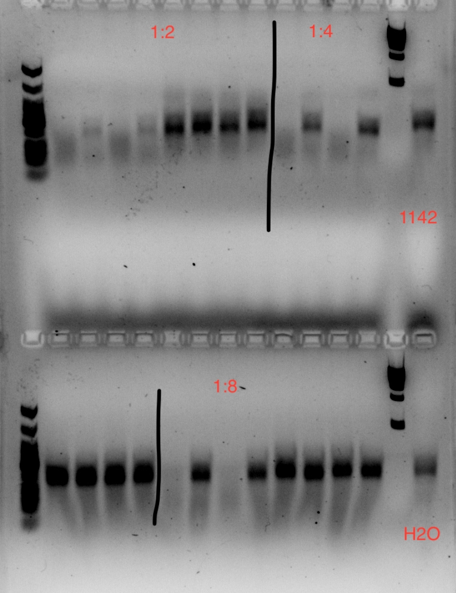

# Background
- Exp65: high-efficiency transformation of full cytosolic 8x dicodon library into Hel2-del and Syh1-del yeast
- Exp66: Library prep and overview of results -> libraries were bottlenecked and had other issues, so I am redoing them here
  - Make sure to run for tapestation and other QC measures before submitting
- https://github.com/rasilab/rqc_aggregation_aging/issues/113
- Harvest pellets at 50mL of OD0.4-0.5 (~200 million cells) in exp65

# Goal
Library prep exp65 cytosolic 8x dicodon library in hel2-del and syh1-del cells & run QC

# Strategy
- Maintaining representation in gDNA for a 200,000 barcode library:
  - Extract/shear/cleanup >=2ug gDNA (>=1000x per cell)
  - Input >=2ug gDNA into IVT reaction, IVT should amplify the gDNA ~50x
  - Input at least half of the gRNA into RT reaction
  - Input 20% of RT product into R1 reaction
  - Input 25-50% of R1 product in R2
- Maintaining representation in RNA for a 200,000 barcode library:
  - Extract >=10ug RNA from cells
  - Input at least half of that yield into the RT reaction, splitting up or doing >=100uL reactions if needed
  - Input 20% of RT product into R1 reaction
  - Input 25-50% of R1 product in R2

# Procedure
- Extract gDNA from 6x50mL pellets in 35uL tris each time
- Harvest RNA from one pellet and expect >=10ug yield as usual

### Extract mRNA
- 2022-10-03 10:15 thaw one pellet each on ice ~15-20m
- For 50mL OD0.4 pellet: 400uL trizol should produce a yield of 5-13 ug, make sure to elute in H2O
- Perform all column-related steps at RT unless otherwise noted
- Set centrifuge to 4C
- Add 400uL trizol to each yeast pellet and triturate to resuspend
- Transfer trizol+yeast to eppy with 500uL glass beads (G8772 yeast, Sigma) in an Agilent eppendorf tube
- Vortex 9m in cold room
  - 2m-3m on/30s off
- Invert the tube and poke hole with 21G needle, then poke hole at top, rest at the top of 15mL conical (wipe eppy with ethanol first)
- Spin 4000rpm 4C 5min (cold room) to collect lysate
  - May see pellet of debris at bottom of falcon
- Transfer supernatant to pre-chilled eppy
- Spin 20,000g, 4C, 5min
  - Note you will not see any phases after this spin but you might see some debris/glass beads
- Transfer ~400 uL supernatant to new eppy and add 1X volume of 100% ethanol and mix thoroughly
- Transfer into Zymo-Spin IIC columns -> spin max and transfer to new collection tube
  - 800uL volume is ~max for spin columns generally
- DNase1-tx
  - Add 400uL RNA wash buffer to column and spin
  - Make MM of Dnase I in digestion buffer:
    - The 1500U tube in HPark's -20C (E1011-A)
    - 5uL DNase I -> 10.5uL 
    - 75uL DNA digestion buffer -> 157.5uL
    - Mix and add 80uL directly to column
  - Incubate RT 15m
- Add 400µl Direct-zol RNA PreWash to the column and centrifuge. 
- Discard the flow-through and repeat
- Add 700µl RNA Wash Buffer to the column and centrifuge for 2 minutes to ensure complete removal of wash buffer
- Transfer column very carefully to RNAse-free tube, don't let column touch any buffer in collection tube
- To elute RNA, add 50µl DNase/RNase-Free Water directly to the column matrix and spin max speed
- Generally, want purities >1.8 for NGS

| label  | genotype            | ng/uL | 260/280 | 260/230 | vol     | amt     | loc                  |
| ------ | ------------------- | ----- | ------- | ------- | ------- | ------- | -------------------- |
| 67RNA1 | scHP1408::pHPSC1142 | 281   | 2.1     | 2.15    | <=49 uL | 13.8 ug | -80C KChen RNA box 4 |
| 67RNA2 | scKC192::pHPSC1142  | 334   | 2.1     | 2.46    | <=49 uL | 16.4 ug | -80C KChen RNA box 4 |

### Extract gDNA
- Standard protocol for 50mL of OD 0.4 culture pellet, or ~2e8 cells or 4x the manufacturer protocol
- 2022-10-03 13:30
- Protocol:
  - Take 6x50mL pellets for 1408 and 192 out from -80C onto ice (12xpellets)
    - one of the 192 pellets was 45mL instead of 50mL
  - add YD digestion buffer and R-zymolyase
    - resuspend R-zymolyase with 200uL storage buffer, vortex/spin down/mix around until fully resuspended
    - 3mL YD digestion buffer
    - 125uL R-zymolyase
  - resuspend each pellet in 245uL mix and transfer to eppy
    - do 5xpellets for 1408 and 5xpellets for 192, wiping pipette with ethanol between each sample
    - after confirming there is enough mix, do the final pellet for each (wiping between each sample)
  - Incubate at 37°C for 45 minutes 500rpm (our lab's eppendorf block thingy).
    - accidentally put eppies in when block was ~45C, took out immediately (<10s in the block). I felt the eppies and they did not feel warm yet. leave at RT until block comes down to 37C
    - You should be able to see if cells are completely or incompletely lysed following this step (aka the solution should go from cloudy to clear)
  - Prewarm 10mM Tris pH8 to 65C  
  - Add 120 μl of YD Lysis Buffer -> vortex hard for 10-20 seconds
  - Add 250 μl of chloroform. Mix thoroughly for 1 minute.
  - Centrifuge in a table top centrifuge at >10,000 rpm for 2 minutes.
  - Separate the top phase into a separate eppy
    - The liquid will be separated into 2 aqueous phase and separated by a thin white line in between. Be careful not to disturb the white line and anything below!! Leave some behind if you need to!
  - Load 1/6 of the supernatant onto Zymo-spin III column (x2 columns at a time) and centrifuge at >10,000 rpm for 1 minute.
  - Add 300 μl of DNA Wash Buffer and centrifuge for 1 minute at ≥10,000 rpm to wash. 
  - Add another 300 μl of DNA Wash Buffer to repeat the wash and centrifuge for 1 minute.
  - Transfer the Zymo-spin III column to a new 1.5 ml centrifuge tube and add 50 μl prewarmed 10mM Tris pH8 directly onto the membrane. incubate 3m and spin 1m max speed
    - spin into two agilent eppies (should be ~150uL at end)
  - Then repeat until all top phase is washed/eluted into the same agilent eppy
  - Nanodrop the final eluate:
    - scHP1408::1142: 
    - scKC192::1142:

| label/genotype      | ng/uL | 260/280 | 260/230 | vol    | amt     |
| ------------------- | ----- | ------- | ------- | ------ | ------- |
| scHP1408::pHPSC1142 | 41.7  | 1.89    | 0.63    | 300 uL | 12.5 ug |
| scKC192::pHPSC1142  | 33.8  | 1.87    | 0.74    | 300 uL | 10 ug   |

### Shear gDNA
- Repeat as was done in exp51: shear 30s on/off 10m balanced in Agilent eppies, 2x150uL per strain (4x150uL total)
- Shear 30s on/off 10m balanced, (Agilent eppies, use H2O to balance)
  - VIDD bldg 4th floor
  - fill with one small bucket of ice (added another 0.5 bucket because I couldn't find the MQ machine and felt like some ice probably melted)
  - fill to line with MQ
- liquid had splashed all around the inside of each tube, some ice still left unmelted
- Combine into one eppy after shearing and nanodrop (no big change in specs)

| label/genotype      | ng/uL | 260/280 | 260/230 | vol    |
| ------------------- | ----- | ------- | ------- | ------ |
| scHP1408::pHPSC1142 | 40.4  | ~1.9    | 0.6     | 300 uL |
| scKC192::pHPSC1142  | 33    | ~1.9    | 0.7     | 300 uL |

### Clean up and concentrate gDNA
- Add 2:1 DNA Binding buffer to sheared sample, pipette to mix
  - recall uprep mini holds 25ug
  - add 600uL DNA binding buffer to each sample
- Transfer 500uL to uprep mini column, spin, repeat for remaining sample
- Wash 700uL DNA Wash buffer (20mM pH7 Tris 80% ethanol)
- spin ~1m to remove any residual ethanol
- Elute 21uL prewarmed 10mM Tris pH 8 (incubate on column 5m)
- Nanodrop, expect a >=50% drop in gDNA amount

| label   | genotype            | ng/uL | 260/280 | 260/230 | vol   | amt    | amt lost |
| ------- | ------------------- | ----- | ------- | ------- | ----- | ------ | -------- |
| 67gDNA1 | scHP1408::pHPSC1142 | 175   | 1.8     | 2.3     | 20 uL | 3.5 ug | 9.5 ug   |
| 67gDNA2 | scKC192::pHPSC1142  | 153   | 1.8     | 2.3     | 20 uL | 3 ug   | 7 ug     |

### IVT gDNA -> gRNA
- Leave out fluc pos control this time, I don't think it's worth the reagents

| Label   | gDNA sample         | conc | vol DNA | amt   | vol H2O |
| ------- | ------------------- | ---- | ------- | ----- | ------- |
| 67gDNA1 | scHP1408::pHPSC1142 | 175  | 11.4 uL | 2 ug  | 8.6 uL  |
| 67gDNA2 | scKC192::pHPSC1142  | 153  | 13 uL   | 2 ug  | 7 uL    |

- Wear gloves and use nuclease-free tubes and reagents to avoid RNase contamination. 
- Reactions are typically 20 μl but I will scale up to 50uL to fit in all 2 ug (do this because it was done in exp51 for WT library). 
- Reactions should be assembled in nuclease-free microfuge tubes or PCR strip tubes.
- Thaw the T7 HIScribe kit components (orange box), mix and pulse-spin in microfuge to collect solutions to bottom of tubes. Keep on ice.
- Use the aliquots of all NTPs so you avoid freeze-thaws
- Assemble the reaction mastermix at room temperature:

| Reagent                | 1x vol    | Conc.           | 2.1X MM |
| :--------------------- | :-------- | :-------------- | ------- |
| 10X Reaction Buffer    | 5 μl      | –               | 10.5    |
| NTP mastermix (100 mM) | 20 μl     | 10 mM final/NTP | 42      |
| T7 RNA Polymerase Mix  | 5 μl      | –               | 10.5    |
| Superase-In            | 0.625     | –               | 1.31    |
| Template DNA           | 20 μl     | 2ug             | --      |
| Total reaction volume  | 50.625 μl |                 | 64.31   |

- Dilute gDNA in PCR strip tubes as per table above
- Aliqout 28uL of this mastermix into one PCR strip tube to each tube
- Add 1uL MM to each tube (29uL total)
- Mix and aliquot 24.5uL per strip tube
- Pulse-spin in microfuge. 
- 2022-10-03 18:17 Incubate at 37°C O/N
- Skip DNase-tx since the IVT is just to make the amplification proceed better
- 2022-10-04 12:25 Clean up with RNA clean and concentrator kit, following manufacturer protocol
  - Combine back into one tube (~50uL total)
  - Add 100uL RNA binding buffer to both samples
  - Add 150uL 100% ethanol -> zymo IICR column (from direct-zol rna kit)
  - 400uL RNA prep buffer
  - 700uL RNA wash buffer
  - empty and spin 30s to remove all ethanol
- Elute into 30 uL of RNase-free H20

| label   | gDNA input | genotype            | ng/uL | 260/280 | 260/230 | vol   | amt     | loc |
| ------- | ---------- | ------------------- | ----- | ------- | ------- | ----- | ------- | --- |
| 67gRNA1 | 67gDNA1    | scHP1408::pHPSC1142 | 1014  | 2.02    | 2.32    | 15 uL | 15.2 ug |     |
| 67gRNA2 | 67gDNA2    | scKC192::pHPSC1142  | 1096  | 2.01    | 2.41    | 15 uL | 16.4 ug |     |

- keep on ice until RT

### Reverse Transcription of mRNA & gRNA
- use >=50% of the RNA yield for each reaction
- use 1/2 input for -RT controls and then subtract 1 cycles during qPCR when deciding if -RT controls are good or not

| Label   | Input       | Sample                   | ng/uL | uL   | uL H2O | amt    |
| ------- | ----------- | ------------------------ | ----- | ---- | ------ | ------ |
| 67cDNA1 | 67RNA1      | scHP1408::pHPSC1142 RNA  | 281   | 27.5 | 0      | 7.7ug  |
| 67cDNA2 | 67RNA1 -RT  | scHP1408::pHPSC1142 RNA  | 281   | 13.7 | 13.8   | 3.85ug |
| 67cDNA3 | 67RNA2      | scKC192::pHPSC1142 RNA   | 334   | 23   | 4.5    | 7.7ug  |
| 67cDNA4 | 67RNA2 -RT  | scKC192::pHPSC1142 RNA   | 334   | 11.5 | 16     | 3.85ug |
| 67cDNA5 | 67gRNA1     | scHP1408::pHPSC1142 gRNA | 1014  | 9.9  | 17.6   | 10ug   |
| 67cDNA6 | 67gRNA1 -RT | scHP1408::pHPSC1142 gRNA | 1014  | 4.9  | 22.6   | 5ug    |
| 67cDNA7 | 67gRNA2     | scKC192::pHPSC1142 gRNA  | 1096  | 9.1  | 18.4   | 10ug   |
| 67cDNA8 | 67gRNA2 -RT | scKC192::pHPSC1142 gRNA  | 1096  | 4.6  | 22.9   | 5ug    |

- 50uL reactions
- Set up rxns for annealing template to oligo:

| Reagent      | μl/rxn | note                   | 8.5X MM | Note                                        |
| :----------- | :----- | :--------------------- | ------- | ------------------------------------------- |
| 10 mM dNTP   | 2.5    | use Rnase-free aliquot | 21.25   | made by pnugent KChen RNA Reagents 2        |
| 10 μM oPB354 | 2.5    | use Rnase-free aliquot | 21.25   | made from Phil's 100uM stock in oligo box 5 |
| RNA template | 27.5   | >=5ug for total RNA    |         | SSIV protocol: max 5ug/20uL, 12.5ug/50uL    |
| TOTAL        | 32.5   | 27.5/rxn               |         |                                             |

- Add 5uL MM to each 27.5uL diluted RNA sample
- Incubate at 65 C for 5 mins, then on ice for >1 min.
- Prepare RT rxn mixes:

| Reagent                   | μl/rxn | amt      | 4.5X MM | Note                            |
| :------------------------ | :----- | :------- | ------- | ------------------------------- |
| 5X commercial SSIV buffer | 10     | 1x       | 45      | commercial vial                 |
| 100 mM DTT                | 2.5    | 5mM      | 11.25   | single use aliquot              |
| SuperaseIN                | 2.5    | 50U      | 11.25   | commerical vial                 |
| Homemade SSIV 2.43mg/uL   | 2.5    |          | 11.25   | aliquot in KChen RNA Reagents 2 |
| TOTAL                     | 17.5   | 17.5/rxn |         |                                 |

- Add 17.5 μl of this MM to each RT rxn.
- Prepare noRT rxn mixes:

| Reagent                   | μl/rxn | amt      | 4.5X MM |
| :------------------------ | :----- | :------- | ------- |
| 5X commercial SSIV buffer | 10     | 1x       | 45      |
| 100 mM DTT                | 2.5    | 5mM      | 11.25   |
| SuperaseIN                | 2.5    |          | 11.25   |
| H2O                       | 2.5    |          | 11.25   |
| TOTAL                     | 17.5   | 17.5/rxn |         |

- Add 17.5 μl of this MM to each noRT rxn.
- Incubate rxns at 50C for 30 mins, then 80C for 10 mins.
- Multichannel 10uL strip tubes neat aliquots (each strip is 20% of the RT reaction)
- 2022-10-04 15:40 Save all strip tubes in KChen cDNA box -20C

### qPCR dilution curve
- 2022-10-04 16:35 Take out one strip from -20C
- Add 10uL ultrapure H2O to 10uL neat RT reactions (1:2) 
- Serially dilute 10uL + 10uL ultrapure H2O (1:4) until 1:128
- filter tips except for p20 because don't have
- Goal is to use 20% of the RT product in an R1 reaction large enough s.t. RT product does not exceed 20% R1 reaction volume
- Aliquot 16uL MM per tube
- Multichannel 4uL diluted sample per tube
- Keep reagents on ice until real round 1

| Reagent                                  | μl/rxn | amt   | 62X MM |
| :--------------------------------------- | :----- | :---- | ------ |
| ultrapure H2O                            | 9.2    |       | 570.4  |
| 5X Phusion HF clear buffer               | 4      | 1X    | 248    |
| Phusion polymerase                       | 0.2    |       | 12.4   |
| 10 mM dNTPs                              | 0.4    | 0.2mM | 24.8   |
| 10uM oHP534 F                            | 1      | 0.5uM | 62     |
| 10uM oPB354 R                            | 1      | 0.5uM | 62     |
| 100X Sybr Green                          | 0.2    | 1X    | 12.4   |
| template cDNA diluted or diluted plasmid | 4      |       | --     |
| TOTAL                                    | 20uL   |       | 992    |

| Tube | cDNA input | sample      | dil    | input uL    | CT           | CT  |
| :--- | :--------- | :---------- | :----- | :---------- | :----------- | --- |
| 1    | 67cDNA1    | 67RNA1      | 1:2    | 4           | Undetermined |     |
| 2    | 67cDNA2    | 67RNA1 -RT  | 1:2    | 4           | 26.998       | 27  |
| 3    | 67cDNA3    | 67RNA2      | 1:2    | 4           | Undetermined |     |
| 4    | 67cDNA4    | 67RNA2 -RT  | 1:2    | 4           | 26.707       | 27  |
| 5    | 67cDNA5    | 67gRNA1     | 1:2    | 4           | 19.619       | 20  |
| 6    | 67cDNA6    | 67gRNA1 -RT | 1:2    | 4           | 17.340       | 16  |
| 7    | 67cDNA7    | 67gRNA2     | 1:2    | 4           | 19.869       | 20  |
| 8    | 67cDNA8    | 67gRNA2 -RT | 1:2    | 4           | 17.251       | 16  |
| 9    | 67cDNA1    | 67RNA1      | 1:4    | 4           | Undetermined |     |
| 10   | 67cDNA2    | 67RNA1 -RT  | 1:4    | 4           | 24.813       | 25  |
| 11   | 67cDNA3    | 67RNA2      | 1:4    | 4           | Undetermined |     |
| 12   | 67cDNA4    | 67RNA2 -RT  | 1:4    | 4           | 24.535       | 24  |
| 13   | 67cDNA5    | 67gRNA1     | 1:4    | 4           | 14.204       | 14  |
| 14   | 67cDNA6    | 67gRNA1 -RT | 1:4    | 4           | 17.962       | 17  |
| 15   | 67cDNA7    | 67gRNA2     | 1:4    | 4           | 13.881       | 14  |
| 16   | 67cDNA8    | 67gRNA2 -RT | 1:4    | 4           | 18.022       | 17  |
| 17   | 67cDNA1    | 67RNA1      | 1:8    | 4           | 29.599       | 30  |
| 18   | 67cDNA2    | 67RNA1 -RT  | 1:8    | 4           | 23.657       | 23  |
| 19   | 67cDNA3    | 67RNA2      | 1:8    | 4           | 31.319       | 31  |
| 20   | 67cDNA4    | 67RNA2 -RT  | 1:8    | 4           | 23.562       | 23  |
| 21   | 67cDNA5    | 67gRNA1     | 1:8    | 4           | 11.430       | 11  |
| 22   | 67cDNA6    | 67gRNA1 -RT | 1:8    | 4           | 18.769       | 18  |
| 23   | 67cDNA7    | 67gRNA2     | 1:8    | 4           | 11.828       | 12  |
| 24   | 67cDNA8    | 67gRNA2 -RT | 1:8    | 4           | 18.726       | 18  |
| 25   | 67cDNA1    | 67RNA1      | 1:16   | 4           | 23.230       | 23  |
| 26   | 67cDNA2    | 67RNA1 -RT  | 1:16   | 4           | 23.531       | 22  |
| 27   | 67cDNA3    | 67RNA2      | 1:16   | 4           | 24.981       | 25  |
| 28   | 67cDNA4    | 67RNA2 -RT  | 1:16   | 4           | 23.642       | 23  |
| 29   | 67cDNA5    | 67gRNA1     | 1:16   | 4           | 10.959       | 11  |
| 30   | 67cDNA6    | 67gRNA1 -RT | 1:16   | 4           | 19.669       | 19  |
| 31   | 67cDNA7    | 67gRNA2     | 1:16   | 4           | 11.301       | 11  |
| 32   | 67cDNA8    | 67gRNA2 -RT | 1:16   | 4           | 19.715       | 19  |
| 33   | 67cDNA1    | 67RNA1      | 1:32   | 4           | 19.792       | 20  |
| 34   | 67cDNA2    | 67RNA1 -RT  | 1:32   | 4           | 23.344       | 22  |
| 35   | 67cDNA3    | 67RNA2      | 1:32   | 4           | 20.623       | 21  |
| 36   | 67cDNA4    | 67RNA2 -RT  | 1:32   | 4           | 23.341       | 22  |
| 37   | 67cDNA5    | 67gRNA1     | 1:32   | 4           | 11.313       | 11  |
| 38   | 67cDNA6    | 67gRNA1 -RT | 1:32   | 4           | 20.502       | 19  |
| 39   | 67cDNA7    | 67gRNA2     | 1:32   | 4           | 11.367       | 11  |
| 40   | 67cDNA8    | 67gRNA2 -RT | 1:32   | 4           | 20.622       | 19  |
| 41   | 67cDNA1    | 67RNA1      | 1:64   | 4           | 18.600       | 19  |
| 42   | 67cDNA2    | 67RNA1 -RT  | 1:64   | 4           | 23.450       | 22  |
| 43   | 67cDNA3    | 67RNA2      | 1:64   | 4           | 18.974       | 19  |
| 44   | 67cDNA4    | 67RNA2 -RT  | 1:64   | 4           | 23.466       | 22  |
| 45   | 67cDNA5    | 67gRNA1     | 1:64   | 4           | 12.012       | 12  |
| 46   | 67cDNA6    | 67gRNA1 -RT | 1:64   | 4           | 21.374       | 21  |
| 47   | 67cDNA7    | 67gRNA2     | 1:64   | 4           | 11.998       | 12  |
| 48   | 67cDNA8    | 67gRNA2 -RT | 1:64   | 4           | 21.331       | 21  |
| 49   | 67cDNA1    | 67RNA1      | 1:128  | 4           | 18.461       | 18  |
| 50   | 67cDNA2    | 67RNA1 -RT  | 1:128  | 4           | 23.250       | 22  |
| 51   | 67cDNA3    | 67RNA2      | 1:128  | 4           | 18.682       | 19  |
| 52   | 67cDNA4    | 67RNA2 -RT  | 1:128  | 4           | 23.225       | 22  |
| 53   | 67cDNA5    | 67gRNA1     | 1:128  | 4           | Undetermined | und |
| 54   | 67cDNA6    | 67gRNA1 -RT | 1:128  | 4           | 21.979       | 21  |
| 55   | 67cDNA7    | 67gRNA2     | 1:128  | 4           | 12.897       | 13  |
| 56   | 67cDNA8    | 67gRNA2 -RT | 1:128  | 4           | 21.507       | 20  |
| 57   |            | pHPSC1142   | 1ng/uL | 1 + 3uL H2O | 10.280       | 10  |
| 58   |            | ultrapure   | 0      | 4           | 23.460       | 23  |

- 2022-10-04 17:08 George 96well

| Cycles | Temp | Time |
| ------ | ---- | ---- |
| 1      | 98   | 120s |
| 30     | 98   | 20s  |
|        | 60C  | 20s  |
|        | 72   | 20s  |

- Add 4uL 10X FD Green and run 12uL on 2% gel 150V 15m for first ~30 samples + two controls
- 2022-10-05 14:44 there was a lot of contamination in NTC and noRT controls.. I think all the contamination in the noRT controls must have come from reagents and not from gDNA or anything like that. I want to redo this reaction to be sure things are okay and to get a more certain CT.

### qPCR dilution curve redo
- Put all PCR reagents that I've been using into a separate box for now. 
- Get new 10mM dNTP aliquot, Phusion 6-21, 1x aliquot, re-aliquot ultrapure H2O from bottle, new dilutions of oHP534 and oPB354 in new H2O
  - Aliquot phusion into 100uL and 200uL
  - switch gloves between diluting cDNA and making/aliquoting MM
  - filtered tips for all
  - bleach pipetteboys, bench, gloves
- Thaw strip of cDNA
- Add 10uL ultrapure H2O to 10uL neat RT reactions (1:2) 
- Serially dilute 10uL + 10uL ultrapure H2O (1:4) until 1:128
- Aliquot 16uL MM per tube (p20 filtered)
- Multichannel 4uL diluted sample per tube
- Keep reagents on ice until real round 1

| Reagent                                  | μl/rxn | amt   | 62X MM |
| :--------------------------------------- | :----- | :---- | ------ |
| ultrapure H2O                            | 9.2    |       | 570.4  |
| 5X Phusion HF clear buffer               | 4      | 1X    | 248    |
| Phusion polymerase                       | 0.2    |       | 12.4   |
| 10 mM dNTPs                              | 0.4    | 0.2mM | 24.8   |
| 10uM oHP534 F                            | 1      | 0.5uM | 62     |
| 10uM oPB354 R                            | 1      | 0.5uM | 62     |
| 100X Sybr Green                          | 0.2    | 1X    | 12.4   |
| template cDNA diluted or diluted plasmid | 4      |       | --     |
| TOTAL                                    | 20uL   |       | 992    |

| Tube | cDNA input | sample      | dil    | input uL    | CT           | adj CT | >=5cyc diff | well |
| :--- | :--------- | :---------- | :----- | :---------- | :----------- | ------ | ----------- | ---- |
| 1    | 67cDNA1    | 67RNA1      | 1:2    | 4           | 29           |        |             | A1   |
| 2    | 67cDNA2    | 67RNA1 -RT  | 1:2    | 4           | Undetermined |        |             | A2   |
| 3    | 67cDNA3    | 67RNA2      | 1:2    | 4           | Undetermined |        |             | etc  |
| 4    | 67cDNA4    | 67RNA2 -RT  | 1:2    | 4           | Undetermined |        |             |      |
| 5    | 67cDNA5    | 67gRNA1     | 1:2    | 4           | 11           | 11     |             |      |
| 6    | 67cDNA6    | 67gRNA1 -RT | 1:2    | 4           | 16           | 15     |             |      |
| 7    | 67cDNA7    | 67gRNA2     | 1:2    | 4           | 13           | 13     |             |      |
| 8    | 67cDNA8    | 67gRNA2 -RT | 1:2    | 4           | 17           | 16     |             |      |
| 9    | 67cDNA1    | 67RNA1      | 1:4    | 4           | 23           | 23     |             | B1   |
| 10   | 67cDNA2    | 67RNA1 -RT  | 1:4    | 4           | Undetermined |        |             | B2   |
| 11   | 67cDNA3    | 67RNA2      | 1:4    | 4           | 25           | 25     |             | etc  |
| 12   | 67cDNA4    | 67RNA2 -RT  | 1:4    | 4           | Undetermined |        |             |      |
| 13   | 67cDNA5    | 67gRNA1     | 1:4    | 4           | 10           | 10     | YES         |      |
| 14   | 67cDNA6    | 67gRNA1 -RT | 1:4    | 4           | 16           | 15     | YES         |      |
| 15   | 67cDNA7    | 67gRNA2     | 1:4    | 4           | 10           | 10     | YES         |      |
| 16   | 67cDNA8    | 67gRNA2 -RT | 1:4    | 4           | 16           | 15     | YES         |      |
| 17   | 67cDNA1    | 67RNA1      | 1:8    | 4           | 17           | 17     | YES         | C1   |
| 18   | 67cDNA2    | 67RNA1 -RT  | 1:8    | 4           | 29           | 28     | YES         | C2   |
| 19   | 67cDNA3    | 67RNA2      | 1:8    | 4           | 19           | 19     | YES         | etc  |
| 20   | 67cDNA4    | 67RNA2 -RT  | 1:8    | 4           | Undetermined | und    | YES         |      |
| 21   | 67cDNA5    | 67gRNA1     | 1:8    | 4           | 9            | 9      |             |      |
| 22   | 67cDNA6    | 67gRNA1 -RT | 1:8    | 4           | 17           | 16     |             |      |
| 23   | 67cDNA7    | 67gRNA2     | 1:8    | 4           | 9            | 9      |             |      |
| 24   | 67cDNA8    | 67gRNA2 -RT | 1:8    | 4           | 16           | 15     |             |      |
| 25   | 67cDNA1    | 67RNA1      | 1:16   | 4           | 15           | 15     |             |      |
| 26   | 67cDNA2    | 67RNA1 -RT  | 1:16   | 4           | 27           | 26     |             |      |
| 27   | 67cDNA3    | 67RNA2      | 1:16   | 4           | 16           | 15     |             |      |
| 28   | 67cDNA4    | 67RNA2 -RT  | 1:16   | 4           | 28           | 27     |             |      |
| 29   | 67cDNA5    | 67gRNA1     | 1:16   | 4           | 9            | 9      |             |      |
| 30   | 67cDNA6    | 67gRNA1 -RT | 1:16   | 4           | 17           | 16     |             |      |
| 31   | 67cDNA7    | 67gRNA2     | 1:16   | 4           | 9            | 9      |             |      |
| 32   | 67cDNA8    | 67gRNA2 -RT | 1:16   | 4           | 17           | 16     |             |      |
| 33   | 67cDNA1    | 67RNA1      | 1:32   | 4           | 15           | 15     |             |      |
| 34   | 67cDNA2    | 67RNA1 -RT  | 1:32   | 4           | 26           | 25     |             |      |
| 35   | 67cDNA3    | 67RNA2      | 1:32   | 4           | 16           | 15     |             |      |
| 36   | 67cDNA4    | 67RNA2 -RT  | 1:32   | 4           | 26           | 25     |             |      |
| 37   | 67cDNA5    | 67gRNA1     | 1:32   | 4           | 10           | 10     |             |      |
| 38   | 67cDNA6    | 67gRNA1 -RT | 1:32   | 4           | 18           | 17     |             |      |
| 39   | 67cDNA7    | 67gRNA2     | 1:32   | 4           | 9            | 9      |             |      |
| 40   | 67cDNA8    | 67gRNA2 -RT | 1:32   | 4           | 18           | 17     |             |      |
| 41   | 67cDNA1    | 67RNA1      | 1:64   | 4           | 16           | 16     |             |      |
| 42   | 67cDNA2    | 67RNA1 -RT  | 1:64   | 4           | 25           | 24     |             |      |
| 43   | 67cDNA3    | 67RNA2      | 1:64   | 4           | 16           | 16     |             |      |
| 44   | 67cDNA4    | 67RNA2 -RT  | 1:64   | 4           | 25           | 24     |             |      |
| 45   | 67cDNA5    | 67gRNA1     | 1:64   | 4           | 10           | 10     |             |      |
| 46   | 67cDNA6    | 67gRNA1 -RT | 1:64   | 4           | 19           | 18     |             |      |
| 47   | 67cDNA7    | 67gRNA2     | 1:64   | 4           | 10           | 10     |             |      |
| 48   | 67cDNA8    | 67gRNA2 -RT | 1:64   | 4           | 18           | 17     |             |      |
| 49   | 67cDNA1    | 67RNA1      | 1:128  | 4           | 17           | 17     |             |      |
| 50   | 67cDNA2    | 67RNA1 -RT  | 1:128  | 4           | 24           | 23     |             |      |
| 51   | 67cDNA3    | 67RNA2      | 1:128  | 4           | 17           | 17     |             |      |
| 52   | 67cDNA4    | 67RNA2 -RT  | 1:128  | 4           | 24           | 23     |             |      |
| 53   | 67cDNA5    | 67gRNA1     | 1:128  | 4           | 11           | 11     |             |      |
| 54   | 67cDNA6    | 67gRNA1 -RT | 1:128  | 4           | 20           | 19     |             |      |
| 55   | 67cDNA7    | 67gRNA2     | 1:128  | 4           | 11           | 11     |             |      |
| 56   | 67cDNA8    | 67gRNA2 -RT | 1:128  | 4           | 20           | 19     |             |      |
| 57   |            | pHPSC1142   | 1ng/uL | 1 + 3uL H2O | 11           | 11     |             |      |
|      |            | ultrapure   | 0      | 4           | 24           | 24     |             |      |

- 2022-10-05 16:00 George 96well as before
- Add 4uL 10X FD Green and run 12uL (on top) and 10uL (on bottom) on 2% gel 150V 15m
- 2022-10-05 17:30 I feel much better about these CTs and the noRT controls do not have bands at all. The NTC has a band but it's not the same size (unlike in first run, where noRT and NTC all had bands of the same size). So I believe some component of the PCR was contaminated possibly with a previous library PCR product, which is cleared up now.

- Pick reactions with Cts around 14 for RNA and 4 for gRNA and where noRT controls are >=5 cycles (after subtracting 1) from RT reactions:

| cDNA input | sample      | CT  | dil | vol   |
| ---------- | ----------- | --- | --- | ----- |
| 67cDNA1    | 67RNA1      | 17  | 1:8 | 400uL |
| 67cDNA2    | 67RNA1 -RT  | 28  | 1:8 | 50uL  |
| 67cDNA3    | 67RNA2      | 19  | 1:8 | 400uL |
| 67cDNA4    | 67RNA2 -RT  | und | 1:8 | 50uL  |
| 67cDNA5    | 67gRNA1     | 10  | 1:4 | 200uL |
| 67cDNA6    | 67gRNA1 -RT | 15  | 1:4 | 50uL  |
| 67cDNA7    | 67gRNA2     | 10  | 1:4 | 200uL |
| 67cDNA8    | 67gRNA2 -RT | 15  | 1:4 | 50uL  |

- 67RNA1 and 67RNA2:
  - dilute 10uL of RT cDNA up 1:8 in ultrapure H2O (+70uL ultrapure H2O)
  - 80uL cDNA in 400uL total R1 reaction -> 8x50uL each
- 67gRNA1 and 67gRNA2:
  - dilute 10uL of RT cDNA up 1:4 in ultrapure H2O (+30uL ultrapure H2O)
  - 40uL cDNA in 200uL total R1 reaction -> 4x50uL each

### Round 1
- 2022-10-05 18:20
- Use filtered tips
- Thaw one strip of cDNA reactions
- Add ultrapure H2O
- Make MM 

| Reagent                                  | μl/rxn | amt   | 30X  |
| :--------------------------------------- | :----- | :---- | ---- |
| ultrapure H2O                            | 23.5   |       | 705  |
| 5X Phusion HF clear buffer               | 10     | 1X    | 300  |
| Phusion polymerase                       | 0.5    |       | 15   |
| 10 mM dNTPs                              | 1      | 0.2mM | 30   |
| 10uM oHP534 F                            | 2.5    | 0.5uM | 75   |
| 10uM oPB354 R                            | 2.5    | 0.5uM | 75   |
| template cDNA diluted or diluted plasmid | 10     |       | --   |
| TOTAL                                    | 50uL   |       | 1200 |

| Tube | cDNA input | sample      | uL MM  | dil | uL H2O | uL cDNA | total rxn vol | split  | cycles |
| ---- | ---------- | ----------- | ------ | --- | ------ | ------- | ------------- | ------ | ------ |
| 1    | 67cDNA1    | 67RNA1      | 320 uL | 1:8 | 0 uL   | 80 uL   | 400 uL        | 8x50uL | 17     |
| 2    | 67cDNA2    | 67RNA1 -RT  | 40 uL  | 1:8 | 10 uL  | 0 uL    | 50 uL         | 1x50uL | 17     |
| 3    | 67cDNA3    | 67RNA2      | 320 uL | 1:8 | 0 uL   | 80 uL   | 400 uL        | 8x50uL | 19     |
| 4    | 67cDNA4    | 67RNA2 -RT  | 40 uL  | 1:8 | 10 uL  | 0 uL    | 50 uL         | 1x50uL | 19     |
| 5    | 67cDNA5    | 67gRNA1     | 160 uL | 1:4 | 0 uL   | 40 uL   | 200 uL        | 4x50uL | 10     |
| 6    | 67cDNA6    | 67gRNA1 -RT | 40 uL  | 1:4 | 10 uL  | 0 uL    | 50 uL         | 1x50uL | 10     |
| 7    | 67cDNA7    | 67gRNA2     | 160 uL | 1:4 | 0 uL   | 40 uL   | 200 uL        | 4x50uL | 10     |
| 8    | 67cDNA8    | 67gRNA2 -RT | 40 uL  | 1:4 | 10 uL  | 0 uL    | 50 uL         | 1x50uL | 10     |

| Cycles   | Temp | Time |
| -------- | ---- | ---- |
| 1        | 98   | 120s |
| 10/17/19 | 98   | 20s  |
|          | 60C  | 20s  |
|          | 72   | 20s  |

- Put directly in -20C
- 2022-10-07 10:30 Recombine back into one eppy -> clean up half
  - + 5:1 Zymo DNA binding buffer in an eppy
    - 1mL + 200uL 1 and 3
    - 500uL + 100uL 5 and 7
    - don't need to clean up 2/4/6/8 (noRT controls, just run on gel to confirm no band)
    - spin through new uprep mini columns 600uL at a time until all through
  - + 700uL DNA wash buffer
  - spin 1m to remove all ethanol
  - Elute in 40uL 10mM Tris pH8 (incubate ~5m RT)
  - Store remaining half in -20C as backup
- nanodrop to get approx measure of product

| Tube | cDNA input | sample      | R1 cycles | cleaned up | ng/uL   | peak |
| ---- | ---------- | ----------- | --------- | ---------- | ------- | ---- |
| 1    | 67cDNA1    | 67RNA1      | 17        | 67R1PCR1   | 5.5     | good |
| 2    | 67cDNA2    | 67RNA1 -RT  | 17        |            |         |      |
| 3    | 67cDNA3    | 67RNA2      | 19        | 67R1PCR3   | 18.4    | good |
| 4    | 67cDNA4    | 67RNA2 -RT  | 19        |            |         |      |
| 5    | 67cDNA5    | 67gRNA1     | 10        | 67R1PCR5   | (<) 2.5 | flat |
| 6    | 67cDNA6    | 67gRNA1 -RT | 10        |            |         |      |
| 7    | 67cDNA7    | 67gRNA2     | 10        | 67R1PCR7   | (<) 2.8 | flat |
| 8    | 67cDNA8    | 67gRNA2 -RT | 10        |            |         |      |

- gRNA R1 products are probably less than nanodrop measured and just relatively undetectable
- RNA R1 products had good peaks, but very confused by 67cDNA3 had so much product for R1... I was expecting like 2-4ng/uL
- It doesn't make sense to me conceptually why the R1s would have different concentrations, cDNA3's R1 concentration is consistent with cDNA1's R1 concentration doubled twice (17 cycles vs 19 cycles), which makes me think I should have ran them both at 17 cycles. But qPCR clearly shows that 17cycle cDNA1 = 17cycle cDNA3:

- I suppose I should have ran these in replicate to get a clearer answer.
- 2022-10-07 15:05 submit for tapestation:

| Tube | sample   | ng/uL   | send   | uL H2O | result        |
| ---- | -------- | ------- | ------ | ------ | ------------- |
| KC4  | 67R1PCR1 | 5.5     | 0.5 uL | 4 uL   | single, 131bp |
| KC5  | 67R1PCR3 | 18.4    | 0.5 uL | 4 uL   | single, 125bp |
| KC6  | 67R1PCR5 | (<) 2.5 | 0.5 uL | 4 uL   | single, 131bp |
| KC7  | 67R1PCR7 | (<) 2.8 | 0.5 uL | 4 uL   | single, 132bp |

### Rerun round 1
- 2022-10-10 10:00
- Rerun at lower cycles because I am concerned about how high the yield for cDNA3 was, considering it should be about the same as cDNA1.
- Use filtered tips
- Thaw one strip of cDNA reactions
- Add ultrapure H2O
- Make MM 

| Reagent                                  | μl/rxn | amt   | 30X  |
| :--------------------------------------- | :----- | :---- | ---- |
| ultrapure H2O                            | 23.5   |       | 705  |
| 5X Phusion HF clear buffer               | 10     | 1X    | 300  |
| Phusion polymerase                       | 0.5    |       | 15   |
| 10 mM dNTPs                              | 1      | 0.2mM | 30   |
| 10uM oHP534 F                            | 2.5    | 0.5uM | 75   |
| 10uM oPB354 R                            | 2.5    | 0.5uM | 75   |
| template cDNA diluted or diluted plasmid | 10     |       | --   |
| TOTAL                                    | 50uL   |       | 1200 |

- dilute cDNA up accordingly

| Tube | cDNA input | sample      | uL MM  | dil | uL H2O | uL cDNA | total rxn vol | split  | cycles |
| ---- | ---------- | ----------- | ------ | --- | ------ | ------- | ------------- | ------ | ------ |
| 1    | 67cDNA1    | 67RNA1      | 320 uL | 1:8 | 70 uL  | 10 uL   | 400 uL        | 8x50uL | 16     |
| 2    | 67cDNA2    | 67RNA1 -RT  | 40 uL  | 1:8 | 70 uL  | 10 uL   | 50 uL         | 1x50uL | 16     |
| 3    | 67cDNA3    | 67RNA2      | 320 uL | 1:8 | 70 uL  | 10 uL   | 400 uL        | 8x50uL | 16     |
| 4    | 67cDNA4    | 67RNA2 -RT  | 40 uL  | 1:8 | 70 uL  | 10 uL   | 50 uL         | 1x50uL | 16     |
| 5    | 67cDNA5    | 67gRNA1     | 160 uL | 1:4 | 30 uL  | 10 uL   | 200 uL        | 4x50uL | 10     |
| 6    | 67cDNA6    | 67gRNA1 -RT | 40 uL  | 1:4 | 30 uL  | 10 uL   | 50 uL         | 1x50uL | 10     |
| 7    | 67cDNA7    | 67gRNA2     | 160 uL | 1:4 | 30 uL  | 10 uL   | 200 uL        | 4x50uL | 10     |
| 8    | 67cDNA8    | 67gRNA2 -RT | 40 uL  | 1:4 | 30 uL  | 10 uL   | 50 uL         | 1x50uL | 10     |

| Cycles | Temp | Time |
| ------ | ---- | ---- |
| 1      | 98   | 120s |
| 10/16  | 98   | 20s  |
|        | 60C  | 20s  |
|        | 72   | 20s  |

- 2022-10-10 11:30 Recombine back into one eppy -> clean up half
  - + 5:1 Zymo DNA binding buffer in an eppy
    - 1mL + 200uL 1 and 3
    - 500uL + 100uL 5 and 7
    - don't need to clean up 2/4/6/8 (noRT controls, just run on gel to confirm no band)
    - spin through new uprep mini columns 600uL at a time until all through
  - + 700uL DNA wash buffer
  - spin 1m to remove all ethanol
  - Elute in 40uL 10mM Tris pH8 (incubate ~5m RT)
  - Store remaining half in -20C as backup
- nanodrop to get approx measure of product

| Tube | Cleaned up | cDNA input | sample      | R1 cycles | ng/uL | peak        | A260 | A280 |
| ---- | ---------- | ---------- | ----------- | --------- | ----- | ----------- | ---- | ---- |
| 1    | 67R1PCR1.2 | 67cDNA1    | 67RNA1      | 16        | 2.9   | pretty flat | .058 | .026 |
| 2    |            | 67cDNA2    | 67RNA1 -RT  | 16        |       |             |      |      |
| 3    | 67R1PCR3.2 | 67cDNA3    | 67RNA2      | 16        | 2.2   | pretty flat | .045 | .009 |
| 4    |            | 67cDNA4    | 67RNA2 -RT  | 16        |       |             |      |      |
| 5    | 67R1PCR5.2 | 67cDNA5    | 67gRNA1     | 10        | 3.7   | pretty flat | .074 | .036 |
| 6    |            | 67cDNA6    | 67gRNA1 -RT | 10        |       |             |      |      |
| 7    | 67R1PCR7.2 | 67cDNA7    | 67gRNA2     | 10        | 3.2   | pretty flat | .065 | .039 |
| 8    |            | 67cDNA8    | 67gRNA2 -RT | 10        |       |             |      |      |

### Round 2 PCR -- test run due to thermocycler error
- 2022-10-10 13:42

| Reagent                    | μl/rxn | amt     | 25X |
| :------------------------- | :----- | :------ | --- |
| H2O                        | 5.4    | to 20uL | 135 |
| 5X Phusion HF clear buffer | 4      | 1X      | 100 |
| 10 mM dNTPs                | 0.4    | 0.2mM   | 10  |
| Phusion polymerase         | 0.2    |         | 5   |
| 10uM oAS111 F              | 1      | 0.5uM   | 25  |
| 10uM R                     | 1      | 0.5uM   | --  |
| template cleaned up R1     | 8      |         | --  |
| TOTAL                      | 20uL   |         |     |

- Make oligo MMs:

| template   | 5.5X MM | oligo  | uL oligo |
| ---------- | ------- | ------ | -------- |
| 67R1PCR1.2 | 60.5    | oAS127 | 5.5uL    |
| 67R1PCR3.2 | 60.5    | oAS128 | 5.5uL    |
| 67R1PCR5.2 | 60.5    | oAS129 | 5.5uL    |
| 67R1PCR7.2 | 60.5    | oAS130 | 5.5uL    |

- Aliquot 12uL per tube
- Add 8uL cleaned up R1 or ultrapure H2O to each tube

| Tube | R1 PCR     | oligo  | cycles |
| ---- | ---------- | ------ | ------ |
| 1    | 67R1PCR1-2 | oAS127 | 2      |
| 2    | 67R1PCR3-2 | oAS128 | 2      |
| 3    | 67R1PCR5-2 | oAS129 | 2      |
| 4    | 67R1PCR7-2 | oAS130 | 2      |
| 5    | H2O        | oAS127 | 2      |
| 6    | 67R1PCR1-2 | oAS127 | 3      |
| 7    | 67R1PCR3-2 | oAS128 | 3      |
| 8    | 67R1PCR5-2 | oAS129 | 3      |
| 9    | 67R1PCR7-2 | oAS130 | 3      |
| 10   | H2O        | oAS128 | 3      |
| 11   | 67R1PCR1-2 | oAS127 | 4      |
| 12   | 67R1PCR3-2 | oAS128 | 4      |
| 13   | 67R1PCR5-2 | oAS129 | 4      |
| 14   | 67R1PCR7-2 | oAS130 | 4      |
| 15   | H2O        | oAS129 | 4      |
| 16   | 67R1PCR1-2 | oAS127 | 5      |
| 17   | 67R1PCR3-2 | oAS128 | 5      |
| 18   | 67R1PCR5-2 | oAS129 | 5      |
| 19   | 67R1PCR7-2 | oAS130 | 5      |
| 20   | H2O        | oAS130 | 5      |

- 2022-10-10 14:00 themocycler malfunction, said there was an error but looked like it was still running. Rather than risk it, I cancelled the run at 1m ~20s (still in 98C step) and tried to restart. But the block was greyed out saying there was an error. Since HPark is using the other block, I don't want to turn it off and back on again until after he's done in 50m
- Treat these as a test run -> see which cycle they come up at, slice out one set of bands as backup, then repeat based on these results

| Step                        | Temp | Time        |
| :-------------------------- | :--- | :---------- |
| Initial Denaturation        | 98°C | 120 seconds |
| 2/3/4/5 Cycles Denaturation | 98°C | 20 seconds  |
| 2/3/4/5 Cycles Annealing    | 60°C | 20 seconds  |
| 2/3/4/5 Cycles              | 72°C | 20 seconds  |

- Add 2uL 10X FD green and load full volume to 2% gel 150V 20m in large apparatus
- Run these to see if 2-5 cycles works, but don't these for anything since I don't trust the error interruption
- Clearly correct size and mostly looks like it's getting more intense with increasing cycle, 2cycle already shows up pretty prominently for all samples and increases from there
- But based on tapestation last time, I suspect the majority of 2cycle lanes are incomplete library

### Clean remainder of R1
- 1/3 have ~160uL and 5/7 have ~80uL
  - + 5:1 Zymo DNA binding buffer in an eppy
    - 800uL + 160uL 1 and 3
    - 400uL + 100uL 5 and 7
    - spin through new uprep mini columns 600uL at a time until all through
  - + 700uL DNA wash buffer
  - spin 1m to remove all ethanol
  - Elute in 40uL 10mM Tris pH8 (incubate ~5m RT) into same eppy as before (has a couple uL left)
    - meant to elute in 32uL but forgot, but yields seem pretty much identical to the first time
- nanodrop to get approx measure of product, want something ~2ng/uL

| Tube | cDNA input | sample      | R1 cycles | cleaned up | ng/uL | peak        | A260 | A280 |
| ---- | ---------- | ----------- | --------- | ---------- | ----- | ----------- | ---- | ---- |
| 1    | 67cDNA1    | 67RNA1      | 16        | 67R1PCR1.2 | 2.8   | pretty flat | .057 | .031 |
| 2    | 67cDNA2    | 67RNA1 -RT  | 16        |            |       |             |      |      |
| 3    | 67cDNA3    | 67RNA2      | 16        | 67R1PCR3.2 | 2.0   | pretty flat | .040 | .019 |
| 4    | 67cDNA4    | 67RNA2 -RT  | 16        |            |       |             |      |      |
| 5    | 67cDNA5    | 67gRNA1     | 10        | 67R1PCR5.2 | 3.8   | pretty flat | .075 | .027 |
| 6    | 67cDNA6    | 67gRNA1 -RT | 10        |            |       |             |      |      |
| 7    | 67cDNA7    | 67gRNA2     | 10        | 67R1PCR7.2 | 3.3   | pretty flat | .066 | .028 |
| 8    | 67cDNA8    | 67gRNA2 -RT | 10        |            |       |             |      |      |

### Round 2

| Reagent                    | μl/rxn | amt     | 20X |
| :------------------------- | :----- | :------ | --- |
| H2O                        | 5.4    | to 20uL | 108 |
| 5X Phusion HF clear buffer | 4      | 1X      | 80  |
| 10 mM dNTPs                | 0.4    | 0.2mM   | 8   |
| Phusion polymerase         | 0.2    |         | 4   |
| 10uM oAS111 F              | 1      | 0.5uM   | 20  |
| 10uM R                     | 1      | 0.5uM   | --  |
| template cleaned up R1.2   | 8      |         | --  |
| TOTAL                      | 20uL   |         |     |

- Make oligo MMs:

| template   | 4.5X MM | oligo  | uL oligo |
| ---------- | ------- | ------ | -------- |
| 67R1PCR1.2 | 49.5    | oAS127 | 4.5uL    |
| 67R1PCR3.2 | 49.5    | oAS128 | 4.5uL    |
| 67R1PCR5.2 | 49.5    | oAS129 | 4.5uL    |
| 67R1PCR7.2 | 49.5    | oAS130 | 4.5uL    |

- Aliquot 12uL per tube
- Add 8uL cleaned up R1 or ultrapure H2O to each tube

| Tube | R1 PCR     | oligo  | cycles |
| ---- | ---------- | ------ | ------ |
| 1    | 67R1PCR1.2 | oAS127 | 2      |
| 2    | 67R1PCR3.2 | oAS128 | 2      |
| 3    | 67R1PCR5.2 | oAS129 | 2      |
| 4    | 67R1PCR7.2 | oAS130 | 2      |
| 5    | H2O        | oAS127 | 2      |
| 6    | 67R1PCR1.2 | oAS127 | 3      |
| 7    | 67R1PCR3.2 | oAS128 | 3      |
| 8    | 67R1PCR5.2 | oAS129 | 3      |
| 9    | 67R1PCR7.2 | oAS130 | 3      |
| 10   | H2O        | oAS128 | 3      |
| 11   | 67R1PCR1.2 | oAS127 | 4      |
| 12   | 67R1PCR3.2 | oAS128 | 4      |
| 13   | 67R1PCR5.2 | oAS129 | 4      |
| 14   | 67R1PCR7.2 | oAS130 | 4      |
| 15   | H2O        | oAS129 | 4      |

| Step                        | Temp | Time        |
| :-------------------------- | :--- | :---------- |
| Initial Denaturation        | 98°C | 120 seconds |
| 2/3/4/5 Cycles Denaturation | 98°C | 20 seconds  |
| 2/3/4/5 Cycles Annealing    | 60°C | 20 seconds  |
| 2/3/4/5 Cycles              | 72°C | 20 seconds  |

- 2022-10-10 17:30 Add 2uL 10X FD green and load full volume to 2% gel 150V 23m in large apparatus
- 2022-10-10 18:14 slice out all -> store -20C
- 2022-10-11 10:55 spin down and add 1:3 gel dissolving buffer (300uL for ~100uL gel slice)
  - Shake 55C 750rpm 10min until dissolved
  - Transfer to Uprep micro tubes and spin 30s max speed
    - purify using same column from lowest cycle to highest cycle
  - +400uL DNA wash buffer (20mM Tris pH 7 in 80% ethanol)
  - +400uL DNA wash buffer (20mM Tris pH 7 in 80% ethanol)
  - Elute 12uL 10mM Tris pH8 into DNA lobind tubes
- nanodrop the 4cycle samples
- Submit for TapeStation and use approximate amounts for concentrations

| tube | sample      | desc                     | submit | H2O | main peak / % | minor peak / % | minor peak /% |
| ---- | ----------- | ------------------------ | ------ | --- | ------------- | -------------- | ------------- |
| KC1  | 67lib1 2cyc | scHP1408::pHPSC1142 RNA  | 0.5    | 4.5 | 157 / 68      | 179 / 32       |               |
| KC2  | 67lib1 3cyc | scHP1408::pHPSC1142 RNA  | 0.5    | 4.5 | 160 / 100     |                |               |
| KC3  | 67lib1 4cyc | scHP1408::pHPSC1142 RNA  | 0.5    | 4.5 | 169 / 100     |                |               |
| KC4  | 67lib2 2cyc | scKC192::pHPSC1142 RNA   | 0.5    | 4.5 | 166 / 100     |                |               |
| KC5  | 67lib2 3cyc | scKC192::pHPSC1142 RNA   | 0.5    | 4.5 | 164 / 39      | 191 / 55       | 307 / 6       |
| KC6  | 67lib2 4cyc | scKC192::pHPSC1142 RNA   | 0.5    | 4.5 | 159 / 28      | 184 / 58       | 227 / 14      |
| KC7  | 67lib3 2cyc | scHP1408::pHPSC1142 gRNA | 0.5    | 4.5 | 189 / 100     |                |               |
| KC8  | 67lib3 3cyc | scHP1408::pHPSC1142 gRNA | 0.5    | 4.5 | 187 / 100     |                |               |
| KC9  | 67lib3 4cyc | scHP1408::pHPSC1142 gRNA | 0.5    | 4.5 | 191 / 88      |                | 302 / 12      |
| KC10 | 67lib4 2cyc | scKC192::pHPSC1142 gRNA  | 0.5    | 4.5 | 182 / 82      |                | 303 / 18      |
| KC11 | 67lib4 3cyc | scKC192::pHPSC1142 gRNA  | 0.5    | 4.5 | 183 / 100     |                |               |
| KC12 | 67lib4 4cyc | scKC192::pHPSC1142 gRNA  | 0.5    | 4.5 | 189 / 100     |                |               |

- Submit 4cycle libraries for sangerseq without P5/P7 amplification (this will help see how mixed the libraries are compared to amplifying first)

| tube        | ng/uL | submit | 10uM oPB3 | 10uM oPB4 | H2O  | result                                |
| ----------- | ----- | ------ | --------- | --------- | ---- | ------------------------------------- |
| 67lib1 4cyc | 8.9   | 1.1    | 2.5       | 0         | 11.4 | mixed A peak at first base of 6bp idx |
| 67lib2 4cyc | 10.2  | 1      | 2.5       | 0         | 11.5 | mixed A peak at first base of 6bp idx |
| 67lib3 4cyc | 8.7   | 1.1    | 2.5       | 0         | 11.4 | mixed A peak at first base of 6bp idx |
| 67lib4 4cyc | 10    | 1      | 2.5       | 0         | 11.5 | mixed A peak at first base of 6bp idx |
| 67lib1 4cyc | 8.9   | 1.1    | 0         | 2.5       | 11.4 | a little messy after 24VNN            |
| 67lib2 4cyc | 10.2  | 1      | 0         | 2.5       | 11.5 | a little messy after 24VNN            |
| 67lib3 4cyc | 8.7   | 1.1    | 0         | 2.5       | 11.4 | a little messy after 24VNN            |
| 67lib4 4cyc | 10    | 1      | 0         | 2.5       | 11.5 | a little messy after 24VNN            |

- Possible things to look for:
  - sequence that gets mixed after a certain point (clean libraries would stop abruptly at the end of the amplicon)
  - perhaps drop in peak height at a certain point indicating incomplete libraries (though this would be most prominent in 2cycle libraries based on tapestation)
- Observations:
  - sequencing gets messy after 24VNN for oPB4 but it overall looks good
  - mysterious A peak at the first base of 6bp index, no mixing after this point
  - I think this is indication that a subset of amplicons terminate right there, and don't reach the remaining ~30bp
  - tapestation supports this because even at 4cycle there is still a prominent ~165bp peak
  - tapestation also shows that there is some overamplification (~300bp bands showing up at 4cycle), so I think using so much R1 product is not the best thing here. I will repeat using 2uL R1 product and running for 3 and 4 cycle, then picking the lib with the best tapestation results (most complete libraries)
- Store -20C KChen Illumina Libraries 2

## P5/P7 PCR amplification of libraries to confirm absence of mysterious A
- 2022-10-12 13:44
- Amplify 2,4 cycle libraries and see if mysterious A is still there

| Component           | 1X  | 4.2X MM |
| :------------------ | :-- | :------ |
| 2x Phusion Flash MM | 10  | 42 uL   |
| 10 uM oPB4          | 1   | 4.2 uL  |
| 10 uM oPB3          | 1   | 4.2 uL  |
| ultrapure H2O       | 7   | 29.4 uL |
| Template            | 1   |         |

- aliquot 19uL per tube and add 1uL template

| tube | Library | R2 cycles | sample    |
| ---- | ------- | --------- | --------- |
| 1    | 67lib1  | 2cyc      | hel2_rna  |
| 2    | 67lib1  | 4cyc      | hel2_rna  |
| 3    | 67lib4  | 2cyc      | syh1_gdna |
| 4    | 67lib4  | 4cyc      | syh1_gdna |

- thermocycle

| Step                   | Temp | Time        |
| :--------------------- | :--- | :---------- |
| Initial Denaturation   | 98°C | 120 seconds |
| 30 Cycles Denaturation | 98°C | 20 seconds  |
| 30 Cycles Annealing    | 68°C | 20 seconds  |
| 30 Cycles              | 72°C | 20 seconds  |
| Final extension        | 72C  | 1m          |

- add 2uL 10X FD Green
- run 5uL on gel to check along with 2uL digested plasmid on 2% gel (made yesterday)

- add 5:1 DNA binding buffer for PCR
  - +100 uL PCR products
  - spin through uprep micro
  - wash 400uL
  - elute 16uL H2O
  - nanodrop
- Send for sangerseq:

| label | Library     | ng/uL | send   | uL H2O | uL oPB3 | result       |
| ----- | ----------- | ----- | ------ | ------ | ------- | ------------ |
| 67P1  | 67lib1 2cyc | ~30   | 0.5 uL | 7      | 2.5     | no A, GGACGG |
| 67P2  | 67lib1 4cyc | ~30   | 0.5 uL | 7      | 2.5     | no A, GGACGG |
| 67P3  | 67lib4 2cyc | ~30   | 0.5 uL | 7      | 2.5     | no A, TTTCAC |
| 67P4  | 67lib4 4cyc | ~30   | 0.5 uL | 7      | 2.5     | no A, TTTCAC |

- 2022-10-13 12:24 I think this confirms my theory, the mysterious A is actually the sangerseq reaction terminating for a subset of the reads (i.e. never reach P7 grafting primer) while the complete libraries sequence to the end. When amplifying with P5 and P7 primers, only the complete libraries are picked up hence no mysterious A and the indices are correct

### Repeat Round 2 with less R1 input
- 2022-10-13 10:35

| Reagent                    | μl/rxn | amt     | 14X   |
| :------------------------- | :----- | :------ | ----- |
| H2O                        | 11.4   | to 20uL | 159.6 |
| 5X Phusion HF clear buffer | 4      | 1X      | 56    |
| 10 mM dNTPs                | 0.4    | 0.2mM   | 5.6   |
| Phusion polymerase         | 0.2    |         | 2.8   |
| 10uM oAS111 F              | 1      | 0.5uM   | 14    |
| 10uM R                     | 1      | 0.5uM   | --    |
| template cleaned up R1     | 2      |         | --    |
| TOTAL                      | 20uL   |         |       |

- Make oligo MMs:

| 3X MM | oligo  | uL oligo |
| ----- | ------ | -------- |
| 51    | oAS127 | 3uL      |
| 51    | oAS128 | 3uL      |
| 51    | oAS129 | 3uL      |
| 51    | oAS130 | 3uL      |

- Aliquot 18uL per tube
- Add 2uL cleaned up R1 or ultrapure H2O to each tube

| Tube | R1 PCR     | oligo  | cycles |
| ---- | ---------- | ------ | ------ |
| 1    | 67R1PCR1.2 | oAS127 | 3      |
| 2    | 67R1PCR3.2 | oAS128 | 3      |
| 3    | 67R1PCR5.2 | oAS129 | 3      |
| 4    | 67R1PCR7.2 | oAS130 | 3      |
|      | H2O        | oAS127 | 3      |
| 5    | 67R1PCR1.2 | oAS127 | 4      |
| 6    | 67R1PCR3.2 | oAS128 | 4      |
| 7    | 67R1PCR5.2 | oAS129 | 4      |
| 8    | 67R1PCR7.2 | oAS130 | 4      |
|      | H2O        | oAS128 | 4      |

| Step                    | Temp | Time        |
| :---------------------- | :--- | :---------- |
| Initial Denaturation    | 98°C | 120 seconds |
| 3/4 Cycles Denaturation | 98°C | 20 seconds  |
| 3/4 Cycles Annealing    | 60°C | 20 seconds  |
| 3/4 Cycles              | 72°C | 20 seconds  |

- Add 2uL 10X FD green and load full volume to 2% gel 150V 23m in large apparatus
- slice out all

- Add 1:3 gel dissolving buffer (300uL for ~100uL gel slice)
  - Shake 55C 750rpm 10min until dissolved
  - Transfer to Uprep micro tubes and spin 30s max speed
    - purify using same column from lowest cycle to highest cycle
  - +400uL DNA wash buffer (20mM Tris pH 7 in 80% ethanol)
  - +400uL DNA wash buffer (20mM Tris pH 7 in 80% ethanol)
  - Elute 12uL 10mM Tris pH8 into DNA lobind tubes
- submit 0.5uL for tapestation

| tube | sample        | desc                     | submit | H2O | correct |
| ---- | ------------- | ------------------------ | ------ | --- | ------- |
| KC1  | 67lib1.2 3cyc | scHP1408::pHPSC1142 RNA  | 0.5    | 4.5 | 63%     |
| KC2  | 67lib1.2 4cyc | scHP1408::pHPSC1142 RNA  | 0.5    | 4.5 | 62%     |
| KC3  | 67lib2.2 3cyc | scKC192::pHPSC1142 RNA   | 0.5    | 4.5 | 63%     |
| KC4  | 67lib2.3 4cyc | scKC192::pHPSC1142 RNA   | 0.5    | 4.5 | 61%     |
| KC5  | 67lib3.2 3cyc | scHP1408::pHPSC1142 gRNA | 0.5    | 4.5 | 100%    |
| KC6  | 67lib3.2 4cyc | scHP1408::pHPSC1142 gRNA | 0.5    | 4.5 | 100%    |
| KC7  | 67lib4.2 3cyc | scKC192::pHPSC1142 gRNA  | 0.5    | 4.5 | 100%    |
| KC8  | 67lib4.2 4cyc | scKC192::pHPSC1142 gRNA  | 0.5    | 4.5 | 100%    |

# Final libraries
- Qubit: Maria does for all in our lab

| tube | sample        | desc                     | ng/uL |
| ---- | ------------- | ------------------------ | ----- |
| 1    | S1            | standard1                |       |
| 2    | S2            | standard2                |       |
| 3    | 67lib1.2 4cyc | scHP1408::pHPSC1142 RNA  | 1.08  |
| 4    | 67lib2.2 4cyc | scKC192::pHPSC1142 RNA   | 1.15  |
| 5    | 67lib3.2 3cyc | scHP1408::pHPSC1142 gRNA | 0.686 |
| 6    | 67lib4.2 3cyc | scKC192::pHPSC1142 gRNA  | 0.642 |

| Library name | sample    | desc                     | cleaned R1 | RT      | RNA     | oligo  | ix  | ix seq | R1 cycles | R2 cycles | total | loc                        |
| ------------ | --------- | ------------------------ | ---------- | ------- | ------- | ------ | --- | ------ | --------- | --------- | ----- | -------------------------- |
| 67lib1.2     | hel2_rna  | scHP1408::pHPSC1142 RNA  | 67R1PCR1.2 | 67cDNA1 | 67RNA1  | oAS127 | 16  | CCGTCC | 16        | 4         | 20    | KChen Illumina libraries 2 |
| 67lib2.2     | syh1_rna  | scKC192::pHPSC1142 RNA   | 67R1PCR3.2 | 67cDNA3 | 67RNA2  | oAS128 | 17  | GTAGAG | 16        | 4         | 20    | KChen Illumina libraries 2 |
| 67lib3.2     | hel2_gdna | scHP1408::pHPSC1142 gRNA | 67R1PCR5.2 | 67cDNA5 | 67gRNA1 | oAS129 | 18  | GTCCGC | 10        | 3         | 13    | KChen Illumina libraries 2 |
| 67lib4.2     | syh1_gdna | scKC192::pHPSC1142 gRNA  | 67R1PCR7.2 | 67cDNA7 | 67gRNA2 | oAS130 | 19  | GTGAAA | 10        | 3         | 13    | KChen Illumina libraries 2 |